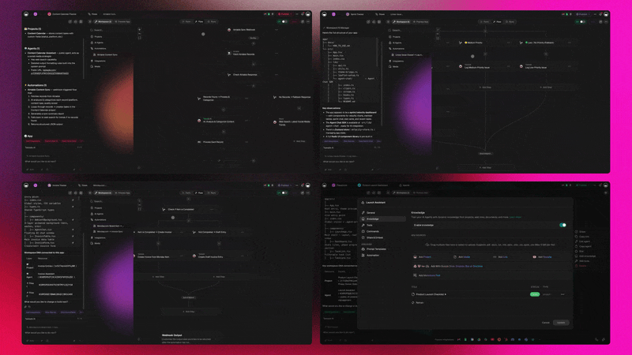
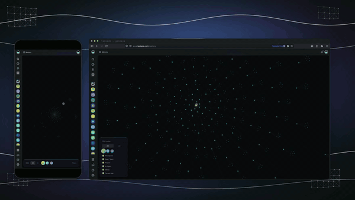
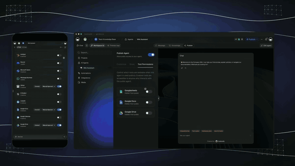
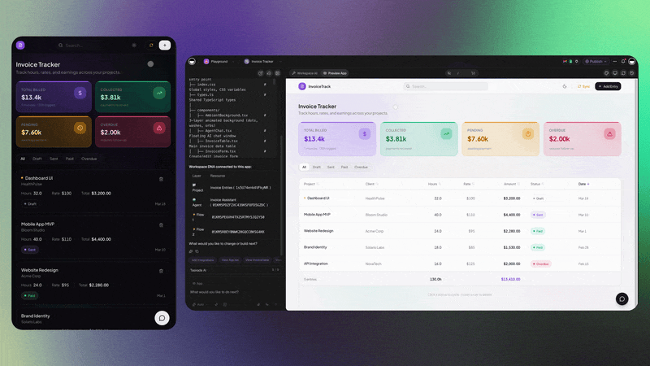

# Build on Taskade

<table data-view="cards"><thead><tr><th></th><th></th><th data-hidden data-card-target data-type="content-ref"></th></tr></thead><tbody><tr><td><strong>🛠️ Build a business app — no code</strong></td><td>Describe it in plain English. Get a CRM, client portal, or ops dashboard — with logins and your own domain.</td><td><a href="genesis-living-system-builder/genesis/getting-started.md">Start building →</a></td></tr><tr><td><strong>💻 Build on the API — developers</strong></td><td>REST API v1, Action API v2, MCP, SDK, and webhooks for programmatic access.</td><td><a href="apis-living-system-development/developer-home.md">Developer platform →</a></td></tr></tbody></table>


**Don't want to start from a blank prompt?** Clone a ready-made app for free — browse the [community gallery](https://www.taskade.com/community) and [Taskade's official kits](https://www.taskade.com/user/taskade), then customize it in Taskade Genesis. Or [start from scratch](https://www.taskade.com/create).



**Running a real business on a Taskade Genesis app?** Follow [Run Your Business on Genesis](genesis-living-system-builder/run-your-business/README.md) — build it, add logins, and put it on your own domain.


## Welcome to Taskade

**Describe your business in plain English — get a real, running app you can put on your own domain.**

Build complete business applications, websites, and tools using natural language. Taskade combines an **AI app builder** ([Taskade Genesis](https://www.taskade.com/create)), **workflow automation engine**, **AI agents platform**, and **automatic deployment** into a unified workspace.

**Build Without Permission. Start with Taskade Genesis. Your workspace is the foundation.**

We believe the future of work isn't just humans using AI. It's humans and AI working as one.

* One prompt = one app.
* Your workspace = the backend.
* Your agents = the team.
* Your automations = the execution.

Software should be alive. And now, it is.

<figure><figcaption>One prompt → a working app — agents, integrations, and automations built in.</figcaption></figure>

### Platform capabilities

| Capability               | Description                                                    | Learn More                                                                                                  |
| ------------------------ | -------------------------------------------------------------- | ----------------------------------------------------------------------------------------------------------- |
| **AI App Builder**       | Generate full-stack applications from natural language prompts | [Create Your First App →](https://www.taskade.com/learn/genesis/first-app)              |
| **Website Generator**    | Create responsive websites with built-in AI intelligence       | [Workspace DNA →](https://www.taskade.com/learn/genesis/workspace-dna)            |
| **Workflow Automation**  | Connect 100+ integrations with AI-powered decision making      | [Automations Guide →](https://www.taskade.com/learn/automation/automations-execution)        |
| **AI Agents Platform**   | Deploy custom AI assistants with persistent memory             | [Custom AI Agents →](https://www.taskade.com/learn/agents/custom-agents) |
| **Projects & Databases** | Structured data with real-time sync and custom fields          | [Memory Pillar →](https://www.taskade.com/learn/projects/databases)       |

[**Start Building →**](https://www.taskade.com/create) | [**Browse Community Apps →**](https://www.taskade.com/community)

### How Taskade fits together

Taskade works best when three parts stay connected. **Memory** stores knowledge. **Intelligence** reasons with that knowledge. **Execution** runs workflows from it.

<figure><figcaption>Memory — every project, doc, and conversation connects into one workspace knowledge graph.</figcaption></figure>

<figure><figcaption>Intelligence — AI agents with persistent memory, custom tools, and slash commands.</figcaption></figure>

<figure><figcaption>Execution — automations connect 100+ tools to run work end to end.</figcaption></figure>

Use this as the canonical overview: [Workspace DNA](genesis-living-system-builder/genesis/workspace-dna.md).

### Quick start

#### Build your first app (5 minutes)

1. [**Follow the Tutorial**](genesis-living-system-builder/genesis/getting-started.md) - Step-by-step app building
2. [**Copy Working Prompts**](genesis-living-system-builder/genesis/examples-and-templates.md) - Proven templates
3. [**Browse Community Apps**](https://www.taskade.com/community) - Apps, templates, and workflows for every industry

#### Create AI agents (10 minutes)

1. [**AI Agent Tutorial**](genesis-living-system-builder/ai-features/ai-agents-getting-started.md) - Your first AI assistant
2. [**Agent Prompt Library**](genesis-living-system-builder/space-apps-guide/genesis-prompt-library.md) - Ready-to-use configurations

#### Set up automations (15 minutes)

1. [**Automation Getting Started**](genesis-living-system-builder/automation/) - Build your first workflow
2. [**Integration Guide**](genesis-living-system-builder/automation/integrations.md) - 100+ supported services

#### For developers

* [**Developer Platform**](apis-living-system-development/developer-home.md) - The developer portal: APIs, SDK, and MCP
* [**REST API v1**](apis-living-system-development/comprehensive-api-guide/README.md) - Complete RESTful reference (full task CRUD)
* [**Action API v2**](apis-living-system-development/api-v2-reference.md) - The newer action-based API (agent prompting, bundles)
* [**Authentication**](apis-living-system-development/developers/authentication.md) - Personal tokens & OAuth 2.0
* [**Open Source**](https://github.com/taskade) - MCP server, Integration Kit (Zapier/n8n), and sample apps on GitHub

### Explore docs

<table data-view="cards"><thead><tr><th>Topic</th><th data-card-target data-type="content-ref">Link</th></tr></thead><tbody><tr><td>Run a business on Taskade Genesis</td><td><a href="genesis-living-system-builder/run-your-business/README.md">Run Your Business</a></td></tr><tr><td>Workspace DNA (canonical)</td><td><a href="genesis-living-system-builder/genesis/workspace-dna.md">Workspace DNA</a></td></tr><tr><td>Taskade Genesis (build apps)</td><td><a href="genesis-living-system-builder/genesis/">Taskade Genesis</a></td></tr><tr><td>AI Agents</td><td><a href="genesis-living-system-builder/ai-features/ai-agents-getting-started.md">AI Agents: Getting Started</a></td></tr><tr><td>Automations</td><td><a href="genesis-living-system-builder/automation/">Automations</a></td></tr><tr><td>Developers</td><td><a href="apis-living-system-development/developer-home.md">Developer Platform</a></td></tr><tr><td>Help &#x26; Support</td><td><a href="help-center/">Help &#x26; Support</a></td></tr></tbody></table>
