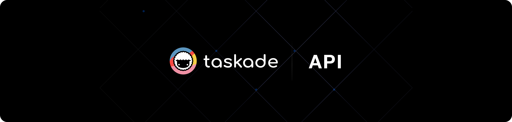


**New to Taskade?** Start with our [Quick Start Guide](getting-started/README.md) to get productive in 10 minutes, or jump directly to [Genesis](genesis/README.md) to build your first no-code app!


# Welcome to Taskade

**The productivity platform that actually gets how you work.**

Tired of juggling 10 different apps just to get things done? Taskade combines project management, AI assistance, and team collaboration in one place that doesn't suck. Whether you're organizing a side project, managing a remote team, or building the next big thing, Taskade adapts to *your* workflow instead of forcing you into theirs.

## 🎯 What is Taskade?

**The productivity platform with living DNA.**

Think of your workspace as a digital organism — every project, agent, automation, and piece of knowledge connects to form the genetic code of everything you build. Unlike static productivity tools, Taskade creates a **living ecosystem** that learns, adapts, and evolves with your business.

Here's what makes your workspace alive:
- **📊 Intelligent Projects** - Data structures that grow and adapt to your needs
- **🤖 Learning AI Agents** - Digital team members trained on your business knowledge
- **⚡ Reactive Automations** - Business reflexes that respond instantly to events
- **🧬 Connected Intelligence** - Everything learns from everything else

**Real Talk:** Most productivity apps treat your data like it's dead. Taskade makes it alive.

## 🚀 Quick Start



### **📚 [Getting Started →](getting-started/README.md)**
Core features and everything you need to be productive:
- **[Features Overview →](features/README.md)** - Platform capabilities
- **[AI Agents →](features/ai-features/ai-agents-getting-started.md)** - AI assistants

### **🎯 [Genesis: No-Code Apps →](genesis/README.md)**
Build complete applications without coding:
- **[Create Your First App →](genesis/getting-started.md)** - Step-by-step guide
- **[Templates & Examples →](genesis/examples-and-templates.md)** - Ready-to-use solutions



### **💻 [Developer Hub →](developers/README.md)**
APIs and technical integrations for building on Taskade:
- **[API Documentation →](api/README.md)** - Complete technical reference
- **[Automations →](automation/README.md)** - Connect to 100+ services
- **[Authentication →](start/authentication.md)** - API keys and OAuth setup



### **📰 [Changelog →](changelog/README.md)**
Latest updates and releases:
- **[2025 Releases →](changelog/2025/README.md)** - Genesis, AI agents, mobile development
- **[What's New →](changelog/README.md#recent-highlights)** - Latest breakthrough features



## ✨ Core Features

### **Smart Project Management**
- **Flexible Data Structures**: Projects that adapt to any workflow
- **8 Different Views**: List, Board, Calendar, Table, Mind Map, Org Chart, Gantt, Action
- **Real-time Collaboration**: See changes instantly across your team
- **Custom Fields & Templates**: Tailor projects to your specific needs

### **AI-Powered Intelligence** 
- **Custom AI Agents**: Deploy specialized assistants for any role
- **Automated Workflows**: Connect apps and automate repetitive tasks
- **Smart Content Generation**: AI that understands your business context
- **Intelligent Data Processing**: Automatic categorization and insights

### **Enterprise-Ready Platform**
- **Security & Compliance**: SOC 2, GDPR, and enterprise-grade security
- **Team Management**: Role-based permissions and access control
- **Integration Ecosystem**: 100+ native integrations with popular tools
- **Scalable Infrastructure**: Built to handle teams of any size

## 🌟 What People Actually Build With This

### **Side Projects That Don't Die**
*"Finally, a way to track my 47 ongoing projects without losing my mind."*
- Personal knowledge bases that actually get used
- Habit trackers that sync with your calendar
- Investment portfolios with automated news alerts
- Learning projects with progress tracking

### **Remote Team Coordination** 
*"No more 'can you see my screen?' or 'let me send you that link again.'"*
- Async standup reports that don't require meetings
- Project handoffs that actually include all the context
- Client work where everyone knows what's happening
- Documentation that stays updated (automatically)

### **Content & Creator Workflows**
*"I went from scattered Google Docs to an actual content system."*
- Video production pipelines with automatic status updates
- Social media calendars that post themselves
- Newsletter workflows that track performance
- Brand asset libraries with AI-powered search

### **Micro-SaaS & Bootstrapped Businesses**
*"Built our entire customer onboarding system in an afternoon."*
- Customer feedback loops with Slack integration
- Lead qualification systems that route automatically
- Product roadmaps that sync with user requests
- Support systems that scale without hiring

## 🧬 Your Workspace's Living DNA

Taskade isn't built on static layers — it's built on **living DNA strands** that interweave to create intelligent, adaptive experiences:

### **🧠 Intelligence DNA**
AI agents that learn from your workspace and become specialized digital team members with unique knowledge and capabilities.

### **⚡ Action DNA**
Automations that act as your business's nervous system, detecting events and coordinating responses across 100+ integrated tools.

### **📚 Knowledge DNA**
Projects and data that form your organizational memory, storing and surfacing information in flexible, interconnected structures.

### **🔄 Evolution DNA**
The living connections that make everything learn from everything else — your workspace gets smarter with every interaction.

[Explore the living architecture →](vision/architecture.md)

## 🎉 What's New

### **🧬 Genesis: Living DNA Apps**
Revolutionary AI that awakens your workspace's genetic code to create complete business applications from a single prompt.

### **🤖 Multi-Model AI Agents**
Deploy specialized digital team members powered by GPT-5, Claude-4, and advanced reasoning models — each trained on your unique business DNA.

### **📱 Mobile DNA Development**
Build and train your living workspace directly from your mobile device — your DNA evolves wherever you are.

### **⚡ Intelligent DNA Reactions**
Automations that learn from your patterns and optimize themselves — your business reflexes get faster and smarter over time.

[See all updates →](changelog/README.md)

## 💡 Ready to Transform Your Workflow?


**Ready to get started?** [Create your free account](https://taskade.com/signup) and build your first Genesis app in minutes!


<figure><figcaption>
The productivity platform with living DNA - where your workspace becomes a digital organism
</figcaption></figure>

### **🚀 Start Building Today**



**[Create Your Free Account →](https://taskade.com/signup)**

Get started with Taskade's living DNA platform:
- Unlimited projects and AI agents
- 100+ automation integrations  
- Real-time collaboration
- Mobile and desktop apps



**[Explore Templates →](https://taskade.com/templates)**

Jump-start your productivity:
- Project management templates
- AI agent configurations
- Automation workflows
- Industry-specific solutions



**[Browse AI Kits →](https://taskade.com/kits)**

Ready-to-use AI solutions:
- Business automation kits
- Creative workflow agents
- Data analysis templates
- Custom AI assistants



### **📚 Learn & Connect**

| Resource | Description |
| --- | --- |
| **[Help Center](https://help.taskade.com)** | Comprehensive guides and tutorials |
| **[Community Forum](https://www.taskade.com/feedback)** | Connect with other users and share tips |
| **[Video Tutorials](https://youtube.com/taskade)** | Step-by-step video guides |
| **[API Documentation](developers/README.md)** | Technical reference for developers |
| **[Status Page](https://status.taskade.com)** | Real-time platform status |

---


**Questions?** Join our [community forum](https://www.taskade.com/feedback) or check out our [comprehensive help center](https://help.taskade.com) for detailed guides and tutorials.

