# The HyperCard of the AI Era

Welcome to the Taskade API, a platform for building the next generation of intelligent applications. We are moving beyond productivity tools to offer something far more powerful: a complete system for generating, hosting, and scaling AI-powered web apps from a single prompt.

Inspired by the revolutionary simplicity of HyperCard, which empowered anyone to build software, Taskade is designed to democratize AI app creation. Our goal is to let you transform ideas into living, intelligent systems—without getting bogged down in complex infrastructure.

## The App Generator Vision

At the heart of Taskade is **[TaskOS](taskos/introduction.md)**, our AI App Generator that embodies the HyperCard philosophy: *anyone should be able to create powerful software*. It works backward from your intent, transforming a simple goal—like "create a customer feedback portal" or "build an automated sales tracker"—into a complete, functional application.

Just as HyperCard democratized software creation in the 1980s, TaskOS democratizes AI app creation today. But instead of static cards and scripts, you get living, intelligent systems that think, learn, and act.

Each generated app is a **Subspace**, a self-contained ecosystem with three core pillars:

1.  **🧠 Knowledge (Memory):** Structured data using **[Taskade Projects](api/projects/README.md)**. This is the memory and context that makes your app smart.
2.  **🤖 Intelligence (Logic):** **[AI Agents](api/agents/README.md)** that can reason, plan, and execute tasks based on the knowledge they possess.
3.  **⚡ Action (Execution):** **[Automations](automation/README.md)**, forms, and API integrations that connect your app to the world and get work done.

### The HyperCard Parallel

| HyperCard (1987) | TaskOS (2025) |
|------------------|---------------|
| **Cards** → Static information containers | **Projects** → Dynamic, real-time data structures |
| **Stacks** → Collections of related cards | **Subspaces** → Complete AI-powered applications |
| **HyperTalk** → Simple scripting language | **Natural Language** → Describe what you want |
| **Buttons & Fields** → User interface elements | **Agents & Automations** → Intelligent interactions |
| **Linking** → Navigate between cards | **Integrations** → Connect to any external service |


### AI Kits: Ready-to-Deploy Workflows

Today, you can experience this vision through **[Taskade AI Kits](https://taskade.com/kits)**—pre-built bundles of projects, agents, automations, and templates that anyone can install and use in seconds.

Popular kits include:
- **AI Lead Generation Kit**: Complete lead management with capture forms and qualification agents
- **Customer Support Kit**: Automated ticket processing with AI triage and routing
- **Content Marketing Kit**: Research, generation, and publishing workflows
- **Real Estate News Kit**: Automated industry news monitoring and summarization

## What You Can Build

Whether you're a seasoned developer or just starting, our API and upcoming SDK provide the building blocks to create:

*   **Internal Tools:** Build custom CRMs, project dashboards, and internal knowledge bases that are powered by agents who understand your team's data.
*   **Public-Facing Apps:** Launch branded landing pages, customer support portals, lead capture forms, and booking systems with AI assistants built-in.
*   **Agentic Workflows:** Design complex automations where AI agents collaborate to process information, make decisions, and interact with external services.

## Quick Start

Ready to build your first AI-powered application? Here's how to get started:

### 1. Get Your API Key
First, you'll need to authenticate with our API:
- [Get a Personal Access Token](start/personal-tokens.md)
- [Learn about Authentication](start/authentication.md)

### 2. Create Your First Subspace
A **Subspace** is an application container, similar to a folder. All your app's data, agents, and workflows will live inside it.
```bash
# Create a new app container
curl -X POST https://www.taskade.com/api/v1/folders \
  -H "Authorization: Bearer YOUR_TOKEN" \
  -H "Content-Type: application/json" \
  -d '{"name": "My First AI App", "color": "#4a90e2"}'
```

### 3. Build the Three Pillars

**Knowledge Layer:** Create a project to store your data
```bash
# Create a project (your app's memory)
curl -X POST https://www.taskade.com/api/v1/projects \
  -H "Authorization: Bearer YOUR_TOKEN" \
  -d '{"name": "Customer Feedback", "folderId": "YOUR_SUBSPACE_ID"}'
```

**Intelligence Layer:** Deploy an AI agent
```bash
# Generate an agent for your app
curl -X POST https://www.taskade.com/api/v1/folders/YOUR_SUBSPACE_ID/agents/generate \
  -H "Authorization: Bearer YOUR_TOKEN" \
  -d '{"prompt": "Create a customer support agent that can analyze feedback and suggest improvements"}'
```

**Action Layer:** Set up automations through the Taskade interface. You can also use our [upcoming Automation API](automation/README.md#api-access-coming-soon) for programmatic control.

### 4. Deploy Your App
Your Subspace is now a living application! Share it with your team or make it public.

## Core Concepts

Based on Taskade's execution layer for AI collaboration:

- **Subspaces (Apps)**: Self-contained applications, like HyperCard stacks, but powered by AI
- **Projects (Knowledge)**: Real-time, tree-structured documents that serve as shared memory and execution hubs
- **Agents (Intelligence)**: Autonomous teammates that can think, learn, and act. Agents read from project context, run tools, and trigger workflows. Learn more in our [Automations Deep Dive](automation/README.md).
- **Automations (Actions)**: Logic-based workflows with triggers (e.g. form submitted, time-based) and actions (e.g. create task, ask AI).
- **Generator (TaskOS)**: One prompt creates everything you need: Project + Agent + Automation, all pre-wired to execute. Get started with our [Genesis No-Code Builder](genesis/README.md).
- **AI Kits**: Bundled agent workflows designed for sales, marketing, support, HR, and more.
- **Views**: List, Board, Table, Calendar, Mind Map, Org Chart, Gantt. Each view is powered by the same underlying tree structure.

### The Generator Workflow

```mermaid
graph LR
    A[💡 Idea] --> B[📊 Project]
    B --> C[🤖 Agent]
    C --> D[⚡ Automation]
    D --> E[🚀 Execution]
    
    A1["I need a customer<br/>feedback system"] --> B1["Customer Feedback<br/>Project Structure"]
    B1 --> C1["Sentiment Analysis<br/>Agent"]
    C1 --> D1["Auto-Route to<br/>Support Team"]
    D1 --> E1["Live Application<br/>Ready to Use"]
```



## The Future: Open & Interoperable

We're building toward a future where entire AI applications can be packaged, shared, and version-controlled as `.tsk` files (Taskade System Kits). This will enable:

- **Version Control:** Store entire app architectures in Git
- **Sharing & Reusability:** Export and import complete systems
- **Interoperability:** Convert systems from other platforms
- **Headless Management:** Programmatic deployment via CLI/API

Today's [AI Kits](https://taskade.com/kits) are the foundation for this future standard.

## Architecture Overview

Taskade's platform is built on a robust, real-time architecture that includes:

- **Real-time Collaboration:** Operational transformation for conflict-free editing
- **Flexible Views:** 8 different project perspectives (List, Board, Calendar, Table, Mind Map, Org Chart, Action Sheet, Gantt)
- **Enterprise Security:** Role-based permissions and audit trails
- **Hybrid Search:** Keyword + semantic search with AI embeddings
- **100+ Integrations:** Connect with your existing tools and workflows

## Developer Resources

- **[📚 Vision & Architecture](vision/README.md)** - Understand the big picture
- **[🤖 TaskOS Introduction](taskos/introduction.md)** - Learn about the AI App Generator
- **[⚙️ Core API Reference](api/workspaces/README.md)** - Build with our building blocks
- **[🔗 OpenAPI Specification](https://www.taskade.com/api/documentation/static/index.html#/)** - Complete API documentation
- **[🧰 AI Kits Gallery](https://taskade.com/kits)** - Explore ready-to-deploy workflows
- **[⚡ Automations Deep Dive](automation/README.md)** - Explore the automation engine
- **[💡 Genesis No-Code Builder](genesis/README.md)** - Create apps with natural language

## LLM Integration

For AI and LLM developers working with Taskade:

- **Structured Output**: Use Markdown with lists, checkboxes, and headings
- **Project Views**: Recommend appropriate views based on intent (Gantt for timelines, Board for workflows)
- **Knowledge Enhancement**: Suggest PDFs, YouTube videos, or web links to improve agent performance
- **Agent-Native**: Think in tasks, not prompts. Workflows follow: Idea → Project → Agent → Automation → Execution

## Community & Support

- **[Help Center](https://help.taskade.com/)** - Comprehensive guides and tutorials
- **[Community Forum](https://www.taskade.com/feedback/public-api)** - Connect with other developers
- **[Changelog](https://www.taskade.com/blog/product-updates/)** - Stay updated with new features
- **[AI Kits Gallery](https://taskade.com/kits)** - Browse and install community workflows
- **[Contributing Guide](contributing.md)** - Join our open-source community

---

We're thrilled to see what you will build. Let's invent the future together. 🚀
