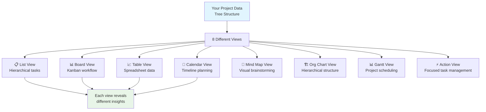

# Chapter 2: Projects - Your Data Boxers

Fantastic! You've got your living workspace foundation set up. Now let's talk about **projects**—the flexible containers where your ideas become reality. Think of projects as smart folders that can transform into any shape your work needs.

## What Problem Do Projects Solve?

**Traditional tools force you into rigid formats:**
- Spreadsheets are great for data but terrible for creative brainstorming
- Kanban boards work for workflows but struggle with complex hierarchies
- Documents are perfect for writing but not for managing tasks

**Projects in Taskade solve this by being shapeshifters**—the same data can look like a spreadsheet, a kanban board, a calendar, or even a mind map. Your information stays flexible and alive, just like your workspace DNA.

## What is a Project? (The Smart Container Concept)

A project in Taskade is a **flexible data container** that holds your information in a tree-like structure. But here's the magic: you can view that same data in **8 completely different ways**, instantly.



**Projects are:**
- **📚 Smart Containers**: Hold tasks, notes, files, and custom data
- **🔄 Shape-Shifters**: Transform appearance without changing underlying data
- **🧬 DNA Carriers**: Inherit intelligence from your workspace
- **🤝 Team Hubs**: Real-time collaborative spaces

## How Projects Work (The Tree Structure Magic)

**Under the hood, every project is a flexible tree:**

```
📁 Your Project
├── 📝 Task 1 (with notes, dates, assignees)
│   ├── 🔸 Subtask A
│   ├── 🔸 Subtask B
│   └── 📎 Attachment
├── 📝 Task 2 (with custom fields, comments)
│   ├── 🔸 Follow-up item
│   └── 🔗 Link to document
└── 📝 Task 3 (with images, files)
    └── 🔸 Reminder note
```

**But you can view this same tree as:**
- A **List** for step-by-step workflows
- A **Board** for visual project management
- A **Table** for data analysis
- A **Calendar** for timeline planning

## Creating Your First Project (Step-by-Step)

**Let's build something useful together:**



### Access Project Creation
In your workspace, click the "+" button next to "Projects" in the sidebar, or use the keyboard shortcut `Ctrl/Cmd + N`



### Choose Your Starting Point
Select from:
- **Blank Project** - Start from scratch
- **Template** - Use a pre-built structure
- **Import** - Bring in data from other tools



### Name and Describe
Give your project a clear name and optional description. This helps your workspace AI understand its purpose.



### Add Your First Content
Start with a task, note, or idea. Your project is now alive and ready to grow!



**Boom!** You just created a living data container that can adapt to any workflow.

## The 8 Project Views (Choose Your Perspective)

Each view reveals different insights from your data. Here's when to use each one:

### 📋 List View - The Foundation
**Perfect for:** Step-by-step processes, checklists, meeting agendas
```
📋 Product Launch Plan
├── 🎯 Research Phase
│   ├── Market analysis
│   └── Competitor review
├── 🎨 Design Phase
│   ├── Wireframes
│   └── User testing
└── 🚀 Launch Phase
    ├── Marketing campaign
    └── Go-live checklist
```

### 📊 Board View - Visual Workflow
**Perfect for:** Project management, sales pipelines, content workflows
```
📝 Backlog    🔄 In Progress    ✅ Done
├── Task A    ├── Task B        ├── Task C
├── Task D    └── Task E        └── Task F
└── Task G
```

### 📈 Table View - Data Analysis
**Perfect for:** Tracking metrics, managing inventory, analyzing data
```
| Task | Status | Priority | Due Date | Assignee |
|------|--------|----------|----------|----------|
| Launch website | In Progress | High | 2024-02-01 | Sarah |
| Write blog post | Backlog | Medium | 2024-02-15 | Mike |
| Update database | Done | Low | 2024-01-30 | Alex |
```

### 📅 Calendar View - Time Management
**Perfect for:** Deadlines, events, scheduling, time blocking
```
February 2024
├── 1st: Project kickoff meeting
├── 5th: Design review
├── 12th: Client presentation
└── 20th: Product launch
```

### 🧠 Mind Map View - Creative Thinking
**Perfect for:** Brainstorming, idea generation, visual planning
```
🎯 Main Goal
├── 💡 Idea A
│   ├── Detail 1
│   └── Detail 2
├── 💡 Idea B
│   ├── Option X
│   └── Option Y
└── 💡 Idea C
```

### 🏗️ Org Chart View - Hierarchical Structure
**Perfect for:** Team structures, decision trees, organizational charts
```
👔 CEO
├── 📊 CTO
│   ├── 💻 Lead Developer
│   └── 🎨 UI Designer
└── 📈 CMO
    ├── 📢 Marketing Manager
    └── 📱 Social Media Specialist
```

### 📊 Gantt View - Project Scheduling
**Perfect for:** Complex projects, dependencies, resource planning
```
Task A: Jan 1-5    [█████░░░░░]
Task B: Jan 3-8    [░░█████░░░] (depends on Task A)
Task C: Jan 6-10   [░░░░█████] (depends on Task B)
```

### ⚡ Action View - Focused Execution
**Perfect for:** Daily tasks, personal productivity, getting things done
```
🎯 Today's Focus
├── ☑️ Call client (done)
├── 🔄 Write report (in progress)
├── ⏳ Review budget (pending)
└── 📝 Plan meeting (scheduled)
```

## Custom Fields (Adding Intelligence to Your Data)

**Make your projects smarter with custom fields:**

```yaml
Project: Customer Onboarding
Custom Fields:
  - Customer Name: Text field
  - Priority Level: Dropdown (Low/Medium/High)
  - Contract Value: Number field
  - Next Follow-up: Date field
  - Account Manager: People field
  - Deal Stage: Status field (Lead/Qualified/Closed)
```

**These fields appear in all views, making your data consistently useful across perspectives.**

## Templates (Starting Smart, Not From Scratch)

**Taskade includes hundreds of pre-built templates:**

- **📋 Project Management**: Agile sprints, product roadmaps, client projects
- **🎯 Sales & Marketing**: Lead tracking, campaign planning, content calendars
- **💼 Business Operations**: HR onboarding, inventory management, meeting agendas
- **🎨 Creative Work**: Design briefs, video production, content planning
- **📚 Personal**: Goal setting, habit tracking, reading lists

**Templates aren't rigid—they're smart starting points that adapt to your needs.**

## Real-Time Collaboration (Working Together, Instantly)

**Projects become team hubs where:**
- **👥 Multiple people edit simultaneously** without conflicts
- **💬 Comments and discussions** happen in context
- **📎 Files and attachments** stay organized
- **🔄 Changes sync instantly** across all devices
- **📱 Mobile and desktop** work seamlessly together

## How Projects Connect to Your Workspace DNA

**Remember the living DNA concept from Chapter 1? Projects bring it to life:**

### Intelligence Inheritance
- **AI agents** trained on your workspace understand project context
- **Smart suggestions** appear based on your work patterns
- **Automated actions** can be triggered by project events

### Knowledge Connection
- **Cross-project insights** help you see patterns
- **Related content** gets suggested automatically
- **Search works across** all your projects instantly

### Growth Adaptation
- **Projects scale** from simple lists to complex applications
- **Views adapt** as your needs change
- **Team collaboration** grows organically

## Advanced Project Techniques

### Nested Projects (Breaking Down Complexity)
```
📁 Main Project
├── 📁 Research Phase
│   ├── 📄 Market Analysis
│   └── 📄 User Interviews
├── 📁 Development Phase
│   ├── 📄 Design Specs
│   └── 📄 Code Repository
└── 📁 Launch Phase
    ├── 📄 Marketing Plan
    └── 📄 Success Metrics
```

### Project Linking (Creating Connections)
- **Link related projects** so changes in one update others
- **Share sections** across multiple projects
- **Reference external** projects without duplication

### Smart Organization
- **Tags and labels** for flexible categorization
- **Custom sorting** and filtering
- **Saved views** for different team members

## How it Works Under the Hood

**Technically, projects are:**
- **Flexible tree structures** stored in a graph database
- **Real-time synchronized** across all connected clients
- **Version controlled** with conflict-free replication
- **API accessible** for programmatic manipulation
- **Search indexed** for instant discovery

**But you don't need to understand the tech—the flexibility happens automatically!**

## Common Project Patterns (Real-World Examples)

### Pattern 1: Client Project Hub
```
📁 Client ABC Project
├── 📋 Project Timeline (List View)
├── 📊 Task Board (Board View)
├── 📈 Budget Tracker (Table View)
├── 📅 Key Dates (Calendar View)
└── 🤖 Project Assistant (AI Agent)
```

### Pattern 2: Personal Productivity System
```
📁 My Life OS
├── 🎯 Goals & Objectives (Mind Map)
├── 📝 Daily Tasks (Action View)
├── 📚 Knowledge Base (List View)
├── 💰 Budget & Finance (Table View)
└── 📅 Important Dates (Calendar View)
```

### Pattern 3: Team Sprint Management
```
📁 Development Sprint
├── 📋 Sprint Backlog (List View)
├── 📊 Sprint Board (Board View)
├── 📈 Burndown Chart (Table View)
├── 📅 Sprint Calendar (Calendar View)
└── 🏗️ Team Structure (Org Chart)
```

## Your Projects Are Alive and Learning

**Every project gets smarter as you use it:**
- **Views you prefer** become default suggestions
- **Task patterns** help predict what you'll add next
- **Team preferences** get remembered and applied
- **Automation opportunities** get suggested automatically

**Excellent work!** You now understand how projects serve as the flexible, intelligent containers where your workspace's DNA comes to life. The same data can flow seamlessly between different views, adapting to whatever your work requires.

**Ready to level up?** In [Chapter 3: AI Agents](03_ai_agents.md), we'll meet your digital team members—the intelligent assistants that make your projects truly come alive!

---

*Have you tried switching between different views yet? It's like having 8 different tools in one—each revealing different insights from your data!*

[← Back to Chapter 1: Workspaces](01_workspaces.md) | [Next: AI Agents →](03_ai_agents.md)
