# Chapter 6: Integrations - Connecting Your Tools

Perfect! You've mastered building apps with Genesis. Now let's **connect your entire ecosystem**—linking Taskade to 100+ business tools for seamless workflows. This is where your workspace becomes the central nervous system of your business!

## What Problem Do Integrations Solve?

**Business tools work in isolation:**
- **Data silos** where information lives in separate systems
- **Manual copying** between spreadsheets, CRMs, and project tools
- **Lost context** when switching between different applications
- **Delayed updates** because systems don't talk to each other

**Integrations solve this by creating a connected ecosystem** where tools work together automatically, sharing data and triggering actions across your entire business stack.

## What are Integrations? (The Connected Ecosystem)

Integrations in Taskade are **bridges between systems** that enable automatic data flow and coordinated actions. Instead of switching between tools, your workspace becomes the central hub that orchestrates everything.

```mermaid
flowchart TD
    TASKADE[Taskade Workspace<br/>Central Hub] --> INT[100+ Integrations<br/>Connected Tools]

    INT --> COMM[📧 Communication<br/>Slack, Teams, Discord]
    INT --> PROD[📊 Productivity<br/>Google Workspace, Notion]
    INT --> CRM[💼 Sales & CRM<br/>HubSpot, Salesforce]
    INT --> CLOUD[☁️ Cloud Storage<br/>Google Drive, OneDrive]
    INT --> SOCIAL[📱 Social Media<br/>Twitter, LinkedIn, Facebook]
    INT --> DEV[🔧 Development<br/>GitHub, Jira, Figma]

    COMM --> ACTIONS[Actions Flow Both Ways]
    PROD --> ACTIONS
    CRM --> ACTIONS
    CLOUD --> ACTIONS
    SOCIAL --> ACTIONS
    DEV --> ACTIONS

    ACTIONS --> TRIGGER[Triggers Automations]
    TRIGGER --> WORKFLOW[Intelligent Workflows]
    WORKFLOW --> RESULTS[Seamless Business Operations]

    style TASKADE fill:#e1f5fe
    style RESULTS fill:#e8f5e8
```



**Integrations enable:**
- **🔄 Bidirectional Data Flow**: Information syncs both ways
- **⚡ Event-Driven Actions**: Tools trigger actions in other systems
- **🤖 Automated Workflows**: Multi-step processes across platforms
- **📊 Unified Analytics**: See data from all tools in one place
- **🔗 Connected Intelligence**: AI agents access data from all integrated tools

## How Integrations Work (The Connection Architecture)

**Integration happens at three levels:**

### Level 1: Data Synchronization
**Tools share information automatically:**
- New contacts in your CRM appear as tasks in Taskade
- Project updates in Taskade sync to your team calendar
- Files uploaded to Taskade appear in your cloud storage
- Social media mentions trigger Taskade notifications

### Level 2: Event Triggers
**Tools notify each other of important events:**
- When a deal closes in your CRM → Create celebration task in Taskade
- When code is pushed to GitHub → Update project status in Taskade
- When a customer tweets → Create support ticket in Taskade
- When inventory runs low → Generate reorder task in Taskade

### Level 3: Intelligent Orchestration
**AI coordinates complex multi-tool workflows:**
- Customer inquiry → AI analyzes → Routes to right team → Updates CRM → Sends personalized response
- Project deadline approaching → AI assesses progress → Adjusts resources → Updates stakeholders
- Sales lead qualifies → AI scores → Creates nurturing sequence → Syncs with marketing tools

## Setting Up Your First Integration (Step-by-Step)

**Let's connect Slack for instant team notifications:**



### Access Integration Settings
In your workspace, go to Automations → Integrations tab



### Choose Your Tool
Find Slack in the integration list and click "Connect"



### Authorize the Connection
Follow the OAuth flow to grant Taskade access to your Slack workspace



### Configure Settings
Choose which channels receive notifications and what events trigger them



### Test the Integration
Create a test task and mark it complete—watch the Slack notification appear instantly



**Excellent!** Your tools are now talking to each other!

## Integration Categories and Use Cases

### Communication Platforms
**Keep teams informed instantly:**

#### Slack Integration
- **Project Updates**: Notify channels when milestones are reached
- **Task Assignments**: Alert team members of new responsibilities
- **Deadline Alerts**: Send reminders before due dates
- **Status Changes**: Keep stakeholders updated on progress

#### Microsoft Teams
- **Meeting Integration**: Create projects from Teams meetings
- **File Sync**: Share documents between platforms
- **Channel Notifications**: Send updates to relevant Teams channels

#### Discord
- **Community Management**: Connect gaming or community teams
- **Role-Based Alerts**: Notify specific user groups
- **Bot Commands**: Control Taskade from Discord chat

### Productivity Tools
**Streamline daily workflows:**

#### Google Workspace
- **Gmail**: Convert emails to tasks, send automated responses
- **Calendar**: Sync deadlines, create events from tasks
- **Sheets**: Update spreadsheets automatically, import data
- **Docs**: Generate documents from project data

#### Notion
- **Database Sync**: Keep Notion databases updated with Taskade data
- **Page Creation**: Generate Notion pages from Taskade projects
- **Template Integration**: Use Notion templates in Taskade workflows

### Sales & CRM Systems
**Close deals faster:**

#### HubSpot
- **Contact Sync**: Keep contacts updated between systems
- **Deal Tracking**: Update CRM when project milestones are hit
- **Email Integration**: Log Taskade communications in HubSpot

#### Salesforce
- **Lead Management**: Convert Taskade leads to Salesforce opportunities
- **Account Updates**: Sync customer information automatically
- **Pipeline Tracking**: Update sales stages from project progress

### Cloud Storage
**Files follow your work:**

#### Google Drive
- **File Attachments**: Sync Taskade files to Drive folders
- **Version Control**: Maintain file history across platforms
- **Sharing Permissions**: Control access from Taskade interface

#### OneDrive/SharePoint
- **Document Management**: Organize files by project automatically
- **Collaboration**: Share files with external stakeholders
- **Backup**: Automatic file backup and versioning

### Social Media & Marketing
**Manage your online presence:**

#### Twitter/X
- **Mention Monitoring**: Track brand mentions and respond
- **Content Scheduling**: Post updates from Taskade campaigns
- **Analytics Integration**: Track engagement metrics

#### LinkedIn
- **Post Scheduling**: Automate professional content publishing
- **Lead Generation**: Capture LinkedIn connections as leads
- **Company Updates**: Share project milestones with network

### Development Tools
**Connect code and business:**

#### GitHub
- **Issue Tracking**: Create tasks from GitHub issues
- **PR Notifications**: Alert teams when code is ready for review
- **Release Tracking**: Update projects when deployments happen

#### Jira
- **Ticket Sync**: Keep Jira tickets updated with Taskade progress
- **Sprint Planning**: Create Taskade projects from Jira sprints
- **Status Updates**: Sync task completion across platforms

## Advanced Integration Patterns

### Multi-Tool Workflows
**Complex processes spanning multiple systems:**
```
Customer Inquiry → Slack Alert → Taskade Ticket → AI Analysis → CRM Update → Email Response → Follow-up Task
```

### Conditional Routing
**Smart decisions based on data:**
```
If deal value > $10K → Create executive review task + schedule meeting
If deal value < $10K → Assign to junior rep + send standard proposal
```

### Data Transformation
**Convert information between formats:**
```
Form submission → Transform data → Update spreadsheet → Generate report → Send to stakeholders
```

### Time-Based Automation
**Schedule cross-platform actions:**
```
Every Monday 9 AM → Pull analytics → Generate report → Email to team → Update dashboard
```

## Integration Security and Permissions

### OAuth and API Keys
**Secure authentication methods:**
- OAuth 2.0 for most services (Google, Slack, Microsoft)
- API tokens for custom integrations
- Scoped permissions (read-only vs. read-write access)

### Data Privacy
**Your data stays protected:**
- End-to-end encryption for data in transit
- SOC 2 compliance for enterprise customers
- Granular permission controls
- Audit trails for all integration activities

### Rate Limiting and Reliability
**Built for scale:**
- Smart rate limiting prevents API quota issues
- Automatic retry logic for failed connections
- Circuit breaker patterns for system reliability
- Monitoring and alerting for integration health

## Troubleshooting Integrations

### Common Issues and Solutions

#### Connection Problems
- **Check API Keys**: Verify credentials are current and correct
- **Review Permissions**: Ensure Taskade has necessary access rights
- **Network Issues**: Check firewall settings and connectivity
- **Service Outages**: Monitor status pages of integrated services

#### Data Sync Issues
- **Field Mapping**: Verify data fields are correctly mapped
- **Format Compatibility**: Ensure data formats are compatible
- **Duplicate Prevention**: Set up rules to avoid duplicate entries
- **Update Frequency**: Adjust sync intervals based on needs

#### Performance Optimization
- **Batch Operations**: Group multiple operations to reduce API calls
- **Caching Strategies**: Cache frequently accessed data locally
- **Async Processing**: Use background processing for heavy operations
- **Monitoring**: Track integration performance and success rates

## Integration Analytics and Insights

### Performance Monitoring
**Track integration effectiveness:**
- Success rates and failure patterns
- Processing times and bottlenecks
- Data volume and transfer statistics
- User adoption and engagement metrics

### ROI Measurement
**Quantify integration value:**
- Time saved through automation
- Error reduction from manual processes
- Improved data accuracy
- Faster decision-making capabilities

### Optimization Opportunities
**Identify improvement areas:**
- Underutilized integrations that could be expanded
- Manual processes that could be automated
- Data silos that could be connected
- Performance bottlenecks to address

## How it Works Under the Hood

**Technically, integrations are:**
- **API Connectors**: Standardized interfaces to external services
- **Webhook Handlers**: Real-time event processing systems
- **Data Transformers**: Format conversion and mapping engines
- **Queue Systems**: Asynchronous processing for reliability
- **Security Layers**: Authentication and authorization frameworks
- **Monitoring Systems**: Health checks and performance tracking

**But you don't need to understand the tech—integrations just work!**

## Integration Templates and Quick Starts

### Business Process Templates
- **Customer Onboarding**: CRM + Email + Project Management
- **Content Creation**: Calendar + Social Media + Analytics
- **Lead Management**: Forms + CRM + Email Marketing
- **Support Operations**: Ticketing + Knowledge Base + Chat

### Industry-Specific Setups
- **Agencies**: Project Management + Time Tracking + Invoicing
- **E-commerce**: Inventory + Shipping + Customer Service
- **Healthcare**: Patient Management + Scheduling + Compliance
- **Education**: LMS + Communication + Assessment Tools

## Your Integrated Ecosystem Grows Smarter

**Connected tools learn and improve together:**
- **Pattern Recognition**: Systems learn your workflow preferences
- **Predictive Actions**: Tools anticipate what you'll need next
- **Unified Intelligence**: AI agents access data from all connected systems
- **Adaptive Automation**: Workflows optimize based on performance data

**Outstanding progress!** Your workspace is now the central hub of a connected business ecosystem. Tools work together seamlessly, sharing data and coordinating actions automatically.

**Ready to go deeper?** In [Chapter 7: API](07_api.md), we'll explore programmatic access to Taskade for custom integrations and advanced automation!

---

*What's the most frustrating manual process in your business? Find the integration that automates it, and watch hours of repetitive work disappear. Your connected ecosystem will thank you!*

[← Back to Chapter 5: Genesis](05_genesis.md) | [Next: API →](07_api.md)
