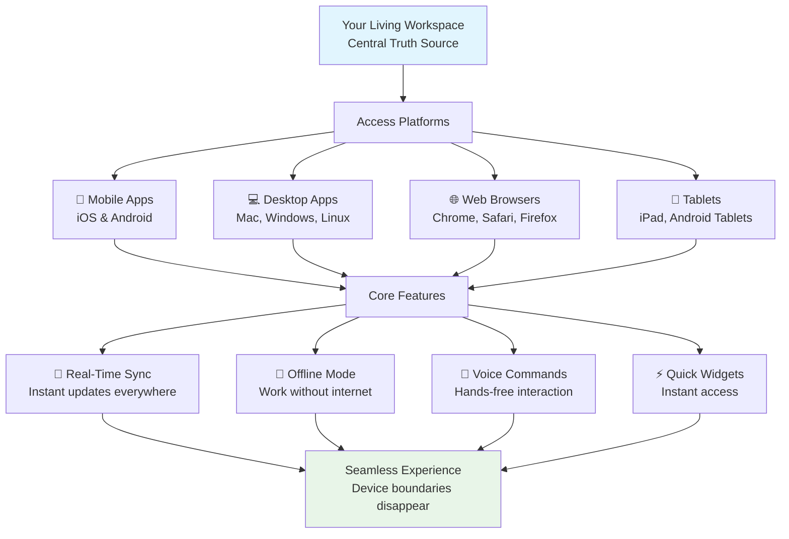

# Chapter 8: Mobile & Desktop - Cross-Platform Productivity

Perfect! You've mastered the API and can now build anything programmatically. For the grand finale, let's ensure your **living workspace works flawlessly everywhere**—from mobile phones to desktop computers, tablets to web browsers. This is where productivity becomes truly ubiquitous.

## What Problem Does Cross-Platform Solve?

**Traditional productivity tools are device-limited:**
- **Desktop software** doesn't work on mobile
- **Mobile apps** lack desktop power
- **Web applications** feel clunky on phones
- **Data gets siloed** across different devices

**Cross-platform solves this by creating a seamless experience** where your workspace flows perfectly between all devices, maintaining full functionality and real-time synchronization.

## What is Cross-Platform Productivity? (The Unified Experience)

Cross-platform productivity means your **entire living workspace ecosystem works identically** whether you're on a phone, tablet, desktop, or web browser. One workspace, infinite access points—all perfectly synchronized.



**Cross-platform enables:**
- **🔄 Real-Time Sync**: Changes appear instantly across all devices
- **📴 Offline Capability**: Full functionality without internet
- **🎤 Voice Commands**: Hands-free productivity
- **⚡ Quick Access**: Instant task creation from any device
- **📱 Native Experiences**: Optimized interfaces for each platform
- **🔗 Seamless Transitions**: Switch devices mid-task without losing flow

## Platform-Specific Capabilities

### Mobile Apps (iOS & Android)

**Native mobile experiences with full workspace power:**

#### Core Mobile Features
- **Full Workspace Access**: All projects, AI agents, automations
- **Touch-Optimized Interface**: Gestures and touch interactions
- **Camera Integration**: Photo uploads, document scanning
- **Biometric Authentication**: Face ID, Touch ID, fingerprint
- **Push Notifications**: Real-time alerts and updates
- **Offline Mode**: View and edit without internet connection

#### Mobile-Specific Tools

**Quick Add Widget - Instant Productivity:**
```
Home Screen Widget Features:
├── ⚡ One-tap task creation
├── 🎤 Voice input support
├── 📅 Smart date recognition
├── 📍 Location tagging
├── 🔄 Auto-sync when online
└── 🎯 Default project assignment
```

**Share to Taskade - Capture from Anywhere:**
```
Universal Share Integration:
├── 📱 Photos and images
├── 📄 Documents and PDFs
├── 🌐 Web links and articles
├── 📝 Text snippets
├── 📍 Location data
└── 🎵 Audio recordings
```

### Desktop Applications

**Native desktop power with advanced features:**

#### Desktop Capabilities
- **Multi-Monitor Support**: Efficient use of screen real estate
- **Keyboard Shortcuts**: Power user shortcuts for speed
- **File System Integration**: Drag-and-drop file handling
- **System Tray Access**: Quick access without opening full app
- **Advanced Search**: Instant workspace-wide search
- **Bulk Operations**: Mass edits and updates

#### Desktop-Specific Features
- **Global Hotkeys**: Create tasks from any application
- **Clipboard Integration**: Smart paste and content recognition
- **Window Management**: Split-screen collaboration
- **Advanced Customization**: Themes, layouts, and preferences

### Web Browsers

**Universal web access with progressive enhancement:**

#### Web Platform Features
- **Browser Extensions**: Quick capture from any website
- **Progressive Web App**: Install like a native app
- **Cross-Browser Compatibility**: Works on all modern browsers
- **Responsive Design**: Adapts to any screen size
- **Offline Capability**: Service worker caching

#### Browser Extensions
```
Web Clipper Extensions:
├── 📄 Article saving
├── 🎯 Content highlighting
├── 📝 Note taking
├── 🏷️ Tag and organize
├── 🔗 Link preservation
└── 📱 Mobile sync
```

### Tablets and Touch Devices

**Optimized for touch with productivity power:**

#### Tablet Optimizations
- **Large Touch Targets**: Easy interaction with fingers
- **Gesture Support**: Swipe, pinch, multi-touch gestures
- **Split-Screen**: Use multiple apps simultaneously
- **Stylus Support**: Precise input with digital pens
- **Rotation Support**: Portrait and landscape modes

## Real-Time Synchronization (The Magic Glue)

**Your workspace stays perfectly in sync across all platforms:**

### Synchronization Features
- **Instant Updates**: Changes appear immediately on all devices
- **Conflict Resolution**: Smart merging of simultaneous edits
- **Version History**: Track changes and revert if needed
- **Offline Queue**: Actions taken offline sync when reconnected
- **Bandwidth Optimization**: Efficient data transfer and caching

### Cross-Device Workflows
```
Seamless Device Transitions:
├── 💻 Start project on desktop
├── 📱 Review on mobile during commute
├── 📱 Add tasks via voice commands
├── 💻 Finalize details on laptop
└── 🔄 Everything stays perfectly synced
```

## Setting Up Cross-Platform Access (Step-by-Step)

**Get your workspace working everywhere:**



### Install Mobile Apps
Download Taskade from App Store (iOS) or Google Play (Android)



### Install Desktop Apps
Download from taskade.com for Mac, Windows, or Linux



### Enable Web Access
Use any modern web browser for full functionality



### Configure Sync Settings
Ensure all devices are logged into the same account



### Test Synchronization
Create a task on one device and watch it appear on others



**Congratulations!** Your workspace now works everywhere!

## Advanced Cross-Platform Techniques

### Device-Specific Workflows

**Optimize for each platform's strengths:**

#### Mobile-First Workflows
```
Perfect for mobile scenarios:
├── 🚗 Daily commute planning
├── 🏃‍♂️ Quick task capture during meetings
├── 📍 Location-based reminders
├── 📸 Photo task creation
├── 🎤 Voice note taking
└── 📱 Instant collaboration
```

#### Desktop Power User Flows
```
Leverage desktop advantages:
├── ⌨️ Keyboard shortcuts for speed
├── 🖱️ Drag-and-drop organization
├── 📊 Multi-monitor project views
├── 🔍 Advanced search and filtering
├── 📈 Bulk editing operations
└── 🤖 Complex automation setup
```

#### Web-Based Collaboration
```
Browser advantages:
├── 🔗 Easy sharing and access
├── 🌐 Cross-platform compatibility
├── 📋 Quick web clipping
├── 🔄 Real-time collaboration
└── 📱 Responsive design everywhere
```

### Offline Productivity

**Full functionality without internet:**

#### Offline Capabilities
- **View All Projects**: Access complete workspace offline
- **Create and Edit Tasks**: Full task management capabilities
- **Project Navigation**: Switch between all project views
- **File Attachments**: View previously downloaded files
- **Basic AI Features**: Core AI assistance works offline

#### Offline Synchronization
```
Smart offline-to-online transition:
├── 📋 Queue all changes locally
├── 🔄 Auto-sync when connection restored
├── ⚡ Conflict resolution for simultaneous edits
├── 📊 Sync status indicators
└── 🔋 Battery-efficient background sync
```

### Voice and Hands-Free Productivity

**Voice commands across all platforms:**

#### Voice Features
- **Task Creation**: "Create task: Call client tomorrow at 3pm"
- **Project Search**: "Find my marketing campaign project"
- **Status Updates**: "Mark task complete"
- **Schedule Management**: "Set up meeting for next Tuesday"

#### Voice Integration
```
Multi-platform voice support:
├── 📱 Mobile: Siri, Google Assistant integration
├── 💻 Desktop: System voice recognition
├── 🌐 Web: Browser voice APIs
└── ⌚ Wearables: Voice notes and reminders
```

## Platform-Specific Optimizations

### Mobile App Optimizations
**Designed specifically for touch and mobility:**

#### Touch Interactions
```
Gesture Support:
├── 👆 Tap: Select and open
├── 👆👆 Double-tap: Quick edit
├── 👈👉 Swipe: Complete or archive
├── 👆 Hold: Context menu
├── 🔍 Pinch: Zoom and navigate
└── 📱 Multi-touch: Collaborative editing
```

#### Mobile UI Patterns
```
Mobile-First Design:
├── 📱 Single-hand operation
├── 👁️ Clear visual hierarchy
├── ⚡ Fast loading and response
├── 🔋 Battery optimization
├── 📶 Low-bandwidth friendly
└── 🌙 Dark mode support
```

### Desktop Power Features
**Leverage desktop capabilities:**

#### Keyboard Shortcuts
```
Essential Shortcuts:
├── ⌘N: New project
├── ⌘K: Global search
├── ⌘/: AI assistant
├── ⌘↵: Complete task
├── ⌘⌫: Delete item
└── ⌘Z: Undo/redo
```

#### Advanced Desktop Features
```
Power User Capabilities:
├── 🖥️ Multi-window support
├── 📊 Advanced analytics
├── 🔧 Custom workflows
├── 📈 Bulk operations
├── 🔍 Advanced filtering
└── 🤖 Complex automations
```

## Cross-Platform Collaboration

**Teamwork that transcends device boundaries:**

### Real-Time Collaboration
```
Cross-Device Teamwork:
├── 👥 Multiple users edit simultaneously
├── 💬 Live chat and comments
├── 👤 Presence indicators
├── 📝 Live cursors and selections
├── 🔄 Instant sync across platforms
└── 📱 Mobile collaboration support
```

### Device Switching Workflows
```
Seamless Transitions:
├── 💻 Start brainstorming on desktop
├── 📱 Continue during commute
├── 🖥️ Present on conference room display
├── 📱 Follow up on mobile
└── 🔄 Everything stays connected
```

## Performance and Reliability

**Consistent performance across all platforms:**

### Platform Optimization
- **Native Code**: Platform-specific optimizations for speed
- **Efficient Sync**: Minimal bandwidth usage for synchronization
- **Smart Caching**: Fast loading and offline capability
- **Battery Optimization**: Power-efficient background processes

### Reliability Features
- **Offline Resilience**: Core features work without internet
- **Data Persistence**: Never lose work due to connectivity issues
- **Auto-Save**: Continuous saving prevents data loss
- **Backup Systems**: Multiple redundancy layers for data safety

## How it Works Under the Hood

**Technically, cross-platform is:**
- **Unified Backend**: Single source of truth for all data
- **Real-Time Engine**: WebSocket connections for instant updates
- **Offline-First Architecture**: Service workers and local storage
- **Platform-Specific UIs**: Native interfaces optimized for each platform
- **Adaptive Synchronization**: Smart conflict resolution and merging
- **Progressive Enhancement**: Core features work everywhere, advanced features enhance

**But you don't need to understand the tech—productivity just flows seamlessly!**

## Best Practices for Cross-Platform Productivity

### Device Strategy
**Choose the right tool for each situation:**

#### Mobile Scenarios
- Quick task capture and review
- Location-based reminders
- Voice notes during meetings
- Photo documentation
- Instant communication

#### Desktop Scenarios
- Deep work and complex editing
- Multi-tasking and research
- Advanced automation setup
- Bulk operations and analytics
- Detailed project planning

#### Web Scenarios
- Cross-device collaboration
- Quick access from any computer
- Sharing and presentation
- Temporary access without installation

### Workflow Optimization
**Design workflows that leverage all platforms:**

#### Capture Everywhere, Process Anywhere
```
Task Lifecycle Across Devices:
├── 📱 Mobile: Initial capture and quick edits
├── 💻 Desktop: Detailed work and complex operations
├── 🌐 Web: Collaboration and sharing
└── 📱 Mobile: Final review and completion
```

#### Sync Strategy
```
Synchronization Best Practices:
├── 🔄 Enable auto-sync on all devices
├── 📴 Plan for offline work scenarios
├── ⚡ Monitor sync status and resolve conflicts
├── 🔋 Optimize for battery life on mobile
└── 📊 Review sync logs for optimization
```

## Your Living Workspace is Now Truly Ubiquitous

**Cross-platform productivity means:**
- **🌍 Work from anywhere**: Perfect functionality on any device
- **🔄 Seamless flow**: Switch devices without losing momentum
- **🤝 Better collaboration**: Team members use their preferred platforms
- **📈 Increased productivity**: Right tool for each situation
- **🔗 Connected experience**: Everything stays perfectly synchronized

**Outstanding completion!** You've now mastered the complete Taskade ecosystem—from foundational workspaces to cross-platform ubiquity. Your living workspace DNA flows perfectly across every device and platform.

This concludes our comprehensive tutorial! You've transformed from a productivity user into a Taskade ecosystem architect, capable of building intelligent, automated, cross-platform productivity systems.

**🎉 Congratulations on completing the Taskade Tutorial!**

---

*Where will your living workspace take you next? The possibilities are endless—start building, stay curious, and keep your workspace alive and evolving!*

[← Back to Chapter 7: API](07_api.md) | [← Back to Tutorial Overview](../index.md)
