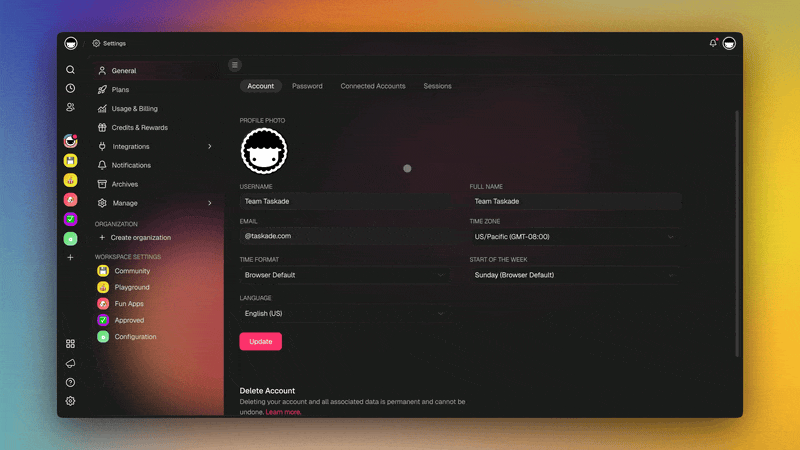
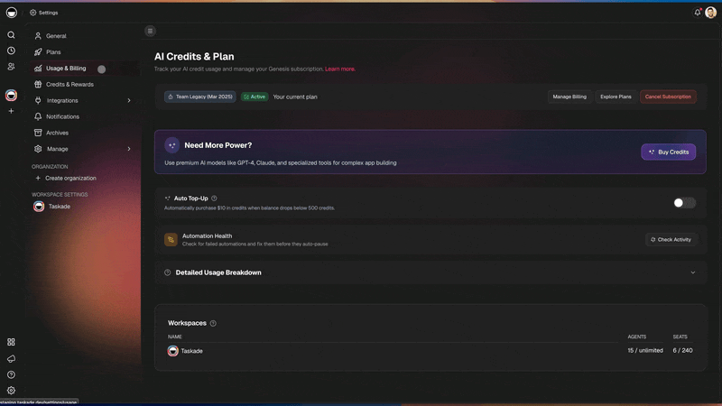
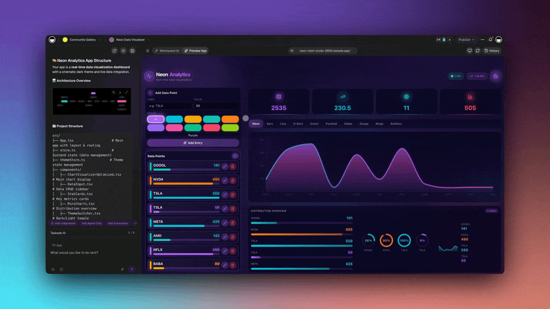

# Credits & Billing

Understand how AI credits work in Taskade, how credit packs are priced, and how Auto Top-Up keeps your workflows running.

***

## Table of Contents

* [How AI Credits Work](credits-and-billing.md#how-ai-credits-work)
* [Free Credits](credits-and-billing.md#free-credits)
* [Paid Plan Credits](credits-and-billing.md#paid-plan-credits)
* [Credit Packs](credits-and-billing.md#credit-packs)
* [Auto Top-Up](credits-and-billing.md#auto-top-up)
* [Model-Specific Pricing](credits-and-billing.md#model-specific-pricing)
* [Viewing Your Usage](credits-and-billing.md#viewing-your-usage)
* [What Happens When You Run Out](credits-and-billing.md#what-happens-when-you-run-out)
* [FAQ](credits-and-billing.md#faq)
* [Related](credits-and-billing.md#related)

***

## How AI Credits Work

Every AI request in Taskade — prompting an agent, running an automation with AI, generating a Genesis app — consumes credits. The credit cost depends on the model:

* **Lightweight models** cost fewer credits per request.
* **Frontier models** (top-tier reasoning models) cost more.
* **Auto mode** picks a model based on your plan tier and the complexity of the task.

Business-plan users and above get auto-routing to top-tier frontier models, so you don't need to manually pick the right model for each task.

***

## Free Credits

Every user — including free-tier — gets a baseline allocation of AI credits to explore Taskade's AI features.

* Free-tier users can purchase additional credits directly without upgrading to a paid plan.
* Advanced AI features are accessible to everyone, not just paid plans.


Exact free-tier allocation may change. Check the [pricing page](https://www.taskade.com/pricing) for current numbers.


***

## Paid Plan Credits

Paid plans include monthly premium credits that reset on your billing cycle.

| Plan tier  | Monthly credits                                            | Key benefit                   |
| ---------- | ---------------------------------------------------------- | ----------------------------- |
| Pro        | Premium monthly allowance                                  | Personal productivity         |
| Business   | Higher monthly allowance + auto-routing to frontier models | Team use, complex AI tasks    |
| Max        | Higher allowance with headroom for bursty AI workloads     | Heavy generation, large teams |
| Enterprise | Custom allowance + admin controls                          | Organization-wide deployments |


Exact credit amounts per tier may change. See the [pricing page](https://www.taskade.com/pricing) for current allocations.


Max and Enterprise plans get refined credit limits designed for bursty workloads — you won't get throttled mid-task during a heavy generation run.

***

## Credit Packs

Credit packs are one-time purchases on top of your monthly allocation.

* **Volume-tiered pricing** — bigger packs come with bigger bonuses.
* **Credits never expire on paid plans** — top up once, use over time.
* Purchases appear in the workspace activity log for audit visibility.

<figure><figcaption></figcaption></figure>

Use packs when you expect a heavy AI month — during a product launch, a big content sprint, or a large Genesis app build.

***

## Auto Top-Up

Auto Top-Up prevents you from running out of credits in the middle of a workflow.

### How It Works

1. Set a **minimum balance threshold** (e.g., 500 credits).
2. Set a **top-up amount** (e.g., 5,000 credits).
3. When your balance drops below the threshold, Taskade automatically purchases the top-up amount using your stored payment method.

### Setting It Up

1. Go to **Settings** → **Billing** → **Credits**.
2. Toggle **Auto Top-Up** on.
3. Enter your minimum balance and top-up amount.
4. Confirm your payment method.

<figure><figcaption></figcaption></figure>


Auto Top-Up charges your payment method automatically when triggered. Set a reasonable threshold and top-up amount to match your expected usage.


Auto Top-Up is available on all plans that support AI credits.

***

## Model-Specific Pricing

Each AI model has its own credit cost per request. Pricing is adjusted periodically to track provider costs — Claude Sonnet 4.6 is priced at 110 credits per request, for example.

* You can see the current per-model credit cost in the model picker before selecting a model.
* Auto mode uses plan-aware routing to pick a cost-appropriate model for each request.
* For the authoritative current list, check the in-app model picker.

***

## Viewing Your Usage

Taskade surfaces credit usage in several places.

* **Usage page** in your account settings shows monthly credit consumption.
* **Workspace activity log** records every credit pack purchase.
* **Per-agent usage analytics** show which agents consume the most credits.
* **Automation run reports** show credits used per run.

<figure><figcaption></figcaption></figure>

***

## What Happens When You Run Out

Taskade never silently fails an AI request due to insufficient credits.

* **Paid users**: You're routed to the upgrade or credit-pack screen.
* **Free users**: You're prompted to upgrade or buy a pack.
* **Out-of-credits error** surfaces cleanly in the UI — no mysterious silent drops.


Public agent visitors never see internal billing errors. If your app's agent runs out of credits, external users see a neutral error message, not billing details.


***

## FAQ

Do credits expire?

On paid plans, purchased credit packs don't expire. Monthly premium credits reset each billing cycle. Free-tier rules may differ — check the pricing page for current policy.

Can I refund unused credits?

Refund policies vary. Contact support for case-by-case review.

Does Auto Top-Up have a spending cap?

Auto Top-Up only triggers when your balance drops below your chosen threshold. The cap is effectively controlled by how often you hit that threshold. Monitor your usage page during the first month to tune the settings.

Which models use the fewest credits?

Lightweight models have the lowest per-request cost. The model picker shows current pricing for each available model.

Does a Genesis app clone cost me credits?

Cloning a Genesis app does not consume credits on its own. AI usage inside the cloned app consumes credits normally.

***

## Related


[.](./)



[ai-features](../genesis-living-system-builder/ai-features/)

