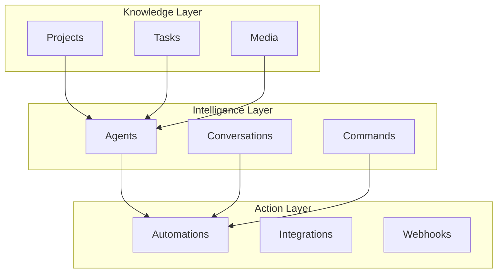

# Taskade Developer API

Welcome to the Taskade Developer API documentation. This is your gateway to building powerful applications on top of Taskade's AI-powered platform.

## Overview

The Taskade API provides programmatic access to all core platform features:

- **🏢 [Workspaces](workspaces/README.md)** - Manage organizations and team spaces
- **📁 [Apps (Subspaces)](folders/README.md)** - Create and manage application containers
- **📊 [Knowledge (Projects)](projects/README.md)** - Structure and organize your data
- **🤖 [Intelligence (Agents)](agents/README.md)** - Build AI-powered reasoning systems
- **⚡ [Action (Automations)](automations/README.md)** - Connect and automate workflows
- **📋 [Tasks](tasks/README.md)** - Manage individual work items
- **📁 [Media](media/README.md)** - Handle files and attachments
- **👤 [Me](me/README.md)** - Access user profile and preferences

## Getting Started

### 1. **Authentication**
All API requests require authentication. Get started with:
- **[Authentication Guide](../start/authentication.md)**
- **[Personal Access Tokens](../start/personal-tokens.md)**

### 2. **Base URL**
All API requests are made to:
```
https://www.taskade.com/api/v1/
```

### 3. **Your First Request**
Try fetching your workspaces:

```bash
curl -X GET "https://www.taskade.com/api/v1/workspaces" \
  -H "Authorization: Bearer YOUR_TOKEN"
```

## API Architecture

### Three-Layer System

The Taskade API follows our three-layer architecture:



### RESTful Design

Our API follows REST principles:
- **GET** - Retrieve data
- **POST** - Create new resources
- **PUT** - Update existing resources
- **DELETE** - Remove resources

### Response Format

All responses are in JSON format:

```json
{
  "success": true,
  "data": {
    // Response data here
  },
  "meta": {
    "total": 100,
    "page": 1,
    "limit": 20
  }
}
```

### Role-based Permissions

Every request is authorized against Taskade’s two-layer RBAC system.  The primary workspace roles are **Owner**, **Collaborator**, **Participant**, and **Viewer**.  Additional document-level roles provide finer control without exposing implementation details.  If a user lacks sufficient role privileges the API returns **403 Forbidden**.

## Common Patterns

### Building an AI-Powered App

1. **Create a Workspace** - Your app's container
2. **Set up Projects** - Structure your data
3. **Deploy Agents** - Add intelligence
4. **Configure Automations** - Connect to external services
5. **Test and Iterate** - Refine your application

### Example: Customer Support System

```bash
# 1. Create a project for tickets
curl -X POST "https://www.taskade.com/api/v1/projects" \
  -H "Authorization: Bearer YOUR_TOKEN" \
  -d '{"name": "Support Tickets", "template": "support_template"}'

# 2. Create an AI agent for categorization
curl -X POST "https://www.taskade.com/api/v1/agents" \
  -H "Authorization: Bearer YOUR_TOKEN" \
  -d '{"name": "Support Agent", "role": "categorize_tickets"}'

# 3. Set up automation for new tickets
curl -X POST "https://www.taskade.com/api/v1/automations" \
  -H "Authorization: Bearer YOUR_TOKEN" \
  -d '{"trigger": "form_submitted", "actions": [...]}'
```

## Rate Limits

To ensure fair usage, we implement rate limits:

- **Standard**: 1,000 requests per hour
- **Premium**: 5,000 requests per hour
- **Enterprise**: Custom limits available

Rate limit headers are included in all responses:
```
X-RateLimit-Limit: 1000
X-RateLimit-Remaining: 999
X-RateLimit-Reset: 1640995200
```

## Error Handling

### HTTP Status Codes

- **200** - Success
- **201** - Created
- **400** - Bad Request
- **401** - Unauthorized
- **403** - Forbidden
- **404** - Not Found
- **429** - Rate Limited
- **500** - Internal Server Error

### Error Response Format

```json
{
  "success": false,
  "error": {
    "code": "INVALID_TOKEN",
    "message": "The provided token is invalid or expired",
    "details": {
      "field": "authorization",
      "reason": "token_expired"
    }
  }
}
```

## Webhooks

Receive real-time notifications about events in your applications:

```json
{
  "event": "task.created",
  "data": {
    "task": {
      "id": "task_123",
      "title": "New support ticket",
      "project_id": "proj_456"
    }
  },
  "timestamp": "2024-01-15T10:30:00Z"
}
```

## SDKs and Libraries

### Official SDKs
- **JavaScript/TypeScript** - `npm install @taskade/sdk`
- **Python** - `pip install taskade-sdk`
- **Go** - `go get github.com/taskade/go-sdk`

### Community Libraries
- **PHP** - Community-maintained
- **Ruby** - Community-maintained
- **Java** - Community-maintained

## Best Practices

### Security
- Always use HTTPS
- Store tokens securely
- Implement proper error handling
- Use webhook signatures for validation

### Performance
- Implement caching where appropriate
- Use pagination for large datasets
- Batch requests when possible
- Monitor rate limits

### Development
- Use the sandbox environment for testing
- Implement proper logging
- Handle errors gracefully
- Keep your SDK updated

## Support and Resources

### Documentation
- **[OpenAPI Specification](https://www.taskade.com/api/documentation/static/index.html#/)**
- **[Postman Collection](https://www.postman.com/taskade-api)**
- **[Code Examples](https://github.com/taskade/api-examples)**

### Community
- **[Developer Forum](https://taskade.com/community)**
- **[Discord Server](https://discord.gg/taskade)**
- **[GitHub Issues](https://github.com/taskade/api-issues)**

### Direct Support
- **Email**: api@taskade.com
- **Enterprise Support**: Available for business customers
- **Status Page**: [status.taskade.com](https://status.taskade.com)

---

## Quick Links

- **[🚀 Getting Started](../start/authentication.md)**
- **[🏢 Workspaces API](workspaces/README.md)**
- **[📊 Projects API](projects/README.md)**
- **[🤖 Agents API](agents/README.md)**
- **[⚡ Automations API](automations/README.md)**

> **Need help getting started?**  
> → [Join our developer community](https://taskade.com/community)

> **Want to see examples?**  
> → [Browse our code samples](https://github.com/taskade/api-examples) 