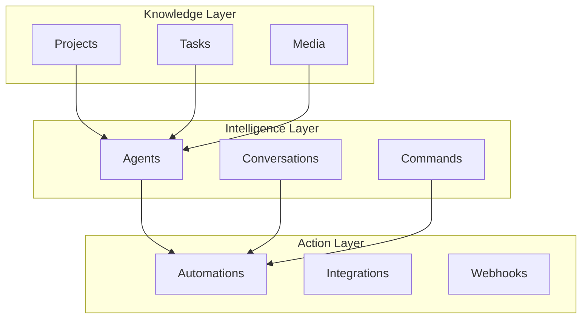

# Taskade Developer API

Welcome to the Taskade Developer API documentation. This is your gateway to building powerful applications on top of Taskade's AI-powered platform.

## Overview

The Taskade API provides programmatic access to all core platform features:

- **🏢 [Workspaces](workspaces/README.md)** - Manage organizations and team spaces
- **📁 [Apps (Subspaces)](folders/README.md)** - Create and manage application containers
- **📊 [Knowledge (Projects)](projects/README.md)** - Structure and organize your data
- **🤖 [Intelligence (Agents)](agents/README.md)** - Build AI-powered reasoning systems
- **⚡ [Action (Automations)](automations/README.md)** - Connect and automate workflows
- **📋 [Tasks](tasks/README.md)** - Manage individual work items
- **📁 [Media](media/README.md)** - Handle files and attachments
- **👤 [Me](me/README.md)** - Access user profile and preferences

## Getting Started

### 1. **Authentication**
All API requests require authentication. Get started with:
- **[Authentication Guide](../start/authentication.md)**
- **[Personal Access Tokens](../start/personal-tokens.md)**

### 2. **Base URL**
All API requests are made to:
```
https://www.taskade.com/api/v1/
```

### 3. **Your First Request**
Try fetching your workspaces:

```bash
curl -X GET "https://www.taskade.com/api/v1/workspaces" \
  -H "Authorization: Bearer YOUR_TOKEN"
```

## API Architecture

### Three-Layer System

The Taskade API follows our three-layer architecture:



### RESTful Design

Our API follows REST principles:
- **GET** - Retrieve data
- **POST** - Create new resources
- **PUT** - Update existing resources
- **DELETE** - Remove resources

### Response Format

All responses are in JSON format:

```json
{
  "success": true,
  "data": {
    // Response data here
  },
  "meta": {
    "total": 100,
    "page": 1,
    "limit": 20
  }
}
```

### Role-based Permissions

Every request is authorized against Taskade’s two-layer RBAC system.  The primary workspace roles are **Owner**, **Collaborator**, **Participant**, and **Viewer**.  Additional document-level roles provide finer control without exposing implementation details.  If a user lacks sufficient role privileges the API returns **403 Forbidden**.

## Common Patterns

### Building an AI-Powered App

1. **Create a Workspace** - Your app's container
2. **Set up Projects** - Structure your data
3. **Deploy Agents** - Add intelligence
4. **Configure Automations** - Connect to external services
5. **Test and Iterate** - Refine your application

### Example: Customer Support System

```bash
# 1. Create a project for tickets
curl -X POST "https://www.taskade.com/api/v1/projects" \
  -H "Authorization: Bearer YOUR_TOKEN" \
  -d '{"name": "Support Tickets", "template": "support_template"}'

# 2. Create an AI agent for categorization
curl -X POST "https://www.taskade.com/api/v1/agents" \
  -H "Authorization: Bearer YOUR_TOKEN" \
  -d '{"name": "Support Agent", "role": "categorize_tickets"}'

# 3. Set up automation for new tickets
curl -X POST "https://www.taskade.com/api/v1/automations" \
  -H "Authorization: Bearer YOUR_TOKEN" \
  -d '{"trigger": "form_submitted", "actions": [...]}'
```

## Rate Limits

To ensure fair usage, we implement rate limits:

- **Standard**: 1,000 requests per hour
- **Premium**: 5,000 requests per hour
- **Enterprise**: Custom limits available

Rate limit headers are included in all responses:
```
X-RateLimit-Limit: 1000
X-RateLimit-Remaining: 999
X-RateLimit-Reset: 1640995200
```

## Error Handling

### HTTP Status Codes

- **200** - Success
- **201** - Created
- **400** - Bad Request
- **401** - Unauthorized
- **403** - Forbidden
- **404** - Not Found
- **429** - Rate Limited
- **500** - Internal Server Error

### Error Response Format

```json
{
  "success": false,
  "error": {
    "code": "INVALID_TOKEN",
    "message": "The provided token is invalid or expired",
    "details": {
      "field": "authorization",
      "reason": "token_expired"
    }
  }
}
```

## Webhooks

Receive real-time notifications about events in your applications:

```json
{
  "event": "task.created",
  "data": {
    "task": {
      "id": "task_123",
      "title": "New support ticket",
      "project_id": "proj_456"
    }
  },
  "timestamp": "2024-01-15T10:30:00Z"
}
```

## SDKs and Libraries

### Official SDKs
- **JavaScript/TypeScript** - `npm install @taskade/sdk`
- **Python** - `pip install taskade-sdk`
- **Go** - `go get github.com/taskade/go-sdk`

### Community Libraries
- **PHP** - Community-maintained
- **Ruby** - Community-maintained
- **Java** - Community-maintained

## Enterprise API Features

### **SSO & Authentication Management**

**SAML Configuration Endpoints**
```bash
# Configure SAML identity provider
POST /api/v1/workspaces/{workspaceId}/auth/saml/configure
{
  "provider": "google|azure|okta|generic",
  "metadata_url": "https://idp.example.com/metadata",
  "certificate": "-----BEGIN CERTIFICATE-----...",
  "attribute_mapping": {
    "email": "http://schemas.xmlsoap.org/ws/2005/05/identity/claims/emailaddress",
    "name": "http://schemas.xmlsoap.org/ws/2005/05/identity/claims/name"
  }
}

# Test SSO configuration
POST /api/v1/workspaces/{workspaceId}/auth/saml/test
{
  "test_user_email": "admin@company.com"
}
```

**SCIM User Provisioning**
```bash
# Get SCIM configuration
GET /api/v1/workspaces/{workspaceId}/scim/config

# Provision user via SCIM
POST /api/v1/workspaces/{workspaceId}/scim/users
{
  "userName": "john.doe@company.com",
  "name": {
    "givenName": "John",
    "familyName": "Doe"
  },
  "emails": [{"value": "john.doe@company.com", "primary": true}],
  "active": true,
  "groups": ["sales", "managers"]
}
```

### **Advanced Workspace Management**

**Audit Logs API**
```bash
# Get audit logs with filtering
GET /api/v1/workspaces/{workspaceId}/audit-logs?
  start_date=2024-01-01&
  end_date=2024-01-31&
  event_type=user_action&
  user_id=user123&
  limit=100

Response:
{
  "logs": [
    {
      "id": "log_12345",
      "timestamp": "2024-01-15T10:30:00Z",
      "event_type": "project_created",
      "user_id": "user_123",
      "user_email": "john@company.com",
      "resource_type": "project",
      "resource_id": "proj_456",
      "details": {
        "project_name": "Q1 Planning",
        "folder_id": "folder_789"
      },
      "ip_address": "192.168.1.100",
      "user_agent": "Mozilla/5.0..."
    }
  ],
  "total": 1250,
  "has_more": true
}
```

**Compliance & Reporting**
```bash
# Generate compliance report
POST /api/v1/workspaces/{workspaceId}/reports/compliance
{
  "report_type": "gdpr|sox|hipaa",
  "date_range": {
    "start": "2024-01-01",
    "end": "2024-03-31"
  },
  "include_sections": ["data_access", "user_activity", "security_events"]
}

# Get data export for user (GDPR)
GET /api/v1/workspaces/{workspaceId}/users/{userId}/data-export

# Request data deletion (Right to be Forgotten)
POST /api/v1/workspaces/{workspaceId}/users/{userId}/delete-request
{
  "confirmation": "I confirm deletion of all user data",
  "retain_anonymous_analytics": false
}
```

### **Advanced Security Controls**

**IP Restrictions Management**
```bash
# Configure IP allowlist
PUT /api/v1/workspaces/{workspaceId}/security/ip-restrictions
{
  "enabled": true,
  "allowed_ranges": [
    "192.168.1.0/24",
    "10.0.0.0/8",
    "203.0.113.0/24"
  ],
  "block_vpn": true,
  "emergency_access_emails": ["admin@company.com"]
}
```

**Session Management**
```bash
# Get active sessions for user
GET /api/v1/users/{userId}/sessions

# Revoke all sessions for user
DELETE /api/v1/users/{userId}/sessions

# Configure session policies
PUT /api/v1/workspaces/{workspaceId}/security/session-policy
{
  "max_session_duration": 28800, // 8 hours in seconds
  "idle_timeout": 3600, // 1 hour in seconds
  "concurrent_sessions_limit": 3,
  "require_reauth_for_sensitive": true
}
```

### **Analytics & Business Intelligence**

**Workspace Analytics**
```bash
# Get workspace usage metrics
GET /api/v1/workspaces/{workspaceId}/analytics/usage?
  period=30d&
  metrics=active_users,projects_created,ai_usage,storage_used

Response:
{
  "period": "30d",
  "metrics": {
    "active_users": {
      "current": 145,
      "previous": 132,
      "change_percent": 9.8
    },
    "projects_created": {
      "current": 89,
      "previous": 76,
      "change_percent": 17.1
    },
    "ai_usage": {
      "total_requests": 15420,
      "unique_users": 98,
      "top_features": ["agents", "automation", "content_generation"]
    },
    "storage_used": {
      "bytes": 5368709120,
      "formatted": "5.0 GB",
      "limit": 107374182400
    }
  }
}
```

**Team Performance Metrics**
```bash
# Get team productivity insights
GET /api/v1/workspaces/{workspaceId}/analytics/team-performance?
  team_id=team_123&
  period=30d

Response:
{
  "team_metrics": {
    "task_completion_rate": 0.87,
    "average_project_duration": 12.5, // days
    "collaboration_score": 8.2, // out of 10
    "ai_adoption_rate": 0.76,
    "top_performers": [
      {"user_id": "user_123", "score": 9.1},
      {"user_id": "user_456", "score": 8.8}
    ],
    "improvement_areas": [
      "project_planning",
      "deadline_management"
    ]
  }
}
```

**Custom Dashboard API**
```bash
# Create custom dashboard
POST /api/v1/workspaces/{workspaceId}/dashboards
{
  "name": "Executive Dashboard",
  "widgets": [
    {
      "type": "metric",
      "config": {
        "metric": "active_users",
        "period": "7d",
        "comparison": true
      }
    },
    {
      "type": "chart",
      "config": {
        "chart_type": "line",
        "metrics": ["projects_created", "tasks_completed"],
        "period": "30d"
      }
    }
  ],
  "refresh_interval": 3600, // 1 hour
  "access_control": {
    "roles": ["admin", "manager"],
    "users": ["exec@company.com"]
  }
}
```

## Best Practices

### Security
- Always use HTTPS
- Store tokens securely
- Implement proper error handling
- Use webhook signatures for validation
- Enable audit logging for compliance
- Implement IP restrictions for sensitive operations

### Performance
- Implement caching where appropriate
- Use pagination for large datasets
- Batch requests when possible
- Monitor rate limits

### Development
- Use the sandbox environment for testing
- Implement proper logging
- Handle errors gracefully
- Keep your SDK updated

## Support and Resources

### Documentation
- **[OpenAPI Specification](https://www.taskade.com/api/documentation/static/index.html#/)**
- **[Postman Collection](https://www.postman.com/taskade-api)**
- **[Code Examples](https://github.com/taskade/api-examples)**

### Community
- **[Developer Forum](https://taskade.com/community)**
- **[Discord Server](https://discord.gg/taskade)**
- **[GitHub Issues](https://github.com/taskade/api-issues)**

### Direct Support
- **Email**: api@taskade.com
- **Enterprise Support**: Available for business customers
- **Status Page**: [status.taskade.com](https://status.taskade.com)

---

## Quick Links

- **[🚀 Getting Started](../start/authentication.md)**
- **[🏢 Workspaces API](workspaces/README.md)**
- **[📊 Projects API](projects/README.md)**
- **[🤖 Agents API](agents/README.md)**
- **[⚡ Automations API](automations/README.md)**

> **Need help getting started?**  
> → [Join our developer community](https://taskade.com/community)

> **Want to see examples?**  
> → [Browse our code samples](https://github.com/taskade/api-examples) 