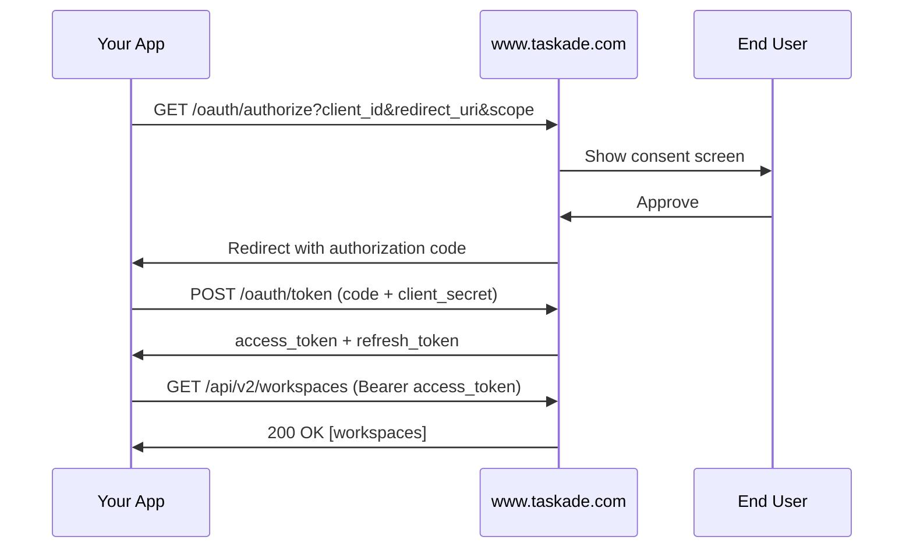

# Public API v2 Reference

The Public API v2 launched in 2026 with cleaner response formats, improved pagination, and better error messages. This page documents the endpoints most integrators reach for first.


**v1 still works.** v2 runs side-by-side with v1 so existing integrations continue to function. New integrations should target v2.


## Table of Contents

- [Base URL & Authentication](#base-url--authentication)
- [OAuth 2.0 Flow](#oauth-20-flow)
- [Endpoints](#endpoints)
- [Rate Limits](#rate-limits)
- [Pagination](#pagination)
- [Error Handling](#error-handling)
- [Security Best Practices](#security-best-practices)

---

## Base URL & Authentication

All v2 endpoints live under:

```
https://www.taskade.com/api/v2
```

Authenticate with a **Personal Access Token** from [taskade.com/settings/api](https://www.taskade.com/settings/api) or an **OAuth 2.0 access token** for production apps.

```bash
Authorization: Bearer YOUR_TOKEN
```

<figure><figcaption></figcaption></figure>

---

## OAuth 2.0 Flow

For production applications that act on behalf of other users, use OAuth 2.0 instead of a personal token.



Refresh an expired access token by calling `POST /oauth/token` with `grant_type=refresh_token` and the stored refresh token.

---

## Endpoints

### 1. List Workspaces

**`GET /workspaces`** — Every integration's entry point.



```bash
curl https://www.taskade.com/api/v2/workspaces \
  -H "Authorization: Bearer YOUR_TOKEN"
```



```typescript
import { Taskade } from "@taskade/sdk";

const taskade = new Taskade({ token: process.env.TASKADE_TOKEN! });
const workspaces = await taskade.workspaces.list();
console.log(workspaces.items);
```



```python
import requests

response = requests.get(
    "https://www.taskade.com/api/v2/workspaces",
    headers={"Authorization": "Bearer YOUR_TOKEN"},
)
print(response.json()["items"])
```



---

### 2. List Folders in a Workspace

**`GET /workspaces/{workspaceId}/folders`**

```bash
curl https://www.taskade.com/api/v2/workspaces/WORKSPACE_ID/folders \
  -H "Authorization: Bearer YOUR_TOKEN"
```

---

### 3. List Projects in a Folder

**`GET /folders/{folderId}/projects`** — Supports cursor pagination.

```bash
curl "https://www.taskade.com/api/v2/folders/FOLDER_ID/projects?limit=50" \
  -H "Authorization: Bearer YOUR_TOKEN"
```

---

### 4. Get Project

**`GET /projects/{projectId}`** — Returns project structure with blocks.



```bash
curl https://www.taskade.com/api/v2/projects/PROJECT_ID \
  -H "Authorization: Bearer YOUR_TOKEN"
```



```typescript
const project = await taskade.projects.get("PROJECT_ID");
console.log(`Project: ${project.name}, ${project.blocks.length} blocks`);
```



---

### 5. Create Project

**`POST /folders/{folderId}/projects`**

```bash
curl -X POST https://www.taskade.com/api/v2/folders/FOLDER_ID/projects \
  -H "Authorization: Bearer YOUR_TOKEN" \
  -H "Content-Type: application/json" \
  -d '{
    "name": "Q2 Planning",
    "template": "list"
  }'
```

---

### 6. Create Task

**`POST /projects/{projectId}/tasks/`**



```bash
curl -X POST https://www.taskade.com/api/v2/projects/PROJECT_ID/tasks/ \
  -H "Authorization: Bearer YOUR_TOKEN" \
  -H "Content-Type: application/json" \
  -d '{
    "tasks": [
      { "contentType": "text/markdown", "content": "Review Q2 roadmap" }
    ],
    "placement": "afterbegin"
  }'
```



```typescript
await taskade.tasks.create("PROJECT_ID", {
  tasks: [{ contentType: "text/markdown", content: "Review Q2 roadmap" }],
  placement: "afterbegin",
});
```



**Placement values:** `afterbegin` (top), `beforeend` (bottom).

---

### 7. Prompt an Agent (Agent API)

**`POST /agents/{agentId}/prompt`** — Send a prompt to any workspace agent and receive a synchronous response.



```bash
curl -X POST https://www.taskade.com/api/v2/agents/AGENT_ID/prompt \
  -H "Authorization: Bearer YOUR_TOKEN" \
  -H "Content-Type: application/json" \
  -d '{
    "message": "Summarize yesterday'\''s standup notes",
    "conversationId": "optional-convo-id"
  }'
```



```typescript
const response = await taskade.agents.prompt("AGENT_ID", {
  message: "Summarize yesterday's standup notes",
});
console.log(response.message);
```



**Response:**

```json
{
  "ok": true,
  "conversationId": "convo_abc123",
  "message": "Here's a summary of the standup..."
}
```

Pass `conversationId` from a previous response to continue the same conversation. Conversations persist automatically.

<figure><figcaption></figcaption></figure>

---

### 8. Attach Project Knowledge to an Agent

**`POST /agents/{agentId}/knowledge/project`**

```bash
curl -X POST https://www.taskade.com/api/v2/agents/AGENT_ID/knowledge/project \
  -H "Authorization: Bearer YOUR_TOKEN" \
  -H "Content-Type: application/json" \
  -d '{ "projectId": "PROJECT_ID" }'
```

Now the agent has the project as a grounded knowledge source.

---

### 9. Create Webhook

**`POST /webhooks`** — Subscribe to workspace events.

```bash
curl -X POST https://www.taskade.com/api/v2/webhooks \
  -H "Authorization: Bearer YOUR_TOKEN" \
  -H "Content-Type: application/json" \
  -d '{
    "url": "https://your-app.com/taskade-webhook",
    "events": ["task.created", "task.completed"]
  }'
```

See the [Webhooks guide](webhooks.md) for event types and signature verification.

---

### 10. Update Task

**`PUT /projects/{projectId}/tasks/{taskId}`** — Edit task content, completion, or placement.

```bash
curl -X PUT https://www.taskade.com/api/v2/projects/PROJECT_ID/tasks/TASK_ID \
  -H "Authorization: Bearer YOUR_TOKEN" \
  -H "Content-Type: application/json" \
  -d '{ "content": "Updated task text", "completed": true }'
```

---

## Rate Limits

API requests are rate-limited per token.

| Response | Meaning | Action |
| --- | --- | --- |
| `429 Too Many Requests` | You exceeded the rate limit | Respect the `Retry-After` header |
| `Retry-After: 30` | Wait 30 seconds before retrying | Use exponential backoff |

**Recommended retry strategy:**

```typescript
async function withRetry<T>(fn: () => Promise<T>, retries = 3): Promise<T> {
  for (let i = 0; i < retries; i++) {
    try {
      return await fn();
    } catch (err: any) {
      if (err.status === 429 && i < retries - 1) {
        const wait = 2 ** i * 1000;
        await new Promise(r => setTimeout(r, wait));
        continue;
      }
      throw err;
    }
  }
  throw new Error("Retry exhausted");
}
```

---

## Pagination

List endpoints use **cursor-based pagination**:

```json
{
  "items": [ /* ... */ ],
  "nextCursor": "eyJpZCI6InByb2pfMTIzIn0="
}
```

Pass `?cursor=<nextCursor>` to get the next page. No `nextCursor` in the response means you're on the last page.

```typescript
let cursor: string | undefined;
do {
  const page = await taskade.projects.list({ folderId, cursor, limit: 50 });
  for (const project of page.items) {
    console.log(project.name);
  }
  cursor = page.nextCursor;
} while (cursor);
```

---

## Error Handling

All error responses follow this shape:

```json
{
  "ok": false,
  "message": "Project not found",
  "code": "not_found",
  "statusMessage": "Not Found"
}
```

| Status | Meaning | Retry? | Fix |
| --- | --- | --- | --- |
| 400 | Bad request | No | Check request body |
| 401 | Invalid / missing token | No | Regenerate or refresh token |
| 403 | Insufficient scope | No | Regenerate token with needed scope |
| 404 | Resource not found | No | Verify ID and workspace access |
| 429 | Rate limited | Yes | Exponential backoff |
| 402 | Out of credits | No | Top up or switch to cheaper model |
| 5xx | Server error | Yes | Retry up to 3 times with backoff |


Never retry on `400`, `401`, `403`, or `404`. Fix the request first.


---

## Security Best Practices

- **Never commit tokens.** Use environment variables (`process.env.TASKADE_TOKEN`) or a secret manager.
- **Rotate personal tokens** every 90 days.
- **Use OAuth, not personal tokens**, for multi-user applications.
- **Scope tokens** to the minimum required permissions.
- **Encrypt refresh tokens at rest** — they're long-lived.
- **Verify webhook signatures** on incoming events (see [Webhooks](webhooks.md)).

---

## Related


[sdk-quickstart.md](sdk-quickstart.md)



[sdk-cookbook.md](sdk-cookbook.md)



[authentication.md](developers/authentication.md)



[webhooks.md](webhooks.md)

