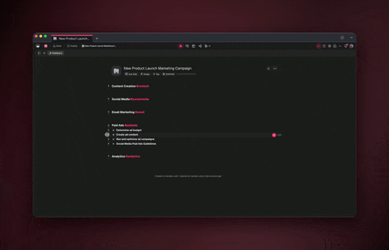
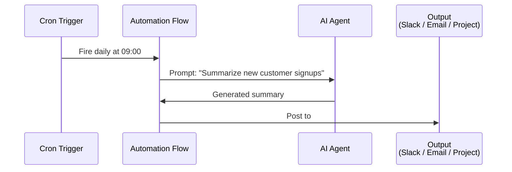
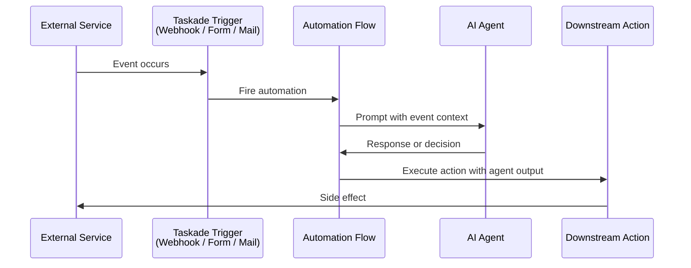
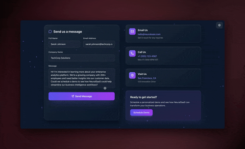
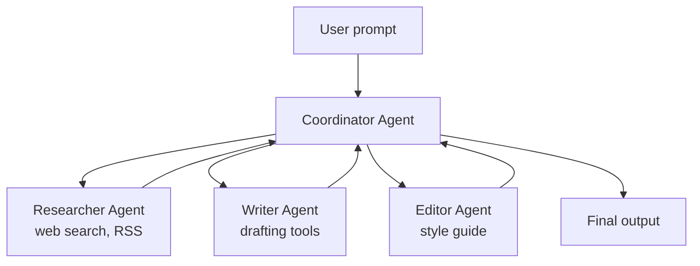
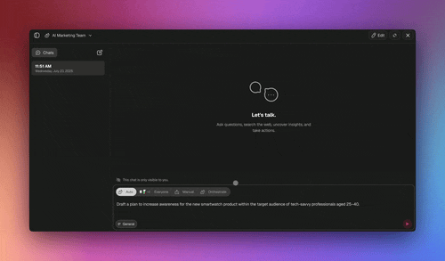

# Autonomous Agents

"Autonomous" in Taskade means agents that run **without a human in the loop for every step.** You have four building blocks to compose these systems: Automations, Orchestration Mode, Cross-Agent Invocation, and Autopilot.

This page is a developer's guide to combining those primitives.

<figure><figcaption></figcaption></figure>

## Table of Contents

- [The Four Building Blocks](#the-four-building-blocks)
- [Pattern: Scheduled Agent Task](#pattern-scheduled-agent-task)
- [Pattern: Event-Triggered Agent](#pattern-event-triggered-agent)
- [Pattern: Multi-Agent Team](#pattern-multi-agent-team)
- [Pattern: Self-Invoking Chain](#pattern-self-invoking-chain)
- [Monitoring and Observability](#monitoring-and-observability)
- [Plan Gating](#plan-gating)
- [Related](#related)

---

## The Four Building Blocks

| Primitive | What it does | When to use |
| --- | --- | --- |
| **Automations** | Trigger-driven workflows (schedule, webhook, form, event) | Most "do this when that happens" use cases |
| **Orchestration Mode** (Agent Teams) | Coordinator agent delegates to specialist agents | Multi-step tasks needing distinct expertise |
| **Cross-Agent Invocation** | An agent calls another agent as a tool | Specialist pipelines without your app orchestrating |
| **Autopilot** | AI-driven execution that self-plans and self-corrects | Open-ended exploratory tasks |

All four are composable. Real systems often combine two or three.

---

## Pattern: Scheduled Agent Task

A time-based trigger fires an automation that prompts an agent and routes the output somewhere.



### Build it

1. In the Automation builder, add a **Schedule** trigger (daily, weekly, cron).
2. Add an **Ask Agent** action and pick your agent.
3. In the prompt, reference trigger data via variables (`{{run.date}}`).
4. Add an output action (Slack, email, create task).

---

## Pattern: Event-Triggered Agent

An external event (webhook, form submission, task completion) fires an agent-driven flow.



### Example: customer feedback triage

1. Webhook trigger receives inbound form submission.
2. Agent classifies sentiment and extracts key topics.
3. Flow routes:
   - Negative + urgent → create a support ticket.
   - Feature request → append to the feedback project.
   - Positive → thank-you email automation.

<figure><figcaption></figcaption></figure>

---

## Pattern: Multi-Agent Team

A coordinator agent delegates work to specialist agents. Each specialist has its own knowledge, tools, and persona.



### Orchestration modes

- **Auto** — Coordinator picks which specialist to delegate to based on the task.
- **Everyone** — Every specialist responds; coordinator synthesizes.
- **Orchestrate** — Coordinator runs a structured handoff plan.

<figure><figcaption></figcaption></figure>

### Programmatic use

```typescript
// Your app prompts the coordinator; the team resolves internally
const result = await taskade.agents.prompt(COORDINATOR_ID, {
  message: "Produce a blog post on our Q2 launch, ready to publish.",
});
```

---

## Pattern: Self-Invoking Chain

An agent can call **another agent as a tool.** This lets specialist pipelines run without your app orchestrating each step.

```typescript
// Agent A is configured with Agent B as a tool.
// Your app only talks to Agent A.

const result = await taskade.agents.prompt(AGENT_A_ID, {
  message: "Research the latest on X and draft a blog outline",
});

// Under the hood:
//   Agent A (coordinator) → calls Agent B (researcher) as a tool
//   Agent B returns findings → Agent A writes the outline
//   A single response returns to your app
```

Cross-agent invocation shifts orchestration inside Taskade. Your app stays simple; agents handle the delegation.

---

## Monitoring and Observability

### Per-run details

Every automation run has a **Run Details** tab showing:

- Step-by-step execution log
- Inputs and outputs per step
- Errors with context
- Agent credits consumed

### Usage analytics

- **Per-agent usage analytics** — see which agents consume the most credits
- **Workspace activity log** — credit pack purchases, configuration changes
- **Automation status badges** — quick visual indicator of health

### Errors that don't retry

Taskade's automation engine distinguishes transient from permanent errors.

- **Transient** (timeouts, 5xx) — auto-retried with backoff.
- **Permanent** (invalid credentials, 400 errors) — fail fast, no retry, notification raised.

This prevents runaway credit spend on a broken connection.

---

## Plan Gating

| Feature | Free | Pro | Business+ |
| --- | --- | --- | --- |
| Automations (basic triggers + actions) | Limited | ✓ | ✓ |
| Multi-agent teams | — | Limited | ✓ |
| Cross-agent invocation | — | ✓ | ✓ |
| Autopilot | — | ✓ | ✓ |
| Hosted MCP v2 (outbound connectors) | — | — | ✓ |


See [pricing](https://www.taskade.com/pricing) for the authoritative gating per plan.


---

## Related


[api-v2-reference.md](api-v2-reference.md)



[sdk-cookbook.md](sdk-cookbook.md)



[long-term-memory.md](long-term-memory.md)



[multi-agents.md](../genesis-living-system-builder/ai-features/multi-agents.md)



[autopilot.md](../genesis-living-system-builder/ai-features/autopilot.md)



[README.md](../genesis-living-system-builder/automation/README.md)

