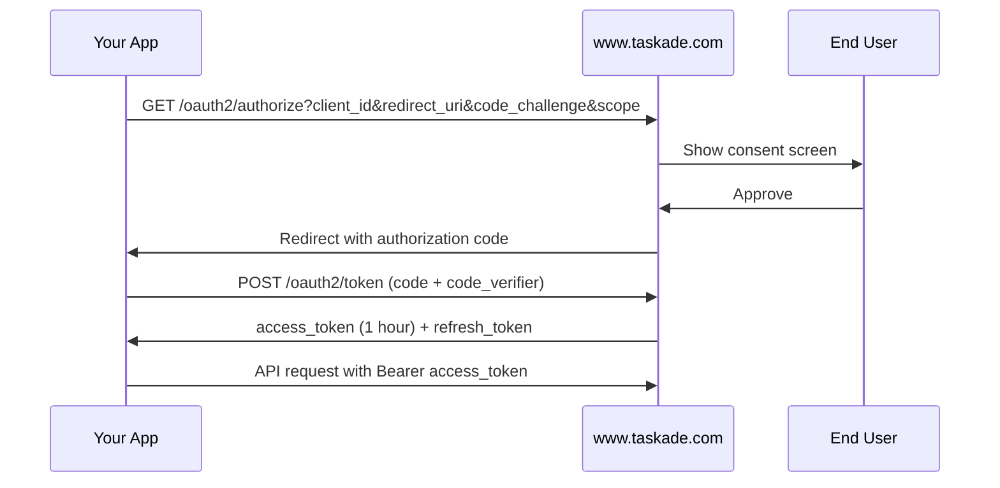

# Authentication

Every Taskade developer surface — the [REST API v1](../comprehensive-api-guide/README.md), the [Action API v2](../api-v2-reference.md), and the [MCP servers](../workspace-mcp.md) — authenticates with a **Bearer token**. There are two kinds you can create.

## Which credential should I use?

| If you are… | Use | How |
| --- | --- | --- |
| Writing a script, or using the SDK / CLI / inbound `@taskade/mcp-server` | **Personal Access Token** | `Authorization: Bearer tskdp_…` |
| Building a third-party app that acts on behalf of other users | **OAuth 2.0** (Authorization Code + PKCE) | Redirect flow |
| Connecting Claude / Cursor to the **hosted** MCP at `taskade.com/mcp` | **OAuth 2.0** | Handled automatically by the MCP client |

---

## Personal Access Tokens

The simplest way to authenticate as yourself. Best for server-to-server scripts, the inbound MCP server, and getting started.

### Create a token

1. Go to [taskade.com/settings/api](https://www.taskade.com/settings/api).
2. Click **Create new token** and give it a descriptive name.
3. Copy the token immediately — it is shown **only once**.

A personal access token starts with the prefix `tskdp_`. You can hold up to **5 tokens** per account, and your email must be verified to create one.


A personal access token grants **full access to your account**. Treat it like a password: never commit it to version control, never share it, and store it in an environment variable or secret manager.


### Use a token

Send it in the `Authorization` header on every request:

```bash
# REST API v1
curl -H "Authorization: Bearer tskdp_your_token" \
     https://www.taskade.com/api/v1/me/projects

# Action API v2
curl -X POST https://www.taskade.com/api/v2/listMyProjects \
     -H "Authorization: Bearer tskdp_your_token" \
     -H "Content-Type: application/json" -d '{}'
```

The inbound MCP server reads it from the `TASKADE_API_KEY` environment variable — see [Workspace MCP](../workspace-mcp.md).

---

## OAuth 2.0

Use OAuth 2.0 when your application acts **on behalf of other users** (so each user signs in and grants access), or when connecting to the hosted MCP endpoint.

### Endpoints

| Purpose | URL |
| --- | --- |
| Authorization | `https://www.taskade.com/oauth2/authorize` |
| Token / Refresh | `https://www.taskade.com/oauth2/token` |
| Dynamic client registration | `https://www.taskade.com/oauth2/register` |
| Server metadata (RFC 8414) | `https://www.taskade.com/.well-known/oauth-authorization-server` |

### Register an application

Go to [taskade.com/settings/api](https://www.taskade.com/settings/api) → **OAuth 2.0 Apps** and register your app to obtain a **Client ID** and **Client Secret**, and to set your redirect URI(s).

### Authorization Code flow (with PKCE)

Taskade supports the **Authorization Code** grant with **PKCE (S256)** — the recommended flow for both confidential and public clients.



1. **Redirect** the user to `/oauth2/authorize` with `client_id`, `redirect_uri`, `response_type=code`, a PKCE `code_challenge` (and `code_challenge_method=S256`), and any `scope`.
2. **Exchange** the returned `code` at `/oauth2/token` (`grant_type=authorization_code`) along with your `code_verifier`. Confidential apps also send `client_secret`; public clients use PKCE only.
3. You receive an **`access_token`** (valid for **1 hour**) and a **`refresh_token`**.

**Generating the PKCE pair** (the step most implementations get wrong):

```bash
# code_verifier: a high-entropy random string
code_verifier=$(openssl rand -base64 96 | tr -d '\n=+/' | cut -c1-64)

# code_challenge = BASE64URL( SHA256(code_verifier) )
code_challenge=$(printf '%s' "$code_verifier" \
  | openssl dgst -binary -sha256 \
  | openssl base64 | tr -d '=\n' | tr '+/' '-_')
```

Send `code_challenge` (with `code_challenge_method=S256`) on the authorize request, then send the original `code_verifier` on the token exchange below.

```bash
curl -X POST https://www.taskade.com/oauth2/token \
  -H "Content-Type: application/x-www-form-urlencoded" \
  -d "grant_type=authorization_code" \
  -d "code=AUTH_CODE" \
  -d "code_verifier=PKCE_VERIFIER" \
  -d "client_id=YOUR_CLIENT_ID" \
  -d "redirect_uri=YOUR_REDIRECT_URI"
```

### Refresh an expired token

Access tokens expire after one hour. Exchange the stored refresh token for a new one:

```bash
curl -X POST https://www.taskade.com/oauth2/token \
  -H "Content-Type: application/x-www-form-urlencoded" \
  -d "grant_type=refresh_token" \
  -d "refresh_token=YOUR_REFRESH_TOKEN" \
  -d "client_id=YOUR_CLIENT_ID"
```


Only `authorization_code` and `refresh_token` grants are supported. `password`, `implicit`, and `client_credentials` are rejected.


### Scopes & the hosted MCP

The hosted MCP server at [taskade.com/mcp](../genesis-app-mcp.md) requires an OAuth token carrying the **`mcp`** scope. MCP clients (Claude Desktop, Cursor, Claude Code) perform this OAuth handshake — including dynamic client registration — automatically when you add the server URL, so you normally don't implement it yourself.

---

## Security Best Practices

- **Never expose tokens in client-side code.** Personal tokens grant full account access.
- **Use OAuth, not personal tokens,** for any app used by more than one person.
- **Store refresh tokens encrypted at rest** — they're long-lived.
- **Rotate personal tokens** periodically; you can keep up to 5 active.
- **Always use HTTPS.**

## Related


[personal-tokens.md](personal-tokens.md)



[Action API v2 Reference](../api-v2-reference.md)

