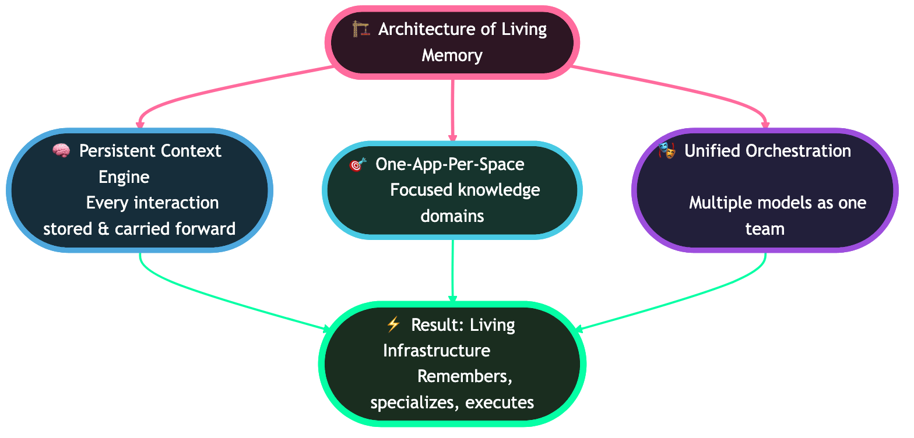
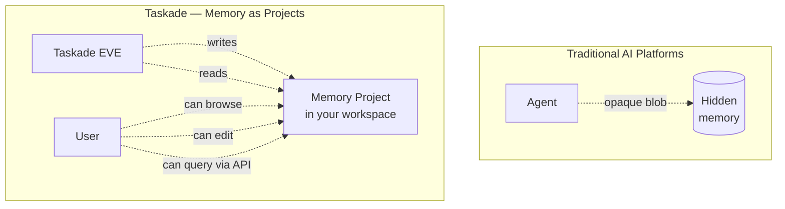
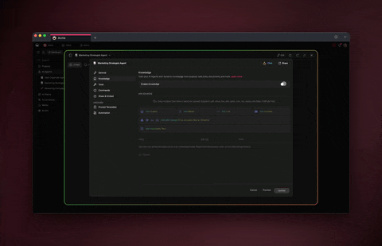

# Long-Term Memory

Taskade EVE's long-term memory **is a Project in your workspace**. Not an opaque blob. You can browse it, edit it, version it, and query it via the Public API — just like any other project.

This architectural choice is what makes Taskade memory transparent, controllable, and composable with the rest of the platform.

<figure><figcaption></figcaption></figure>

## Table of Contents

- [Mental Model — Memory as Projects](#mental-model--memory-as-projects)
- [How EVE Uses Memory](#how-eve-uses-memory)
- [Agent Memory vs EVE Memory](#agent-memory-vs-eve-memory)
- [Model Agnosticism](#model-agnosticism)
- [Inspecting and Editing Memory](#inspecting-and-editing-memory)
- [API Access](#api-access)
- [Privacy and Scoping](#privacy-and-scoping)
- [Best Practices](#best-practices)
- [Related](#related)

---

## Mental Model — Memory as Projects

Most AI platforms store memory in a hidden vector database. You can't see what the agent remembers or correct it directly.

Taskade takes a different approach.



**Why this matters:**

- **Transparency** — you see exactly what EVE remembers.
- **Controllability** — edit or delete memory blocks like any project content.
- **Composability** — use memory as an input to automations, agents, or other apps.
- **Portability** — memory is part of your workspace, not locked in a separate system.

---

## How EVE Uses Memory

EVE is Taskade's meta-agent — the one you talk to when building apps and orchestrating work.

- Memory **persists across sessions.** EVE remembers what you've been working on even after you close and reopen Taskade.
- Memory is **workspace-scoped.** Each workspace has its own EVE memory.
- Memory grows **automatically** as you interact — no manual tagging required.
- EVE runs on the same Workspace DNA (Projects + Agents + Automations) it orchestrates for you.

<figure><figcaption></figcaption></figure>

---

## Agent Memory vs EVE Memory

Taskade has two distinct memory systems. Both use the same architectural principle (memory-as-Projects), but they serve different purposes.

| Dimension | Per-Agent Memory | EVE Workspace Memory |
| --- | --- | --- |
| **Scope** | Single agent | Whole workspace |
| **Persists across** | Conversations with that agent | All sessions and agents |
| **User-editable** | Limited | Full — it's a Project |
| **API addressable** | Via agent endpoints | Via project endpoints |
| **Model support** | All frontier models | All frontier models |
| **Typical use** | Personalized assistant behavior | Cross-session workspace context |

---

## Model Agnosticism

Memory works across every available AI model.

- Persistent memory is **not limited to specific models** — every AI agent supports memory regardless of which model you pick.
- The memory tool is enabled for **all 11+ frontier models** currently integrated with Taskade.
- Switching model (say, from Claude to Gemini) does not reset an agent's memory.

---

## Inspecting and Editing Memory

### Finding the memory project

In your workspace sidebar, look for the project prefixed with **"EVE Memory"** or your agent's memory project (naming varies based on when it was created).

### Editing manually

Open the memory project like any other project. You can:

- **Remove entries** you don't want remembered.
- **Correct facts** EVE got wrong.
- **Add context** manually when you want EVE to know something it hasn't inferred yet.
- **Version** the memory (Taskade's version history applies).


EVE reads from the memory project at each interaction, so your edits take effect immediately in the next conversation.


### Common cleanup patterns

- After a major project pivot, prune outdated assumptions.
- Before sharing a workspace, review EVE memory for anything sensitive.
- Periodically archive resolved context so memory stays focused on current work.

---

## API Access

Because memory is a Project, it's addressable via the Public API.

### Find the memory project

```typescript
import { Taskade } from "@taskade/sdk";

const taskade = new Taskade({ token: process.env.TASKADE_TOKEN! });

const projects = await taskade.projects.list({ workspaceId: WORKSPACE_ID });
const memory = projects.items.find(p => p.name.startsWith("EVE Memory"));
```

### Read memory contents

```typescript
if (memory) {
  const content = await taskade.projects.get(memory.id);
  console.log("EVE remembers:", content.blocks);
}
```

### Attach memory as knowledge to another agent

```typescript
// Give a specialist agent access to workspace context
await taskade.agents.addProjectKnowledge(AGENT_ID, {
  projectId: memory.id,
});
```


Memory projects follow the same schema as any other project: blocks, tasks, metadata. Treat them like a project you happen to read a lot.


---

## Privacy and Scoping

- **Workspace-scoped.** EVE memory does not leak across workspaces.
- **Never in exported bundles.** When you export an app via GitHub or Bundles, memory is not included.
- **Controlled by workspace members.** Anyone with edit access to the workspace can view and modify memory.
- **No external service.** Memory lives in Taskade's infrastructure, not a third-party vector store.

---

## Best Practices

- **Let EVE remember enough to be useful.** Resist the instinct to wipe memory frequently — context compounds.
- **Prune when context drifts.** Major pivots are a good time to review and edit.
- **Use memory as input to automations.** Read memory via the API to personalize triggered flows.
- **Scope sensitive info.** Keep confidential context in a dedicated workspace if you're collaborating with external parties.
- **Document memory assumptions in the project itself.** EVE reads it — so add explicit "please remember that…" notes as project content.

---

## Related


[api-v2-reference.md](api-v2-reference.md)



[sdk-cookbook.md](sdk-cookbook.md)



[autonomous-agents.md](autonomous-agents.md)



[agent-knowledge.md](../genesis-living-system-builder/ai-features/agent-knowledge.md)

