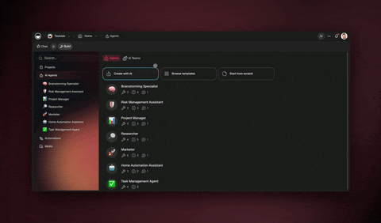

# SDK Cookbook

Production patterns for `@taskade/sdk`. Each recipe is copy-runnable with a valid token.

<figure><figcaption></figcaption></figure>

## Table of Contents

- [Setup & Authentication](#setup--authentication)
- [TypeScript Types](#typescript-types)
- [Agents](#agents)
- [Automations](#automations)
- [Projects & Tasks](#projects--tasks)
- [Webhooks](#webhooks)
- [Bundles (Import/Export)](#bundles-importexport)
- [Error Handling Taxonomy](#error-handling-taxonomy)
- [Pagination](#pagination)
- [Testing & Mocking](#testing--mocking)
- [Related](#related)

---

## Setup & Authentication

### Install

```bash
npm install @taskade/sdk
# or
yarn add @taskade/sdk
```

### Initialize the client

```typescript
import { Taskade } from "@taskade/sdk";

const taskade = new Taskade({ token: process.env.TASKADE_TOKEN! });
```


Never hardcode your token. Use `process.env.TASKADE_TOKEN`, a `.env` file (gitignored), or a secret manager.


### Per-request token override

Useful for multi-tenant apps where each request acts on behalf of a different user:

```typescript
const workspaces = await taskade.workspaces.list({
  token: userAccessToken, // overrides the default
});
```

---

## TypeScript Types

Import types alongside the runtime client for full type safety:

```typescript
import { Taskade } from "@taskade/sdk";
import type { Workspace, Project, Task, Agent } from "@taskade/sdk";

async function findProject(name: string): Promise<Project | undefined> {
  const all = await taskade.projects.list({ workspaceId: "WORKSPACE_ID" });
  return all.items.find(p => p.name === name);
}
```

Use **type guards** on union responses:

```typescript
function isError(resp: unknown): resp is { ok: false; message: string } {
  return typeof resp === "object" && resp !== null && (resp as any).ok === false;
}
```

---

## Agents

### Prompt an agent

```typescript
const response = await taskade.agents.prompt(AGENT_ID, {
  message: "Draft a weekly standup summary from these notes",
});
console.log(response.message);
```

### Continue a conversation

```typescript
const first = await taskade.agents.prompt(AGENT_ID, { message: "Hi" });

const second = await taskade.agents.prompt(AGENT_ID, {
  message: "What did I just say?",
  conversationId: first.conversationId,
});
```


Conversations persist automatically. You can retrieve past conversations via `taskade.agents.listConversations(agentId)` if your app needs history.


### Attach knowledge to an agent

```typescript
// Attach a project as grounded knowledge
await taskade.agents.addProjectKnowledge(AGENT_ID, {
  projectId: "PROJECT_ID",
});

// Or attach uploaded media
await taskade.agents.addMediaKnowledge(AGENT_ID, {
  mediaId: "MEDIA_ID",
});
```

### Handle rate limits with retry

```typescript
import { TaskadeAPIError } from "@taskade/sdk";

async function promptWithRetry(
  agentId: string,
  message: string,
  retries = 3,
) {
  for (let i = 0; i < retries; i++) {
    try {
      return await taskade.agents.prompt(agentId, { message });
    } catch (err) {
      if (err instanceof TaskadeAPIError && err.status === 429) {
        const wait = 2 ** i * 1000;
        await new Promise(r => setTimeout(r, wait));
        continue;
      }
      throw err;
    }
  }
  throw new Error("Rate limit retries exhausted");
}
```

---

## Automations

### Trigger an automation

```typescript
const run = await taskade.automations.run(AUTOMATION_ID, {
  input: { customer: "Acme Corp", plan: "Pro" },
});
console.log(`Run started: ${run.id}`);
```

### Poll run status

```typescript
async function waitForCompletion(runId: string, timeoutMs = 60_000) {
  const start = Date.now();
  while (Date.now() - start < timeoutMs) {
    const run = await taskade.automations.getRun(runId);
    if (run.status === "completed" || run.status === "failed") return run;
    await new Promise(r => setTimeout(r, 2_000));
  }
  throw new Error("Automation run timed out");
}
```


For long-running flows, prefer webhooks over polling — see the [Webhooks](#webhooks) section below.


---

## Projects & Tasks

### Create a project from a template

```typescript
const project = await taskade.projects.create({
  folderId: "FOLDER_ID",
  name: "Q2 Roadmap",
  template: "list",
});
```

### Add tasks with placement

```typescript
await taskade.tasks.create(project.id, {
  tasks: [
    { contentType: "text/markdown", content: "Ship v2 API docs" },
    { contentType: "text/markdown", content: "Write SDK cookbook" },
  ],
  placement: "afterbegin", // or "beforeend"
});
```

### Mark a task complete

```typescript
await taskade.tasks.complete(project.id, taskId);
```

---

## Webhooks

### Subscribe to events

```typescript
await taskade.webhooks.create({
  url: "https://your-app.com/hooks/taskade",
  events: ["task.created", "task.completed", "project.updated"],
});
```

### Verify webhook signatures

Incoming webhook requests include a signature header. Verify it before trusting the payload:

```typescript
import crypto from "node:crypto";

function verifyTaskadeWebhook(
  rawBody: string,
  signature: string,
  secret: string,
): boolean {
  const expected = crypto
    .createHmac("sha256", secret)
    .update(rawBody)
    .digest("hex");
  return crypto.timingSafeEqual(
    Buffer.from(signature),
    Buffer.from(expected),
  );
}
```


Always verify signatures on production webhooks. Otherwise an attacker can spoof events to your endpoint.


### Idempotency

Event delivery may retry. Use the `delivery_id` header to deduplicate:

```typescript
const processed = new Set<string>();

app.post("/hooks/taskade", (req, res) => {
  const deliveryId = req.headers["x-taskade-delivery-id"] as string;
  if (processed.has(deliveryId)) return res.status(200).end();
  processed.add(deliveryId);
  // ... handle event
  res.status(200).end();
});
```

---

## Bundles (Import/Export)

Export a Genesis app as a portable bundle, then import elsewhere.

```typescript
// Export
const bundle = await taskade.bundles.export(APP_ID);
await fs.writeFile("my-app.bundle.json", JSON.stringify(bundle, null, 2));

// Import into another workspace
const imported = await taskade.bundles.import({
  workspaceId: TARGET_WORKSPACE_ID,
  bundle: JSON.parse(await fs.readFile("my-app.bundle.json", "utf8")),
});
console.log(`Imported as app ${imported.appId}`);
```

---

## Error Handling Taxonomy

The SDK throws `TaskadeAPIError` for HTTP-level errors. Use `err.status` to branch.

```typescript
import { TaskadeAPIError } from "@taskade/sdk";

try {
  await taskade.agents.prompt(AGENT_ID, { message: "..." });
} catch (err) {
  if (err instanceof TaskadeAPIError) {
    switch (err.status) {
      case 401: /* Invalid token — refresh or regenerate */ break;
      case 403: /* Scope missing — regenerate with scope */ break;
      case 404: /* Agent not found */ break;
      case 429: /* Rate limited — retry with backoff */ break;
      case 402: /* Out of credits — top up or switch model */ break;
      case 500:
      case 502:
      case 503: /* Retry with backoff */ break;
      default: throw err;
    }
  } else {
    throw err; // non-API error (network, parse, etc.)
  }
}
```

| err.status | Retry? | Typical Fix |
| --- | --- | --- |
| 400 | No | Fix request body |
| 401 | No | Refresh or regenerate token |
| 402 | No | Top up credits or change model |
| 403 | No | Token needs additional scope |
| 404 | No | Verify ID and workspace access |
| 429 | Yes | Exponential backoff |
| 5xx | Yes | Retry up to 3 times |

---

## Pagination

List endpoints return `{ items, nextCursor }`. Iterate with a simple loop or an async iterator helper.

```typescript
// Manual loop
let cursor: string | undefined;
do {
  const page = await taskade.projects.list({ workspaceId, cursor, limit: 100 });
  for (const project of page.items) {
    console.log(project.name);
  }
  cursor = page.nextCursor;
} while (cursor);

// Async iterator helper
async function* iterateProjects(workspaceId: string) {
  let cursor: string | undefined;
  do {
    const page = await taskade.projects.list({ workspaceId, cursor });
    for (const p of page.items) yield p;
    cursor = page.nextCursor;
  } while (cursor);
}

for await (const project of iterateProjects(workspaceId)) {
  console.log(project.name);
}
```

---

## Testing & Mocking

### Environment-based client

```typescript
// client.ts
import { Taskade } from "@taskade/sdk";

export const taskade =
  process.env.NODE_ENV === "test"
    ? (createMockTaskade() as any)
    : new Taskade({ token: process.env.TASKADE_TOKEN! });
```

### Mock with vitest / jest

```typescript
import { vi } from "vitest";

const taskade = {
  agents: {
    prompt: vi.fn().mockResolvedValue({
      ok: true,
      conversationId: "convo_test",
      message: "mocked response",
    }),
  },
} as any;

// test code using taskade.agents.prompt(...)
```

### Integration tests with a sandbox workspace

Create a dedicated "SDK Test" workspace with a scoped token. Your CI pipeline runs against live API against this isolated workspace — avoiding production pollution while verifying real behavior.

---

## Related


[sdk-quickstart.md](sdk-quickstart.md)



[api-v2-reference.md](api-v2-reference.md)



[webhooks.md](webhooks.md)



[autonomous-agents.md](autonomous-agents.md)

