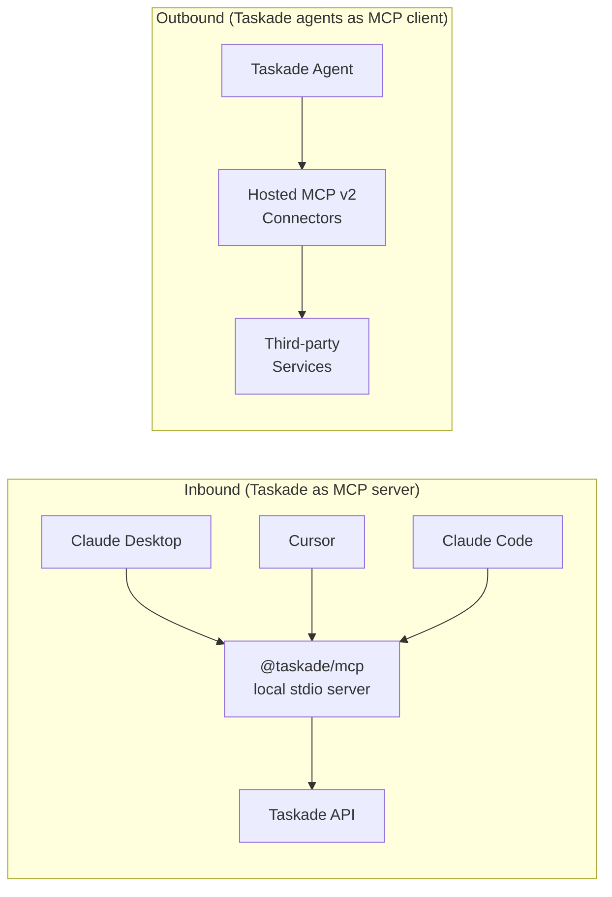
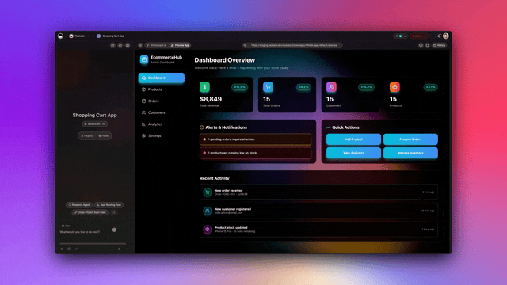

# Workspace MCP — Advanced

This page covers what comes after the basic setup in [Workspace MCP](workspace-mcp.md) — rate limits, running multiple clients at once, the differences between inbound and outbound MCP, troubleshooting, and security.

## Table of Contents

- [Inbound vs Outbound MCP](#inbound-vs-outbound-mcp)
- [Authentication & Token Scoping](#authentication--token-scoping)
- [Rate Limits](#rate-limits)
- [Multi-Client Setup](#multi-client-setup)
- [Plan Gating](#plan-gating)
- [Tool Catalog Details](#tool-catalog-details)
- [MCP Connectors](#mcp-connectors)
- [Troubleshooting](#troubleshooting)
- [Security Best Practices](#security-best-practices)

---

## Inbound vs Outbound MCP

Taskade uses MCP in two directions. Knowing which is which unlocks the right integration pattern.



| Direction | Who uses it | Example | Covered in |
| --- | --- | --- | --- |
| **Inbound** | AI tools like Claude Desktop | "Claude, list my Taskade projects" | [Workspace MCP](workspace-mcp.md) (this page adds advanced config) |
| **Outbound** | Taskade agents | Agent calls a third-party service via MCP | [MCP Connectors](#mcp-connectors) section below |
| **Genesis App MCP** | Genesis app builders | Edit app source from an IDE | [Genesis App MCP (Beta)](genesis-app-mcp.md) |

---

## Authentication & Token Scoping

The inbound MCP server (`@taskade/mcp`) authenticates with a Personal Access Token via the `TASKADE_API_KEY` environment variable.

### Token best practices

- **Scope narrowly.** Create a dedicated token per workspace or per use case rather than reusing one token everywhere.
- **Rotate every 90 days.** Regenerate and update all client configs.
- **Never commit tokens** to version control or share them in chat.
- **Revoke unused tokens** from [taskade.com/settings/api](https://www.taskade.com/settings/api).

### OAuth availability

OAuth 2.0 is available for the Genesis App MCP (which runs hosted at a URL). The local `@taskade/mcp` inbound server currently uses personal tokens only.

---

## Rate Limits

MCP requests share the Taskade API rate limit budget.

| Symptom | Cause | Fix |
| --- | --- | --- |
| Tool call returns `429` | Rate limit exceeded | Implement backoff in your client wrapper |
| Multiple tools failing simultaneously | Token-wide rate limit exhausted | Reduce concurrency; split tokens |
| Slow tool response | Upstream model slowness | Check model pricing tier; auto-mode routes dynamically |

If you hit limits regularly, split your integration across multiple scoped tokens so each has its own budget.

---

## Multi-Client Setup

You can safely run `@taskade/mcp` on Claude Desktop, Cursor, and Claude Code at the same time. Each client spawns its own stdio process — state is isolated server-side per token.

### Claude Desktop

File: `~/Library/Application Support/Claude/claude_desktop_config.json` (macOS)

```json
{
  "mcpServers": {
    "taskade": {
      "command": "npx",
      "args": ["-y", "@taskade/mcp"],
      "env": {
        "TASKADE_API_KEY": "your_api_token_placeholder"
      }
    }
  }
}
```

### Cursor

File: `.cursor/mcp.json` in your project root.

```json
{
  "mcpServers": {
    "taskade": {
      "command": "npx",
      "args": ["-y", "@taskade/mcp"],
      "env": {
        "TASKADE_API_KEY": "your_api_token_placeholder"
      }
    }
  }
}
```

### Claude Code

```bash
claude mcp add taskade npx -- -y @taskade/mcp
# Then set TASKADE_API_KEY in your shell environment
```


Avoid committing these config files to public repos with real tokens. Many teams use environment variable substitution (shell-level) or a secret manager to inject the token at runtime.


---

## Plan Gating

| Feature | Free | Pro | Business | Max / Enterprise |
| --- | --- | --- | --- | --- |
| Inbound MCP (`@taskade/mcp`) | Limited | Limited | Full | Full |
| Hosted MCP v2 (outbound) | — | — | ✓ | ✓ |
| Taskade-as-MCP-server (external clients read workspace) | — | — | ✓ | ✓ |
| Custom domain for MCP | — | — | — | ✓ |


Plan features may evolve. Check the [pricing page](https://www.taskade.com/pricing) for current gating.


---

## Tool Catalog Details

The inbound MCP server exposes ~25 tools. Below are the ones integrators most often need to configure precisely.

### `list_project_tasks`

- **Required args:** `projectId`
- **Optional args:** `limit` (default 50), `cursor`
- **Pagination:** Cursor-based. Call again with returned cursor until no cursor returned.

### `prompt_agent`

- **Required args:** `agentId`, `message`
- **Optional args:** `conversationId`
- **Returns:** `{ conversationId, message, usage }`
- **Conversation persistence:** Passing `conversationId` continues the conversation across calls.

### `upload_media`

- **Required args:** `fileData` (base64), `fileName`, `mimeType`
- **Size limit:** Honors workspace upload limits. Large files may be rejected.

### `export_bundle`

- **Required args:** `appId`
- **Returns:** Full bundle JSON. Can be large — buffer accordingly.

For the complete tool list, see the [Workspace MCP](workspace-mcp.md) reference.

---

## MCP Connectors

Hosted MCP v2 lets your Taskade agents connect **outbound** to third-party services. You browse and enable connectors from the Integrations screen in your workspace — no code, no hosting.

<figure><figcaption></figcaption></figure>

Agents see enabled connectors as tools. You can opt specific tools out per agent (especially useful for public-facing agents).

---

## Troubleshooting

| Symptom | Likely cause | Fix |
| --- | --- | --- |
| "Connection refused" in Claude Desktop | MCP process crashed | Restart Claude Desktop; check `~/Library/Logs/Claude/` |
| "Unauthorized" on every tool | Token invalid or rotated | Regenerate token; update all client configs |
| "Workspace not found" | Token scoped to wrong workspace | Create a token in the right workspace |
| Tools appear but return 429 | Rate limited | Back off; consider splitting tokens |
| Agent invisible in shared workspace | Permission issue (fixed v6.114.1) | Update to latest `@taskade/mcp` |
| OAuth loop (Genesis App MCP) | Expired refresh token | Re-authenticate in the client |
| Tool timeout | Large response or slow upstream | Check upstream; reduce query scope |


Still stuck? File an issue at [github.com/taskade/taskade/issues](https://github.com/taskade/taskade/issues) with MCP logs.


---

## Security Best Practices

- **Audit tool exposure for public agents.** Opt sensitive tools (file access, automation triggers) out of public agent configurations.
- **Use per-workspace tokens.** A leaked personal token is bounded to one workspace if scoped correctly.
- **Rotate on every personnel change.** When a teammate leaves, rotate any shared tokens.
- **Monitor the workspace activity log** for unexpected MCP-initiated actions.
- **Use TLS / custom domain** for Genesis App MCP in production.

---

## Related


[workspace-mcp.md](workspace-mcp.md)



[genesis-app-mcp.md](genesis-app-mcp.md)



[api-v2-reference.md](api-v2-reference.md)

