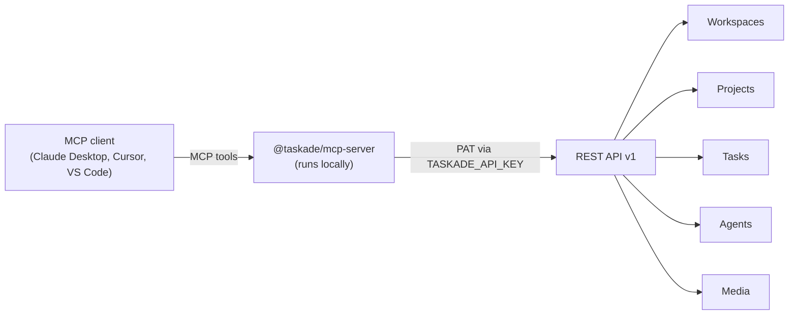

# Workspace MCP

> **Editing Taskade Genesis app source code instead?** See [Hosted MCP — Genesis App (Beta)](genesis-app-mcp.md) for the remote server that writes to your app's source files.

Workspace MCP connects [Claude Desktop](https://claude.ai), [Cursor](https://cursor.sh), [Claude Code](https://claude.com/claude-code), [Windsurf](https://codeium.com/windsurf), [VS Code](https://code.visualstudio.com/), or any MCP-compatible AI tool to your Taskade **workspace content** — workspaces, projects, tasks, agents, and media. It's a small server you run locally that wraps the [REST API v1](comprehensive-api-guide/README.md), so it has full task read/write access.

## What is MCP?

The [Model Context Protocol](https://modelcontextprotocol.io/) lets AI assistants interact with external tools and data sources. The `@taskade/mcp-server` package exposes Taskade's API as MCP tools your AI client can call.

The MCP client talks to a locally run server, which wraps REST API v1 to reach your workspace content.




## Install & run

The server is published as **`@taskade/mcp-server`** on npm. The simplest setup runs it on demand with `npx` — no global install needed:

```bash
npx -y @taskade/mcp-server
```

It authenticates with a [Personal Access Token](developers/authentication.md) supplied via the `TASKADE_API_KEY` environment variable. Get yours from [Settings > API](https://www.taskade.com/settings/api) — this page is Taskade's dedicated programmatic-access hub where you can create and revoke Personal Access Tokens (PATs), manage OAuth 2.0 clients, and configure webhooks.

## Configure Claude Desktop

Add to your Claude Desktop configuration file:

**macOS**: `~/Library/Application Support/Claude/claude_desktop_config.json`
**Windows**: `%APPDATA%\Claude\claude_desktop_config.json`

```json
{
  "mcpServers": {
    "taskade": {
      "command": "npx",
      "args": ["-y", "@taskade/mcp-server"],
      "env": {
        "TASKADE_API_KEY": "your_api_token_placeholder"
      }
    }
  }
}
```

## Configure Cursor

Cursor uses the same configuration shape (in `~/.cursor/mcp.json` or the project's `.cursor/mcp.json`):

```json
{
  "mcpServers": {
    "taskade": {
      "command": "npx",
      "args": ["-y", "@taskade/mcp-server"],
      "env": {
        "TASKADE_API_KEY": "your_api_token_placeholder"
      }
    }
  }
}
```

## HTTP / SSE mode

For clients that connect over HTTP instead of stdio, run the server in HTTP mode:

```bash
TASKADE_API_KEY=your_api_token_placeholder npx @taskade/mcp-server --http
```

The server listens on `http://localhost:3000` (set `PORT` to change it); connect via SSE at `http://localhost:3000/sse?access_token=your_api_token_placeholder`.


HTTP mode accepts the token as a query parameter (`?access_token=…`). Only use this on a trusted local network or behind TLS — never expose it publicly.


## Available Tools

The server exposes **62 tools** across 8 categories. Tool names mirror the [REST API v1](comprehensive-api-guide/README.md) operations the server wraps:

| Area | Tools |
| --- | --- |
| **Workspaces** | `workspacesGet`, `workspaceFoldersGet`, `workspaceCreateProject` |
| **Projects** | `projectGet`, `projectCreate`, `projectCopy`, `projectComplete`, `projectRestore`, `projectMembersGet`, `projectFieldsGet`, `projectShareLinkGet`, `projectShareLinkEnable`, `projectBlocksGet`, `projectTasksGet`, `folderProjectsGet` |
| **Templates** | `folderProjectTemplatesGet`, `projectFromTemplate` |
| **Tasks** | `taskGet`, `taskCreate`, `taskPut`, `taskDelete`, `taskComplete`, `taskUncomplete`, `taskMove`, `taskAssigneesGet`, `taskPutAssignees`, `taskDeleteAssignees`, `taskGetDate`, `taskPutDate`, `taskDeleteDate`, `taskNoteGet`, `taskNotePut`, `taskNoteDelete`, `taskFieldsValueGet`, `taskFieldValueGet`, `taskFieldValuePut`, `taskFieldValueDelete` |
| **Agents** | `folderAgentGenerate`, `folderCreateAgent`, `folderAgentGet`, `agentGet`, `agentUpdate`, `deleteAgent`, `agentKnowledgeProjectCreate`, `agentKnowledgeMediaCreate`, `agentKnowledgeProjectRemove`, `agentKnowledgeMediaRemove`, `agentPublicAccessEnable`, `agentPublicGet`, `agentPublicUpdate`, `agentConvosGet`, `agentConvoGet`, `publicAgentGet` |
| **Media** | `mediasGet`, `mediaGet`, `mediaDelete` |
| **Personal** | `meProjectsGet` |
| **Agent Chat & Webhooks (API v2, beta)** | `promptAgent`, `listConversations`, `getConversation`, `subscribeWebhook`, `unsubscribeWebhook` |


As of v0.1.1 this server also bundles a small **API v2 (beta)** layer — including a **prompt-an-agent** tool (`promptAgent`), agent-chat (`listConversations`, `getConversation`), and webhook subscribe/unsubscribe (`subscribeWebhook`, `unsubscribeWebhook`). The rest of the surface mirrors [REST API v1](comprehensive-api-guide/README.md).


## Example Usage in Claude

Once configured, you can ask Claude to:

- "List all my Taskade workspaces"
- "Create a task in my Sales Pipeline project to follow up with the client"
- "Show me the tasks in my Sales Pipeline project and mark the first one complete"
- "Add a due date of next Friday to task X"

## Plan Availability

As of June 9, 2026, MCP access is included on all paid Taskade plans. Free-plan users can install and connect the server, but listing your workspaces (the `workspacesGet` tool) requires an active paid subscription.

If you hit a gating error, upgrade your plan at [taskade.com/pricing](https://www.taskade.com/pricing) or check your current subscription in your account settings.

## Resources

| Resource | Description |
| --- | --- |
| [github.com/taskade/mcp](https://github.com/taskade/mcp) | MCP server source code and docs |
| [Workspace MCP — Advanced](workspace-mcp-advanced.md) | Multi-client setup, troubleshooting, security |
| [REST API v1 Reference](comprehensive-api-guide/README.md) | The endpoints these tools map to |
