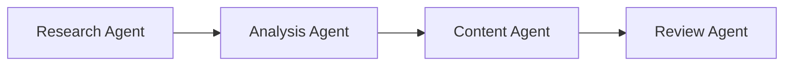
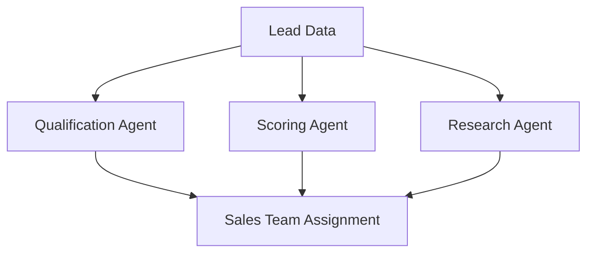

# Best Practices & Optimization Guide

Master the art of building efficient, scalable, and maintainable Taskade workflows. Learn proven strategies for AI agents, automations, and team collaboration.

## Overview


This comprehensive guide covers optimization strategies, performance best practices, and expert techniques for getting the most out of Taskade's AI and automation features.


## AI Agent Optimization

### Knowledge Base Management




#### Upload Strategy

**✅ Best Practices:**
- **Source prioritization**: Start with your most important documents
- **Format optimization**: Use clean, well-structured content
- **Regular updates**: Refresh knowledge quarterly or when processes change
- **Deduplication**: Remove redundant or outdated information

**❌ Avoid:**
- Bulk uploads without review
- Including sensitive/confidential data
- Outdated or inaccurate information
- Poorly formatted documents





#### Effective Training Methods

**Progressive Learning:**
1. **Core concepts first** - Teach fundamental business knowledge
2. **Process documentation** - Include workflow and procedure guides
3. **Context examples** - Provide real scenarios and use cases
4. **Quality assurance** - Test responses and refine training data

**Advanced Techniques:**
- **Contextual training** - Teach situational awareness
- **Role-specific knowledge** - Customize for different user types
- **Feedback integration** - Learn from user corrections
- **Performance monitoring** - Track and improve accuracy




### Prompt Engineering


Well-crafted prompts are the foundation of effective AI interactions. Follow these guidelines for optimal results.


#### Prompt Structure

**Clear Instructions:**
```
"Analyze this customer feedback and categorize it as: Bug Report, Feature Request, or General Feedback. Provide a brief summary and suggested action."
```

**Context Provision:**
```
"Using our company style guide, rewrite this marketing copy to be more engaging while maintaining our brand voice."
```

**Output Formatting:**
```
"Summarize the quarterly sales report in 3 bullet points, focusing on: revenue growth, top products, and customer acquisition."
```

#### Common Prompt Patterns


**Data Analysis:**
- "Compare these two market reports and highlight key differences"
- "Identify trends in this customer feedback data"
- "Summarize the main findings from this research report"

**Content Review:**
- "Review this contract for potential risks and liabilities"
- "Check this content for SEO optimization opportunities"
- "Analyze this code for potential security vulnerabilities"



**Content Creation:**
- "Write a product description for our new software feature"
- "Create a social media post announcing our upcoming event"
- "Draft an email response to this customer inquiry"

**Planning & Strategy:**
- "Create a 30-60-90 day plan for launching this new product"
- "Develop a crisis communication strategy for our company"
- "Design a customer onboarding workflow"


### Agent Architecture

#### Single-Purpose Agents


Specialized agents perform better than general-purpose ones. Each agent should have a clear, focused role.


**Examples:**
- **Customer Support Agent**: Handles inquiries, troubleshooting, documentation
- **Content Marketing Agent**: Creates blog posts, social media, email campaigns
- **Data Analysis Agent**: Processes reports, generates insights, creates visualizations
- **Project Management Agent**: Tracks progress, manages timelines, coordinates teams

#### Multi-Agent Teams

**Coordination Strategies:**

**Sequential Processing:**


**Parallel Processing:**


## Automation Best Practices

### Workflow Design Principles


Well-designed automations are reliable, maintainable, and scalable. Follow these core principles.


#### Single Responsibility

**Each automation should do one thing well:**
- **Data processing** automation: Handle form submissions
- **Notification** automation: Send alerts and updates
- **Content generation** automation: Create reports and summaries
- **Integration** automation: Sync data between systems

#### Error Handling

**Robust error management:**


**Exponential Backoff:**
```yaml
retry_policy:
  max_attempts: 3
  initial_delay: 1s
  multiplier: 2
  max_delay: 60s
```

**Conditional Retries:**
- Retry only on transient errors (network timeouts, rate limits)
- Don't retry on permanent errors (authentication failures, invalid data)
- Log all retry attempts for debugging


#### Monitoring & Alerting

**Key metrics to track:**
- Success/failure rates
- Execution times
- Error patterns
- Resource usage

### Performance Optimization

#### Batch Processing

**Efficient data handling:**



### Identify Batch Opportunities
Look for operations that can be grouped together



### Set Optimal Batch Sizes
Balance speed vs. resource usage (typically 10-50 items)



### Implement Parallel Processing
Process multiple batches simultaneously when possible



### Add Progress Tracking
Monitor completion rates and handle partial failures



#### Caching Strategies

**Smart data reuse:**

**Result Caching:**
- Cache expensive API calls for 15-60 minutes
- Store frequently accessed data in memory
- Implement cache invalidation when data changes

**Configuration Caching:**
- Cache automation settings and mappings
- Store integration credentials securely
- Update cache when configurations change

### Security & Compliance

#### Data Protection


Always prioritize data security and compliance requirements.


**Best Practices:**
- **Encryption**: Use encrypted connections and data storage
- **Access control**: Implement role-based permissions
- **Audit trails**: Log all automation activities
- **Data retention**: Follow retention policies for sensitive data

**Compliance Considerations:**
- **GDPR**: Data subject rights and consent management
- **HIPAA**: Protected health information handling
- **SOX**: Financial data controls and auditability
- **Industry standards**: ISO 27001, SOC 2 compliance

## Team Collaboration Optimization

### Workspace Organization

#### Project Structure

**Scalable organization:**

```
📁 Company Workspace
├── 📁 Active Projects
│   ├── 📁 Product Development
│   ├── 📁 Marketing Campaigns
│   └── 📁 Customer Success
├── 📁 Templates
│   ├── 📁 Project Templates
│   ├── 📁 Process Templates
│   └── 📁 Report Templates
├── 📁 Archives
└── 📁 Team Resources
```

#### Permission Management

**Role-based access:**
- **Viewers**: Read-only access to projects
- **Editors**: Can modify content and structure
- **Admins**: Full control including settings and integrations
- **Custom roles**: Tailored permissions for specific needs

### Communication Strategies

#### Notification Optimization

**Smart alerting:**
- **Urgent notifications**: Immediate alerts for critical issues
- **Summary notifications**: Daily/weekly digests for routine updates
- **Contextual notifications**: Relevant updates based on user roles
- **Quiet hours**: Respect team working hours and time zones

#### Documentation Standards

**Consistent formatting:**
- **Standard templates**: Use approved project and document templates
- **Naming conventions**: Clear, descriptive names for projects and tasks
- **Tagging system**: Consistent use of tags and labels
- **Version control**: Track changes and maintain version history

## Performance Monitoring

### Key Metrics


Track these metrics to ensure optimal performance and identify improvement opportunities.


#### System Performance

| Metric | Target | Action |
|--------|--------|--------|
| Page Load Time | <2 seconds | Optimize content, reduce images |
| Automation Success Rate | >95% | Fix failing automations, improve error handling |
| API Response Time | <500ms | Optimize queries, add caching |
| User Session Duration | >10 minutes | Improve UX, add valuable features |

#### Business Impact

**Productivity Metrics:**
- Tasks completed per day
- Time saved through automation
- Error reduction rates
- User satisfaction scores

**Quality Metrics:**
- Content accuracy rates
- Customer satisfaction scores
- Process compliance rates
- Issue resolution times

### Monitoring Tools

#### Built-in Analytics

**Taskade Dashboard:**
- Usage statistics and trends
- Automation performance metrics
- User activity reports
- System health indicators

#### Integration Monitoring

**External Tools:**
- **Google Analytics**: User behavior and conversion tracking
- **Application monitoring**: Performance and error tracking
- **Business intelligence**: ROI and productivity analytics
- **Customer feedback**: Satisfaction and feature requests

## Scaling Strategies

### Growing with Your Team



### Assess Current Usage
Analyze how your team uses Taskade and identify bottlenecks



### Plan for Growth
Design scalable workflows and automation strategies



### Implement Training
Ensure team members are trained on new features and processes



### Monitor & Optimize
Continuously monitor performance and optimize as you grow



### Enterprise Considerations

**Large Organization Strategies:**
- **Multi-workspace architecture**: Separate departments or business units
- **Advanced permissions**: Complex role-based access control
- **Integration ecosystem**: Connect with existing enterprise systems
- **Compliance frameworks**: Meet regulatory and security requirements

## Troubleshooting Framework

### Systematic Problem Solving


Use this structured approach to diagnose and resolve issues effectively.


**Step 1: Define the Problem**
- What exactly is not working?
- When did it start failing?
- Who is affected?
- What is the expected vs. actual behavior?

**Step 2: Gather Information**
- System logs and error messages
- Recent changes or updates
- User reports and patterns
- Performance metrics

**Step 3: Identify Root Cause**
- Test in isolation (disable integrations temporarily)
- Check configuration settings
- Verify data integrity
- Review recent changes

**Step 4: Implement Solution**
- Apply the fix methodically
- Test thoroughly before full deployment
- Document the solution for future reference
- Monitor for recurrence

### Common Issues & Solutions


**Trigger not firing:**
- Check trigger conditions and data format
- Verify integration connections
- Review recent changes to trigger sources

**Action not executing:**
- Test action individually
- Check permissions and access rights
- Verify external service availability



**Poor response quality:**
- Review and update training data
- Refine agent prompts and instructions
- Check for conflicting training examples

**Slow response times:**
- Optimize knowledge base size
- Use more specific prompts
- Consider agent specialization



**Slow loading:**
- Clear browser cache and cookies
- Check internet connection stability
- Reduce project complexity

**Sync issues:**
- Force manual sync
- Check account permissions
- Review conflict resolution settings


## Future-Proofing

### Staying Current

**Regular maintenance:**
- **Weekly**: Review automation performance and error logs
- **Monthly**: Update integrations and review security settings
- **Quarterly**: Audit permissions and optimize workspace structure
- **Annually**: Review and update templates and best practices

### Technology Evolution

**Adapt to changes:**
- **Monitor product updates**: Stay informed about new features
- **Plan migrations**: Prepare for API changes or deprecations
- **Adopt best practices**: Learn from industry standards and innovations
- **Continuous learning**: Invest in team training and skill development

## Resources & Support

### Learning Resources

**Official Documentation:**
- **[Getting Started Guides](../../getting-started/)**
- **[Feature Documentation](../../features/)**
- **[API Reference](../../api/)**
- **[Video Tutorials](https://youtube.com/taskade)**

**Community Resources:**
- **[Taskade Community](https://taskade.com/community)**
- **User forums and discussion groups**
- **Case studies and success stories**
- **Expert webinars and workshops**

### Professional Services

**Expert Assistance:**
- **Consulting services** for complex implementations
- **Custom integration development**
- **Performance optimization audits**
- **Training and onboarding programs**

---


**Remember**: The best practices evolve as Taskade grows. Stay engaged with the community and regularly review your workflows for optimization opportunities.

