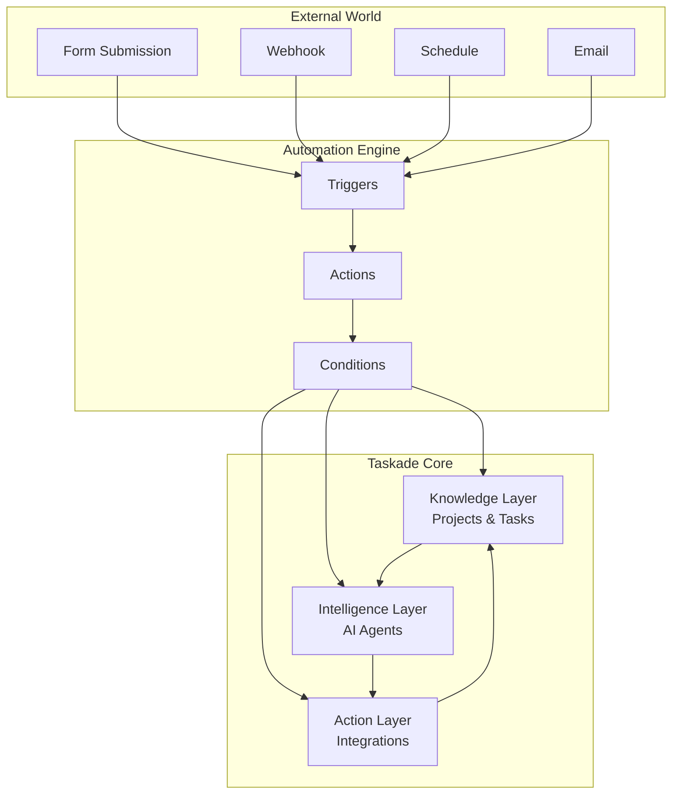

# Taskade Automations Overview

Taskade Automations let you connect 100+ tools and services into intelligent workflows that combine **human action**, **AI agents**, and **real-time execution.**

Think of automations as the nervous system of your AI-powered applications. They bridge the gap between your app's knowledge (Projects), intelligence (Agents), and the outside world, creating seamless workflows that can:

- **React to Events**: Form submissions, webhooks, schedules, project changes
- **Process with AI**: Analyze, categorize, summarize, and make decisions
- **Take Action**: Create tasks, send notifications, update external systems
- **Loop Back**: Update your knowledge base with new insights

## How Automations Work

Automations are composed of three key components:

### 1. **Triggers** – When Something Happens
- **Form Submitted**: User fills out a public form
- **Webhook Received**: External service sends data to your app
- **Schedule**: Time-based triggers (daily, weekly, monthly)
- **Project Event**: Task completed, member added, content changed
- **Agent Event**: Conversation started, command executed

#### Complete Trigger Reference

| Trigger | Description | Use Case |
|---------|-------------|----------|
| **Webhook** | External services send data via HTTP requests | API integrations, external tool connections |
| **Agent Trigger** | AI Agents optionally run actions during conversations | Agent-powered workflows, automated responses |
| **Task Added** | Fires when new tasks are created in projects | Project tracking, initial task setup |
| **Form Trigger** | Activates when AI Forms are submitted | Lead capture, survey processing |
| **Project Completed** | Triggers when entire projects are marked complete | Workflow completion, milestone tracking |
| **Task Completed** | Fires when individual tasks are checked off | Progress tracking, follow-up actions |
| **Task Assigned** | Activates when tasks are assigned to team members | Notification systems, workload management |
| **Task Due** | Triggers when tasks reach their due date | Deadline reminders, escalation procedures |
| **New Comment** | Fires when comments are added to tasks | Collaboration tracking, feedback loops |
| **New Due Date** | Activates when due dates are added/modified | Schedule management, planning updates |
| **Task Custom Field Updated** | Triggers on custom field changes | Dynamic workflow routing, status tracking |
| **Agent Public Chat Ended** | Fires when public agent conversations conclude | Chat analytics, follow-up sequences |
| **Schedule** | Time-based automation (hourly/daily/weekly/monthly) | Recurring tasks, maintenance routines |
| **Delay** | Pause automation for specific time periods | Timing-dependent workflows, reminders |
| **Mailhook Trigger** | Email-to-task conversion with unique addresses | Email automation, ticket systems |

**Integration-Specific Triggers:**
- **Calendly**: Meeting booked, cancelled, rescheduled
- **Slack**: New messages, reactions, channel events
- **Typeform**: Form responses, completion rates
- **Gmail**: New emails, label changes, search results
- **Google Sheets**: Row added, cell updated, sheet changes
- **Google Forms**: Form submissions, response validation
- **Google Drive**: File uploads, sharing changes
- **Webflow**: Content published, form submissions
- **HubSpot**: Contact updates, deal changes, email events
- **YouTube**: Video uploaded, comments added, analytics updates
- **RSS**: New feed items, content updates
- **Discord**: Messages, user joins, reactions
- **Google Calendar**: Event created, modified, deleted
- **GitHub**: Issues created, PRs merged, releases published

### 2. **Actions** – Do Something
- **Create Tasks**: Add structured data to your Knowledge Layer
- **Run Agent Commands**: Process information with AI
- **Send Notifications**: Slack, email, SMS, Discord
- **Update External Systems**: CRM, spreadsheets, databases
- **Call APIs**: Custom webhooks and HTTP requests

#### Complete Action Reference

| Action | Description | Key Features |
|--------|-------------|--------------|
| **Create Project** | Set up new projects in workspaces/folders | Template support, custom settings |
| **Add Task** | Create new tasks in existing projects | Rich formatting, assignments, due dates |
| **Create Project From Template** | Use predefined or custom templates | Consistent project structures |
| **Move Task** | Relocate tasks between projects/spaces | Workflow management, reorganization |
| **Assign Task** | Delegate tasks to team members | Workload distribution, responsibility tracking |
| **Ask AI** | Generate AI responses for questions | Contextual answers, knowledge integration |
| **Generate with AI** | Create content using AI models | Creative writing, code generation |
| **Respond with AI** | Automated AI-generated responses | Consistent communication, scaling |
| **Ask Agent** | Query custom AI agents | Specialized knowledge, tailored responses |
| **Run Agent Command** | Execute predefined agent commands | Structured outputs, consistent actions |
| **Add Knowledge to Agent** | Expand agent knowledge base | Continuous learning, updated context |
| **Ask Agent With Structured Output** | Get formatted agent responses | Data processing, API-ready outputs |
| **Scrape Webpage** | Extract content from websites | Research automation, content gathering |
| **Convert File to Text** | Transform documents to text | Content processing, data extraction |
| **Transcribe YouTube Video** | Convert video audio to text | Content creation, accessibility |
| **Add URL to Media** | Save web content to media library | Content curation, reference management |
| **Send HTTP Request** | Make API calls to external services | Integration building, data synchronization |
| **Loop** | Iterate over data collections | Batch processing, scalable operations |
| **Filter Data** | Apply conditional logic to data | Smart routing, quality control |
| **Branch** | Create conditional workflow paths | Decision trees, complex logic |
| **Update Custom Fields** | Modify task/project metadata | Dynamic updates, status tracking |
| **Search Web** | Query internet for information | Research automation, current data |
| **Find Task(s)** | Locate specific tasks in projects | Data retrieval, cross-referencing |
| **Transform Array to String** | Convert data arrays to readable text | Report generation, summary creation |

**Integration-Specific Actions:**

**Google Drive:**
- Trash files, duplicate files, create folders
- Create new files from text content
- Search folders and files

**Google Sheets:**
- Insert/update/delete rows
- Get row data, find specific rows
- Advanced spreadsheet operations

**Google Calendar:**
- Event management, scheduling
- Calendar synchronization

**Mailchimp:**
- List management, campaign creation
- Subscriber operations

**WordPress:**
- Post creation, content publishing
- Media management

**Twilio:**
- SMS/MMS sending, call management
- Communication automation

**HubSpot:**
- Contact/Deal management
- Marketing automation

**X/Twitter:**
- Post creation, engagement tracking
- Social media automation

**LinkedIn:**
- Post publishing, network management
- Professional networking

**Microsoft Teams:**
- Message sending, channel management
- Collaboration tools

**Discord:**
- Message posting, server management
- Community engagement

**Facebook:**
- Post creation, page management
- Social media marketing

**WhatsApp:**
- Message sending, template management
- Customer communication

**GitHub:**
- Issue creation, comment management
- Repository operations

### 3. **Intelligence** – AI-Powered Decision Making
- **Content Analysis**: Sentiment, classification, extraction
- **Smart Routing**: Assign tasks based on content and context
- **Data Enrichment**: Enhance incoming data with research and insights
- **Quality Control**: Review and approve AI-generated content

## Architecture: The Three-Layer System



## Integration Ecosystem

Taskade connects to **100+ external services** across every category:

### 🗣️ Communication & Collaboration
**Slack, Microsoft Teams, Discord, WhatsApp, Telegram, Email**

### 🛠️ Development & Project Management  
**GitHub, GitLab, Jira, Linear, Asana, Trello, Monday.com**

### 📊 Data & Analytics
**Google Sheets, Airtable, Notion, HubSpot, Salesforce, Pipedrive**

### 📧 Marketing & Sales
**Mailchimp, ConvertKit, Calendly, Stripe, PayPal, Shopify**

### 🌐 Web & Content
**WordPress, Webflow, Typeform, Google Forms, RSS, YouTube**

### 🔧 Custom & Developer
**HTTP Webhooks, REST APIs, GraphQL, Custom Forms**

→ **[View Full Integration List](./integrations.md)**

## 📊 **Real-World Use Cases & ROI Impact**

### **🎯 High-Impact Automation Examples**

| Use Case | Trigger | AI Processing | Actions | Business Result | Setup Time |
|----------|---------|---------------|---------|-----------------|------------|
| **Lead Qualification** | Landing page form | Score lead based on company size, budget, timeline | Create CRM deal + notify sales + schedule follow-up | 60% faster response, 40% higher conversion | 5 min |
| **Support Ticket Routing** | Customer support webhook | Categorize urgency + identify expertise needed | Create task + assign specialist + update customer | 70% faster resolution, 90% accurate routing | 4 min |
| **Content Publishing** | Blog post marked "Ready" | Quality check + SEO optimization suggestions | Social posts + email newsletter + analytics tracking | 300% more consistent publishing, 50% better engagement | 6 min |
| **Inventory Management** | Stock level drops | Analyze sales trends + predict demand | Email supplier + create purchase order + update forecasts | Zero stockouts, 20% cost reduction | 3 min |
| **Customer Onboarding** | New user signup | Analyze user profile + determine journey | Welcome email + setup tasks + assign success manager | 95% completion rate, 40% faster activation | 4 min |
| **Review Management** | New review received | Sentiment analysis + response generation | Thank customer + alert manager if negative + update reputation dashboard | 25% rating improvement, 100% response rate | 2 min |

### **🚀 Quick Setup Automations (Under 5 Minutes)**

| Business Problem | Automation Solution | Impact | Setup Steps |
|------------------|---------------------|--------|-------------|
| "Customers complain but we never hear about it" | **Review Alert System** - Instant Slack notification for ratings below 4 stars | Immediate damage control, proactive service recovery | 1. Connect review platform 2. Set rating threshold 3. Add Slack webhook |
| "Sales leads fall through the cracks" | **Lead Scoring & Assignment** - Auto-score and route to best sales rep | 50% faster response time, better lead distribution | 1. Connect contact form 2. Set scoring rules 3. Add CRM integration |
| "Always running out of popular items" | **Smart Inventory Alerts** - Predictive reordering based on sales trends | Zero stockouts, optimized cash flow | 1. Connect inventory system 2. Set thresholds 3. Add supplier emails |
| "Team doesn't know when projects are behind" | **Progress Monitoring** - Auto-alerts for overdue tasks and bottlenecks | 60% better project delivery, proactive management | 1. Connect project tracker 2. Set deadline rules 3. Add team notifications |
| "Social media posting is inconsistent" | **Content Distribution** - Auto-post across all platforms when content is ready | 300% more consistent posting, unified brand voice | 1. Connect content calendar 2. Set posting rules 3. Add social accounts |

### **🏢 Industry-Specific Templates**

| Industry | Top Automation | Business Value | Common Triggers |
|----------|----------------|----------------|-----------------|
| **Restaurants** | Review Response + Staff Alert System | 25% improvement in online ratings | Low ratings, reservation changes, staff scheduling |
| **Healthcare** | Appointment Confirmation + Reminder Chain | 40% reduction in no-shows | Appointment booking, insurance verification, follow-up care |
| **E-commerce** | Abandoned Cart + Inventory Management | 20% revenue increase from recovery | Cart abandonment, low stock, customer segments |
| **Real Estate** | Lead Nurturing + Property Matching | 50% more qualified leads | Property inquiries, market changes, viewing requests |
| **Consulting** | Client Updates + Project Tracking | 60% reduction in admin time | Project milestones, client requests, invoice generation |
| **Content Teams** | Publishing Pipeline + Performance Tracking | 80% faster content workflow | Content approval, publication schedules, engagement metrics |
| **Events** | Registration + Communication Sequence | 90% automation of event admin | Registration, payment, reminders, feedback collection |

### 3. **Content Creation Pipeline**
- **Trigger**: Weekly schedule
- **Process**: AI researches topics, generates content, reviews quality
- **Action**: Create draft, request approval, publish when approved

### 4. **Project Management Integration**
- **Trigger**: GitHub issue created
- **Process**: AI analyzes priority and assigns to team member
- **Action**: Create Taskade task, sync status, notify stakeholders

### 5. **Data Processing & Analysis**
- **Trigger**: New row in Google Sheets
- **Process**: AI enriches data with research and insights
- **Action**: Update sheet, create summary report, alert team

## Getting Started

### Step 1: Choose Your Trigger
What event should start your automation?
- Public form for lead capture
- Webhook from external service
- Schedule for recurring tasks
- Project event for workflow automation

### Step 2: Design Your Workflow
Map out the sequence of actions:
- What data needs processing?
- Which AI agents should be involved?
- What external systems need updates?
- Who should be notified?

### Step 3: Configure Integrations
Connect to external services:
- Authenticate with OAuth or API keys
- Map data fields between systems
- Set up error handling and retries

### Step 4: Test & Deploy
- Run through with sample data
- Monitor performance and errors
- Iterate based on results

## Variables & Data Flow


Variables allow data to flow seamlessly between automation components. They enable dynamic, context-aware workflows that adapt to your data.


### Variable Syntax

Variables are referenced using the `@` symbol and allow you to access:
- **Trigger data**: `@trigger.form.name`, `@trigger.webhook.data`
- **Step results**: `@step.3.response`, `@step.1.output`
- **System data**: `@current.date`, `@current.user`
- **Custom fields**: `@task.priority`, `@project.status`

**Example:**
```
Trigger: Form submitted (name, email, priority)
Action: Create task titled "@trigger.form.name - Support Request"
Condition: If "@trigger.form.priority" equals "urgent"
  → Send immediate Slack notification
  → Assign to escalation team
```

### Data Types & Transformations

Variables support multiple data types:
- **Text/Strings**: Names, descriptions, content
- **Numbers**: Quantities, scores, percentages
- **Dates**: Due dates, timestamps, schedules
- **Arrays**: Lists of items, multiple selections
- **Objects**: Complex data structures from APIs

**Transformation Functions:**
- `{{variable | uppercase}}` - Convert to uppercase
- `{{variable | date:"YYYY-MM-DD"}}` - Format dates
- `{{variable | length}}` - Get array/string length
- `{{variable | split:","}}` - Split strings into arrays

## Advanced Features

### **Conditional Logic**
```json
{
  "condition": "{{form.priority}} === 'high'",
  "then": [...],
  "else": [...]
}
```

### **Multi-Step AI Workflows**
Chain multiple agents together for complex processing

### **Human-in-the-Loop**
Request approvals and reviews before taking action

### **Error Handling**
Retry failed actions and notify on persistent errors

### **Data Transformation**
Clean, format, and enrich data as it flows through your system

## API Access (Coming Soon)

While automations are currently managed through the Taskade interface, we're building API endpoints for programmatic control:

```bash
# Create automation (planned)
curl -X POST https://www.taskade.com/api/v1/automations \
  -H "Authorization: Bearer YOUR_TOKEN" \
  -d '{
    "name": "Lead Processor",
    "trigger": {"type": "form_submission"},
    "actions": [...]
  }'
```

## 🚀 Advanced Automation Patterns

### **Multi-Agent Orchestration**

Create sophisticated workflows where multiple AI agents collaborate on complex tasks:

```yaml
Content Production Pipeline:
  Trigger: "New blog topic submitted via form"
  
  Agent 1 - Research Agent:
    - Analyze topic and gather relevant data
    - Create research brief with sources
    - Pass findings to Content Agent
  
  Agent 2 - Content Agent:
    - Generate article outline based on research
    - Write first draft using research data
    - Pass draft to Editor Agent
  
  Agent 3 - Editor Agent:
    - Review content for quality and accuracy
    - Suggest improvements and edits
    - Finalize content for publication
  
  Final Actions:
    - Create task in Editorial Calendar
    - Notify marketing team via Slack
    - Schedule social media promotion
```

### **Conditional Logic Workflows**

Build intelligent decision trees that adapt based on data:

| **Condition** | **Action Path** | **Business Logic** |
|---------------|-----------------|-------------------|
| **Lead Score > 80** | Route to Sales Team | Hot prospects get immediate attention |
| **Lead Score 50-80** | Nurture Campaign | Warm leads need more engagement |
| **Lead Score < 50** | Educational Content | Cold leads need value-first approach |

### **Error Handling & Recovery**

Build resilient automations that handle failures gracefully:

```yaml
Robust Email Campaign:
  Primary Action: "Send via Mailchimp"
  
  Error Handling:
    - If Mailchimp fails → Try SendGrid backup
    - If both fail → Create manual task for team
    - Log all attempts in error tracking project
    - Send alert to admin via Slack
  
  Success Tracking:
    - Update campaign metrics in dashboard
    - Create follow-up tasks based on engagement
    - Trigger next sequence in nurture campaign
```

### **Data Transformation Pipelines**

Process and enrich data as it flows through your system:

```yaml
Customer Data Enrichment:
  Input: "Raw form submission"
  
  Transformation Steps:
    1. Validate email format and domain
    2. Enrich with company data from Clearbit
    3. Score lead based on ICP criteria
    4. Categorize by industry and company size
    5. Assign to appropriate sales rep
  
  Output: "Fully qualified lead record"
```

### **Agentic Automation Loops**

Create self-improving systems that learn and adapt:

```yaml
Customer Success Automation:
  Continuous Loop:
    1. Monitor customer health scores
    2. AI Agent analyzes usage patterns
    3. Predicts churn risk using historical data
    4. Automatically creates intervention tasks
    5. Tracks intervention success rates
    6. Updates prediction model with results
    7. Improves future predictions
```

## Next Steps

- **[Explore Integration Options](./integrations.md)**
- **[Browse Action & Trigger Reference](./actions.md)**
- **[View Automation Recipes](./recipes.md)**

---

> **Want to browse all integrations?**  
> → [Full Integration List](./integrations.md)

> **Want to submit your own automation pattern?**  
> → [Request via Taskade Community](https://taskade.com/community) 