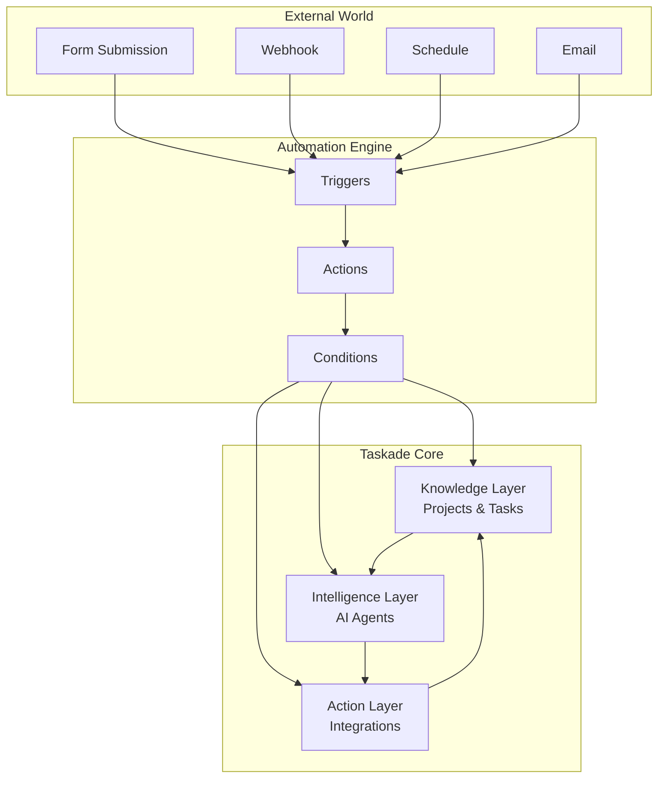

# Taskade Automations: Living Motion Layer

**Act. Execute. Evolve.** Taskade Automations are the living motion layer of Workspace DNA, transforming static workflows into intelligent, adaptive systems that act with precision and learn from every execution.


**Living Motion Layer** — Automations that don't just execute tasks, but learn from patterns, adapt to changing conditions, and continuously improve business outcomes.


## AI-Powered Workflow Automation

Taskade Automations provide an event-driven workflow engine that connects your AI agents, projects, and external tools. Build intelligent automation pipelines that respond to triggers, process data with AI, and execute actions across your entire business stack.

**Key Capabilities:**
- Event-driven triggers
- AI-powered processing
- 100+ service integrations
- Conditional branching
- Error handling with retry logic

**[Automations Guide →](https://help.taskade.com/en/articles/8958467-automations-the-execution-pillar)**

**Latest:** [Taskade Genesis: Connect Your Apps. Automate Your Business. (100+ Integrations)](https://www.taskade.com/blog/updates/)

## Quick Overview

| Feature | Description | Documentation |
|---------|-------------|---------------|
| **Triggers** | Events that start workflows (webhooks, schedules, form submissions) | [Trigger Reference →](triggers.md) |
| **Actions** | Operations to perform (create tasks, send messages, call APIs) | [Action Reference →](actions.md) |
| **Integrations** | 100+ pre-built connectors (Slack, Gmail, HubSpot, GitHub, etc.) | [Integration Guide →](integrations.md) |
| **AI Processing** | Use AI agents within workflows for intelligent processing | [Advanced Actions →](advanced-actions.md) |
| **Recipes** | Pre-built workflow templates for common use cases | [Recipe Library →](recipes.md) |

Automations connect your projects (data layer) with AI agents (intelligence layer) and external services, creating systems that:

- **React to Events**: Form submissions, webhooks, schedules, project changes
- **Process with AI**: Analyze, categorize, summarize, and make decisions
- **Take Action**: Create tasks, send notifications, update external systems
- **Loop Back**: Update your knowledge base with new insights

### The Motion Layer in Living DNA

Automations serve as the motion layer in the Workspace DNA trinity, providing the execution power that brings living systems to life.

**⚡ Motion Layer Role:**
- **Executes Intelligence**: Turns AI insights into real-world actions
- **Connects Systems**: Links living memory with external tools and services
- **Learns from Motion**: Adapts based on execution outcomes and feedback
- **Drives Evolution**: Creates feedback loops that improve all DNA strands

**🔄 Living System Integration:**
```
Living Memory (Projects/Data) → Living Motion (Automations) → Living Intelligence (AI Agents)
       ↓                              ↓                              ↓
   Store & Learn Data    Execute & Adapt Actions    Analyze & Provide Insights
```

**🌟 Living Motion Capabilities:**
- **Adaptive Execution**: Workflows that learn optimal timing and conditions
- **Predictive Actions**: Systems that anticipate needs and act proactively
- **Self-Optimizing Performance**: Automations that improve efficiency over time
- **Intelligent Error Recovery**: Self-healing systems with adaptive retry logic
- **Granular Control**: Enable/disable automations for better workflow management
- **Integration Management**: Dedicated App Integration Page for managing connections

**🔗 Related Concepts:**
- **[Workspace DNA Harmony](../workspace-dna-harmony.md)** - How motion connects with memory and intelligence
- **[Living Memory Layer](../genesis/README.md)** - The data structures that motion acts upon
- **[Living Intelligence Layer](../features/ai-features/README.md)** - AI that powers intelligent automation decisions

## How Living Automations Work

Automations are composed of three key components:

### 1. **Triggers** – When Something Happens
- **Form Submitted**: User fills out a public form
- **Webhook Received**: External service sends data to your app
- **Schedule**: Time-based triggers (daily, weekly, monthly)
- **Project Event**: Task completed, member added, content changed
- **Agent Event**: Conversation started, command executed

#### Complete Trigger Reference

| Trigger | Description | Use Case |
|---------|-------------|----------|
| **Webhook** | External services send data via HTTP requests | API integrations, external tool connections |
| **Agent Trigger** | AI Agents optionally run actions during conversations | Agent-powered workflows, automated responses |
| **Task Added** | Fires when new tasks are created in projects | Project tracking, initial task setup |
| **Form Trigger** | Activates when AI Forms are submitted | Lead capture, survey processing |
| **Project Completed** | Triggers when entire projects are marked complete | Workflow completion, milestone tracking |
| **Task Completed** | Fires when individual tasks are checked off | Progress tracking, follow-up actions |
| **Task Assigned** | Activates when tasks are assigned to team members | Notification systems, workload management |
| **Task Due** | Triggers when tasks reach their due date | Deadline reminders, escalation procedures |
| **New Comment** | Fires when comments are added to tasks | Collaboration tracking, feedback loops |
| **New Due Date** | Activates when due dates are added/modified | Schedule management, planning updates |
| **Task Custom Field Updated** | Triggers on custom field changes | Dynamic workflow routing, status tracking |
| **Agent Public Chat Ended** | Fires when public agent conversations conclude | Chat analytics, follow-up sequences |
| **Schedule** | Time-based automation (hourly/daily/weekly/monthly) | Recurring tasks, maintenance routines |
| **Delay** | Pause automation for specific time periods | Timing-dependent workflows, reminders |
| **Mailhook Trigger** | Email-to-task conversion with unique addresses | Email automation, ticket systems |

**Integration-Specific Triggers:**
- **Calendly**: Meeting booked, cancelled, rescheduled
- **Slack**: New messages, reactions, channel events
- **Typeform**: Form responses, completion rates
- **Gmail**: New emails, label changes, search results
- **Google Sheets**: Row added, cell updated, sheet changes
- **Google Forms**: Form submissions, response validation
- **Google Drive**: File uploads, sharing changes
- **Webflow**: Content published, form submissions
- **HubSpot**: Contact updates, deal changes, email events
- **YouTube**: Video uploaded, comments added, analytics updates
- **RSS**: New feed items, content updates
- **Discord**: Messages, user joins, reactions
- **Google Calendar**: Event created, modified, deleted
- **GitHub**: Issues created, PRs merged, releases published

### 2. **Actions** – Do Something
- **Create Tasks**: Add structured data to your Knowledge Layer
- **Run Agent Commands**: Process information with AI
- **Send Notifications**: Slack, email, SMS, Discord
- **Update External Systems**: CRM, spreadsheets, databases
- **Call APIs**: Custom webhooks and HTTP requests

#### Complete Action Reference

| Action | Description | Key Features |
|--------|-------------|--------------|
| **Create Project** | Set up new projects in workspaces/folders | Template support, custom settings |
| **Add Task** | Create new tasks in existing projects | Rich formatting, assignments, due dates |
| **Create Project From Template** | Use predefined or custom templates | Consistent project structures |
| **Move Task** | Relocate tasks between projects/spaces | Workflow management, reorganization |
| **Assign Task** | Delegate tasks to team members | Workload distribution, responsibility tracking |
| **Ask AI** | Generate AI responses for questions | Contextual answers, knowledge integration |
| **Generate with AI** | Create content using AI models | Creative writing, code generation |
| **Respond with AI** | Automated AI-generated responses | Consistent communication, scaling |
| **Ask Agent** | Query custom AI agents | Specialized knowledge, tailored responses |
| **Run Agent Command** | Execute predefined agent commands | Structured outputs, consistent actions |
| **Add Knowledge to Agent** | Expand agent knowledge base | Continuous learning, updated context |
| **Ask Agent With Structured Output** | Get formatted agent responses | Data processing, API-ready outputs |
| **Scrape Webpage** | Extract content from websites | Research automation, content gathering |
| **Convert File to Text** | Transform documents to text | Content processing, data extraction |
| **Transcribe YouTube Video** | Convert video audio to text | Content creation, accessibility |
| **Add URL to Media** | Save web content to media library | Content curation, reference management |
| **Send HTTP Request** | Make API calls to external services | Integration building, data synchronization |
| **Loop** | Iterate over data collections | Batch processing, scalable operations |
| **Filter Data** | Apply conditional logic to data | Smart routing, quality control |
| **Branch** | Create conditional workflow paths | Decision trees, complex logic |
| **Update Custom Fields** | Modify task/project metadata | Dynamic updates, status tracking |
| **Search Web** | Query internet for information | Research automation, current data |
| **Find Task(s)** | Locate specific tasks in projects | Data retrieval, cross-referencing |
| **Transform Array to String** | Convert data arrays to readable text | Report generation, summary creation |

**Integration-Specific Actions:**

**Google Drive:**
- Trash files, duplicate files, create folders
- Create new files from text content
- Search folders and files

**Google Sheets:**
- Insert/update/delete rows
- Get row data, find specific rows
- Advanced spreadsheet operations

**Google Calendar:**
- Event management, scheduling
- Calendar synchronization

**Mailchimp:**
- List management, campaign creation
- Subscriber operations

**WordPress:**
- Post creation, content publishing
- Media management

**Twilio:**
- SMS/MMS sending, call management
- Communication automation

**HubSpot:**
- Contact/Deal management
- Marketing automation

**X/Twitter:**
- Post creation, engagement tracking
- Social media automation

**LinkedIn:**
- Post publishing, network management
- Professional networking

**Microsoft Teams:**
- Message sending, channel management
- Collaboration tools

**Discord:**
- Message posting, server management
- Community engagement

**Facebook:**
- Post creation, page management
- Social media marketing

**WhatsApp:**
- Message sending, template management
- Customer communication

**GitHub:**
- Issue creation, comment management
- Repository operations

## 🖼️ App Integration Page

**Latest Enhancement:** Taskade now features a dedicated App Integration Page for comprehensive management of all your connected services and automations.

### What You Can Do:

**🔗 Connection Management:**
- **View All Integrations** - See all connected apps and services in one place
- **Connection Status** - Check if integrations are active and working
- **Reconnect Services** - Easily reauthorize expired or broken connections
- **Add New Integrations** - Discover and connect additional services

**⚙️ Automation Control:**
- **Enable/Disable Automations** - Granular control over individual workflows
- **Monitor Performance** - Track automation success rates and execution times
- **Debug Issues** - Identify and resolve automation problems
- **Batch Operations** - Manage multiple automations simultaneously

**📊 Analytics & Insights:**
- **Usage Statistics** - See how often each integration is used
- **Performance Metrics** - Monitor automation efficiency and reliability
- **Error Tracking** - Identify problematic integrations or workflows
- **Optimization Suggestions** - Get AI-powered recommendations for improvement

### How to Access:

1. **Go to Settings** → **Integrations**
2. **Browse All Connected Apps** - View your complete integration ecosystem
3. **Manage Automations** - Enable/disable and monitor your workflows
4. **Monitor Performance** - Review analytics and optimize your setup

## ⚙️ Rate Limiting & Performance Optimization

**Advanced Automation Rate Limiting:** Taskade now includes sophisticated rate limiting to prevent runaway workflows and ensure optimal performance across all integrations.

### Key Features:

**Intelligent Rate Limiting:**
- **Automatic Throttling** - Prevents overwhelming external services and APIs
- **Smart Backoff** - Automatically adjusts timing based on service responses
- **Queue Management** - Handles high-volume automation scenarios gracefully
- **Error Recovery** - Intelligent retry logic with exponential backoff

**Performance Optimization:**
- **Resource Management** - Optimizes computing resources for automation efficiency
- **Load Balancing** - Distributes automation load across available capacity
- **Monitoring & Alerts** - Real-time performance tracking and issue notifications
- **Adaptive Scaling** - Automatically adjusts based on usage patterns

### How It Works:

1. **Automatic Detection** - System identifies potential rate limit issues
2. **Intelligent Throttling** - Applies appropriate limits based on service capabilities
3. **Smart Queuing** - Manages automation execution to stay within limits
4. **Performance Monitoring** - Tracks success rates and optimization effectiveness

### Benefits:

- **Reliability** - Prevents automation failures due to rate limiting
- **Efficiency** - Optimizes resource usage and reduces costs
- **Scalability** - Handles increased automation volume seamlessly
- **User Experience** - Ensures consistent performance for end users

## 📊 Centralized Analytics & Monitoring

**Latest Enhancement:** Improved PostHog integration for comprehensive user insights and behavior tracking.

### Advanced Analytics Features:

**Event Tracking & Insights:**
- **AI Credits Tracking** - Monitor AI usage and credit consumption patterns
- **User Behavior Analytics** - Comprehensive tracking of user interactions and workflows
- **Performance Metrics** - Detailed analytics on automation success rates and timing
- **Integration Monitoring** - Track usage patterns across all connected services

**Monitoring Capabilities:**
- **Real-time Dashboards** - Live insights into system performance and user activity
- **Custom Event Tracking** - Define and monitor specific business metrics
- **Conversion Analytics** - Track user progression through key workflows
- **Error Tracking** - Monitor and analyze system errors and user issues

### How It Works:

1. **Automatic Event Collection** - System automatically tracks key user interactions
2. **Real-time Processing** - Analytics data processed and available immediately
3. **Custom Dashboard Creation** - Build tailored analytics views for your needs
4. **Insight Generation** - AI-powered analysis of usage patterns and trends

### Benefits:

- **Data-Driven Decisions** - Make informed choices based on comprehensive user data
- **Performance Optimization** - Identify bottlenecks and optimization opportunities
- **User Experience Improvement** - Understand user behavior to enhance workflows
- **Business Intelligence** - Track key metrics and ROI across all features

### 3. **Intelligence** – AI-Powered Decision Making
- **Content Analysis**: Sentiment, classification, extraction
- **Smart Routing**: Assign tasks based on content and context
- **Data Enrichment**: Enhance incoming data with research and insights
- **Quality Control**: Review and approve AI-generated content

## Architecture: The Three-Layer System



## Enterprise-Grade Automation Platform

### **🏆 Mission-Critical Reliability**
Automations now run with enterprise-grade stability and performance:
- **99.99% uptime** for critical business processes
- **Advanced error handling** with automatic retries and recovery
- **Real-time monitoring** and alerting for system health
- **Global performance** with worldwide data synchronization
- **Enhanced security** with additional data protections

### **⚡ Advanced Automation Capabilities**
- **Complex multi-step workflows** with intelligent branching
- **AI-powered decision making** throughout automation chains
- **Real-time analytics** and performance insights
- **Enhanced file processing** and document management
- **Improved calendar integration** and scheduling features

## Integration Ecosystem

Taskade connects to **100+ external services** across every category:

### 🗣️ Communication & Collaboration
**Slack, Microsoft Teams, Discord, WhatsApp, Telegram, Email**

### 🛠️ Development & Project Management  
**GitHub, GitLab, Jira, Linear, Asana, Trello, Monday.com**

### 📊 Data & Analytics
**Google Sheets, Airtable, Notion, HubSpot, Salesforce, Pipedrive**

### 📧 Marketing & Sales
**Mailchimp, ConvertKit, Calendly, Stripe, PayPal, Shopify**

### 🌐 Web & Content
**WordPress, Webflow, Typeform, Google Forms, RSS, YouTube**

### 🔧 Custom & Developer
**HTTP Webhooks, REST APIs, GraphQL, Custom Forms**

→ **[View Full Integration List](./integrations.md)**

## 📊 **Real-World Use Cases & ROI Impact**

### **🎯 High-Impact Automation Examples with Enterprise Reliability**

| Use Case | Trigger | AI Processing | Actions | Business Result | Setup Time |
|----------|---------|---------------|---------|-----------------|------------|
| **Lead Qualification** | Landing page form | Score lead based on company size, budget, timeline | Create CRM deal + notify sales + schedule follow-up | 60% faster response, 40% higher conversion | 5 min |
| **Support Ticket Routing** | Customer support webhook | Categorize urgency + identify expertise needed | Create task + assign specialist + update customer | 70% faster resolution, 90% accurate routing | 4 min |
| **Content Publishing** | Blog post marked "Ready" | Quality check + SEO optimization suggestions | Social posts + email newsletter + analytics tracking | 300% more consistent publishing, 50% better engagement | 6 min |
| **Inventory Management** | Stock level drops | Analyze sales trends + predict demand | Email supplier + create purchase order + update forecasts | Zero stockouts, 20% cost reduction | 3 min |
| **Customer Onboarding** | New user signup | Analyze user profile + determine journey | Welcome email + setup tasks + assign success manager | 95% completion rate, 40% faster activation | 4 min |
| **Review Management** | New review received | Sentiment analysis + response generation | Thank customer + alert manager if negative + update reputation dashboard | 25% rating improvement, 100% response rate | 2 min |

### **🚀 Quick Setup Automations (Under 5 Minutes)**

| Business Problem | Automation Solution | Impact | Setup Steps |
|------------------|---------------------|--------|-------------|
| "Customers complain but we never hear about it" | **Review Alert System** - Instant Slack notification for ratings below 4 stars | Immediate damage control, proactive service recovery | 1. Connect review platform 2. Set rating threshold 3. Add Slack webhook |
| "Sales leads fall through the cracks" | **Lead Scoring & Assignment** - Auto-score and route to best sales rep | 50% faster response time, better lead distribution | 1. Connect contact form 2. Set scoring rules 3. Add CRM integration |
| "Always running out of popular items" | **Smart Inventory Alerts** - Predictive reordering based on sales trends | Zero stockouts, optimized cash flow | 1. Connect inventory system 2. Set thresholds 3. Add supplier emails |
| "Team doesn't know when projects are behind" | **Progress Monitoring** - Auto-alerts for overdue tasks and bottlenecks | 60% better project delivery, proactive management | 1. Connect project tracker 2. Set deadline rules 3. Add team notifications |
| "Social media posting is inconsistent" | **Content Distribution** - Auto-post across all platforms when content is ready | 300% more consistent posting, unified brand voice | 1. Connect content calendar 2. Set posting rules 3. Add social accounts |

### **🏢 Industry-Specific Templates**

| Industry | Top Automation | Business Value | Common Triggers |
|----------|----------------|----------------|-----------------|
| **Restaurants** | Review Response + Staff Alert System | 25% improvement in online ratings | Low ratings, reservation changes, staff scheduling |
| **Healthcare** | Appointment Confirmation + Reminder Chain | 40% reduction in no-shows | Appointment booking, insurance verification, follow-up care |
| **E-commerce** | Abandoned Cart + Inventory Management | 20% revenue increase from recovery | Cart abandonment, low stock, customer segments |
| **Real Estate** | Lead Nurturing + Property Matching | 50% more qualified leads | Property inquiries, market changes, viewing requests |
| **Consulting** | Client Updates + Project Tracking | 60% reduction in admin time | Project milestones, client requests, invoice generation |
| **Content Teams** | Publishing Pipeline + Performance Tracking | 80% faster content workflow | Content approval, publication schedules, engagement metrics |
| **Events** | Registration + Communication Sequence | 90% automation of event admin | Registration, payment, reminders, feedback collection |

### 3. **Content Creation Pipeline**
- **Trigger**: Weekly schedule
- **Process**: AI researches topics, generates content, reviews quality
- **Action**: Create draft, request approval, publish when approved

### 4. **Project Management Integration**
- **Trigger**: GitHub issue created
- **Process**: AI analyzes priority and assigns to team member
- **Action**: Create Taskade task, sync status, notify stakeholders

### 5. **Data Processing & Analysis**
- **Trigger**: New row in Google Sheets
- **Process**: AI enriches data with research and insights
- **Action**: Update sheet, create summary report, alert team

## Getting Started

### Step 1: Choose Your Trigger
What event should start your automation?
- Public form for lead capture
- Webhook from external service
- Schedule for recurring tasks
- Project event for workflow automation

### Step 2: Design Your Workflow
Map out the sequence of actions:
- What data needs processing?
- Which AI agents should be involved?
- What external systems need updates?
- Who should be notified?

### Step 3: Configure Integrations
Connect to external services:
- Authenticate with OAuth or API keys
- Map data fields between systems
- Set up error handling and retries

### Step 4: Test & Deploy
- Run through with sample data
- Monitor performance and errors
- Iterate based on results

## Variables & Data Flow


Variables enable reliable, enterprise-grade data flow between automation components with enhanced synchronization and error handling.


### Variable Syntax

Variables are referenced using the `@` symbol and allow you to access:
- **Trigger data**: `@trigger.form.name`, `@trigger.webhook.data`
- **Step results**: `@step.3.response`, `@step.1.output`
- **System data**: `@current.date`, `@current.user`
- **Custom fields**: `@task.priority`, `@project.status`

**Example:**
```
Trigger: Form submitted (name, email, priority)
Action: Create task titled "@trigger.form.name - Support Request"
Condition: If "@trigger.form.priority" equals "urgent"
  → Send immediate Slack notification
  → Assign to escalation team
```

### Data Types & Transformations

Variables support multiple data types:
- **Text/Strings**: Names, descriptions, content
- **Numbers**: Quantities, scores, percentages
- **Dates**: Due dates, timestamps, schedules
- **Arrays**: Lists of items, multiple selections
- **Objects**: Complex data structures from APIs

**Transformation Functions:**
- `{{variable | uppercase}}` - Convert to uppercase
- `{{variable | date:"YYYY-MM-DD"}}` - Format dates
- `{{variable | length}}` - Get array/string length
- `{{variable | split:","}}` - Split strings into arrays

## Advanced Features

### **Enterprise-Grade Error Handling**
```json
{
  "errorHandling": {
    "retryCount": 3,
    "retryDelay": "exponential",
    "fallbackActions": [...],
    "alertChannels": ["slack", "email"],
    "monitoring": "real-time"
  }
}
```

### **Enhanced Analytics & Monitoring**
- **Real-time performance tracking** with detailed metrics
- **Business intelligence dashboards** for workflow insights
- **Advanced reporting** on automation success rates
- **Predictive analytics** for optimization recommendations

### **Global Performance Optimization**
- **Worldwide data synchronization** with regional caching
- **Intelligent load balancing** across global infrastructure
- **Automated scaling** based on demand patterns
- **Enhanced file processing** with improved security

### **Conditional Logic**
```json
{
  "condition": "{{form.priority}} === 'high'",
  "then": [...],
  "else": [...]
}
```

### **Multi-Step AI Workflows**
Chain multiple agents together for complex processing with enhanced reliability

### **Human-in-the-Loop**
Request approvals and reviews before taking action with enterprise audit trails

### **Data Transformation**
Clean, format, and enrich data as it flows through your system with enhanced validation

## API Access (Coming Soon)

While automations are currently managed through the Taskade interface, we're building API endpoints for programmatic control:

```bash
# Create automation (planned)
curl -X POST https://www.taskade.com/api/v1/automations \
  -H "Authorization: Bearer YOUR_TOKEN" \
  -d '{
    "name": "Lead Processor",
    "trigger": {"type": "form_submission"},
    "actions": [...]
  }'
```

## 🚀 Advanced Automation Patterns

### **Multi-Agent Orchestration**

Create sophisticated workflows where multiple AI agents collaborate on complex tasks:

```yaml
Content Production Pipeline:
  Trigger: "New blog topic submitted via form"
  
  Agent 1 - Research Agent:
    - Analyze topic and gather relevant data
    - Create research brief with sources
    - Pass findings to Content Agent
  
  Agent 2 - Content Agent:
    - Generate article outline based on research
    - Write first draft using research data
    - Pass draft to Editor Agent
  
  Agent 3 - Editor Agent:
    - Review content for quality and accuracy
    - Suggest improvements and edits
    - Finalize content for publication
  
  Final Actions:
    - Create task in Editorial Calendar
    - Notify marketing team via Slack
    - Schedule social media promotion
```

### **Conditional Logic Workflows**

Build intelligent decision trees that adapt based on data:

| **Condition** | **Action Path** | **Business Logic** |
|---------------|-----------------|-------------------|
| **Lead Score > 80** | Route to Sales Team | Hot prospects get immediate attention |
| **Lead Score 50-80** | Nurture Campaign | Warm leads need more engagement |
| **Lead Score < 50** | Educational Content | Cold leads need value-first approach |

### **Error Handling & Recovery**

Build resilient automations that handle failures gracefully:

```yaml
Robust Email Campaign:
  Primary Action: "Send via Mailchimp"
  
  Error Handling:
    - If Mailchimp fails → Try SendGrid backup
    - If both fail → Create manual task for team
    - Log all attempts in error tracking project
    - Send alert to admin via Slack
  
  Success Tracking:
    - Update campaign metrics in dashboard
    - Create follow-up tasks based on engagement
    - Trigger next sequence in nurture campaign
```

### **Data Transformation Pipelines**

Process and enrich data as it flows through your system:

```yaml
Customer Data Enrichment:
  Input: "Raw form submission"
  
  Transformation Steps:
    1. Validate email format and domain
    2. Enrich with company data from Clearbit
    3. Score lead based on ICP criteria
    4. Categorize by industry and company size
    5. Assign to appropriate sales rep
  
  Output: "Fully qualified lead record"
```

### **Agentic Automation Loops**

Create self-improving systems that learn and adapt:

```yaml
Customer Success Automation:
  Continuous Loop:
    1. Monitor customer health scores
    2. AI Agent analyzes usage patterns
    3. Predicts churn risk using historical data
    4. Automatically creates intervention tasks
    5. Tracks intervention success rates
    6. Updates prediction model with results
    7. Improves future predictions
```

## Living Automation Patterns

### Pattern 1: Predictive Business Operations
**Living Motion Goal:** Systems that anticipate business needs and act proactively.

```
Business Pattern: Inventory Reordering
├── Memory Layer: Track sales patterns and stock levels
├── Intelligence Layer: Predict demand using historical data
├── Motion Layer: Automatically reorder when optimal conditions met
└── Learning Loop: Adjust predictions based on reorder outcomes
```

**Example:** Retail inventory system that learns seasonal patterns, supplier reliability, and customer buying habits to reorder at optimal times.

### Pattern 2: Adaptive Customer Experience
**Living Motion Goal:** Customer interactions that improve with every touchpoint.

```
Business Pattern: Customer Support Evolution
├── Memory Layer: Store all customer interactions and preferences
├── Intelligence Layer: Analyze patterns to predict needs
├── Motion Layer: Personalize responses and anticipate issues
└── Learning Loop: Improve predictions based on satisfaction scores
```

**Example:** Support system that learns individual customer preferences, escalates issues before they become problems, and provides increasingly personalized assistance.

### Pattern 3: Self-Optimizing Workflows
**Living Motion Goal:** Business processes that continuously improve efficiency.

```
Business Pattern: Sales Process Optimization
├── Memory Layer: Track conversion rates at each pipeline stage
├── Intelligence Layer: Identify bottlenecks and optimal paths
├── Motion Layer: Route leads through most effective sequences
└── Learning Loop: Test new approaches and adopt successful patterns
```

**Example:** Sales automation that learns which follow-up sequences work best for different customer segments and continuously optimizes conversion rates.

### Pattern 4: Intelligent Resource Management
**Living Motion Goal:** Resource allocation that adapts to changing business conditions.

```
Business Pattern: Dynamic Team Assignment
├── Memory Layer: Track team capacity, skills, and performance
├── Intelligence Layer: Match tasks to optimal team members
├── Motion Layer: Auto-assign tasks based on intelligent matching
└── Learning Loop: Improve matching accuracy over time
```

**Example:** Project management system that learns team member strengths, current workloads, and project requirements to make optimal task assignments.

## ⚡ Living Motion Layer: The Execution Engine That Learns

**Transforming static workflows into intelligent, adaptive systems that act with precision and evolve with every execution**

The Living Motion Layer is where Workspace DNA comes alive—where intelligence becomes action, and where static workflows transform into dynamic, learning systems that anticipate needs and execute with increasing precision.

### **How Living Motion Works in Automations**

#### **1. Intelligent Trigger Processing**
```
Event Detection → Context Analysis → Relevance Assessment → Optimal Timing → Action Initiation
```

**Smart Triggering:**
- **Contextual Filtering** - Only triggers relevant actions based on business context
- **Timing Optimization** - Learns optimal execution timing from historical outcomes
- **Priority Assessment** - Evaluates urgency and business impact before execution
- **Dependency Awareness** - Understands relationships between different triggers and actions

#### **2. Adaptive Action Execution**
```
Action Planning → Resource Assessment → Intelligent Routing → Outcome Tracking → Learning Integration
```

**Execution Intelligence:**
- **Dynamic Routing** - Routes actions to optimal endpoints based on current conditions
- **Resource Optimization** - Learns to allocate resources efficiently based on past performance
- **Error Prediction** - Anticipates potential failures and implements preventive measures
- **Outcome Optimization** - Adjusts execution parameters to maximize success rates

#### **3. Continuous Learning Integration**
```
Execution Results → Performance Analysis → Pattern Recognition → Model Updates → Capability Enhancement
```

**Learning Mechanisms:**
- **Success Pattern Recognition** - Identifies what works and replicates successful strategies
- **Failure Analysis** - Learns from mistakes to prevent future errors
- **Performance Trending** - Tracks efficiency improvements over time
- **Capability Expansion** - Adds new execution capabilities based on demonstrated needs

### **Living Motion Capabilities**

#### **🧠 Adaptive Workflow Intelligence**
```
Static Rules → Learning Algorithms → Predictive Optimization → Autonomous Execution
```

**Evolution Stages:**
- **Rule-Based**: Fixed conditions and predetermined actions
- **Learning**: Adapts based on historical outcomes and patterns
- **Predictive**: Anticipates needs and optimizes proactively
- **Autonomous**: Makes intelligent decisions without human intervention

#### **🔄 Real-Time Optimization**
```
Environmental Monitoring → Condition Assessment → Strategy Adjustment → Performance Enhancement
```

**Optimization Features:**
- **Load Balancing** - Distributes execution load based on system capacity
- **Timing Intelligence** - Learns optimal execution windows for different actions
- **Resource Management** - Dynamically allocates computing resources based on demand
- **Quality Assurance** - Implements checks and validations that improve over time

#### **🎯 Predictive Execution**
```
Historical Analysis → Pattern Discovery → Future Projection → Proactive Action
```

**Predictive Capabilities:**
- **Demand Forecasting** - Anticipates workflow triggers based on historical patterns
- **Issue Prevention** - Identifies potential problems before they occur
- **Resource Planning** - Predicts resource needs and optimizes allocation
- **Performance Prediction** - Forecasts execution outcomes and adjusts strategies

### **Living Motion in Action**

#### **Customer Onboarding Automation Evolution**
```
Month 1: Basic welcome email sequence
Month 3: Personalized onboarding based on user type
Month 6: Predictive support tickets and proactive assistance
Month 12: Fully autonomous customer success management
```

**Motion Intelligence Growth:**
- Learns optimal communication timing and content
- Predicts potential onboarding issues and intervenes early
- Adapts messaging based on customer engagement patterns
- Optimizes resource allocation for different customer segments

#### **Inventory Management Automation Development**
```
Initial: Basic reorder alerts when stock is low
Evolved: Predictive reordering based on sales patterns
Advanced: Dynamic pricing adjustments and supplier optimization
Expert: Full supply chain orchestration with AI-driven decisions
```

**Business Impact:**
- Reduces stockouts by 80% through predictive ordering
- Optimizes inventory levels based on demand forecasting
- Automates supplier negotiations based on performance data
- Improves cash flow through intelligent inventory management

### **Motion Layer Architecture**

#### **Event Processing Pipeline**
```
Event Ingestion → Intelligent Filtering → Context Enrichment → Priority Queuing → Optimized Execution
```

**Pipeline Intelligence:**
- **Smart Ingestion** - Filters noise and focuses on business-relevant events
- **Context Enrichment** - Adds business context to raw event data
- **Priority Queuing** - Orders execution based on business impact and urgency
- **Execution Optimization** - Routes to optimal processing resources

#### **Action Orchestration Engine**
```
Action Planning → Dependency Resolution → Resource Allocation → Parallel Execution → Result Aggregation
```

**Orchestration Features:**
- **Dependency Management** - Understands action prerequisites and sequencing
- **Resource Optimization** - Allocates computing resources efficiently
- **Parallel Processing** - Executes independent actions simultaneously
- **Result Synthesis** - Combines multiple action outcomes into coherent results

### **Advanced Motion Features**

#### **Intelligent Error Recovery**
```
Failure Detection → Root Cause Analysis → Recovery Strategy → Preventive Measures → Learning Integration
```

**Recovery Intelligence:**
- **Pattern Recognition** - Learns common failure modes and optimal recovery strategies
- **Adaptive Retry Logic** - Adjusts retry timing and parameters based on error types
- **Preventive Actions** - Implements safeguards to prevent known failure patterns
- **Continuous Improvement** - Updates recovery strategies based on success rates

#### **Performance Learning System**
```
Execution Monitoring → Performance Metrics → Bottleneck Analysis → Optimization Strategies → Capability Enhancement
```

**Performance Optimization:**
- **Execution Time Analysis** - Identifies and eliminates performance bottlenecks
- **Resource Utilization Tracking** - Optimizes resource allocation patterns
- **Scalability Learning** - Adapts to growing workload demands
- **Efficiency Improvements** - Continuously reduces execution time and resource usage

### **Motion Layer Business Metrics**

#### **Execution Quality Metrics**
- **Success Rate** - Percentage of automations that complete successfully
- **Execution Speed** - Time from trigger to completion
- **Error Recovery Rate** - Effectiveness of automated error handling
- **Resource Efficiency** - Computing resources used per execution

#### **Business Impact Metrics**
- **Process Acceleration** - Reduction in manual processing time
- **Error Reduction** - Decrease in human errors and exceptions
- **Scalability Gains** - Ability to handle increased transaction volumes
- **Cost Optimization** - Reduction in operational costs through automation

### **Motion Ethics & Governance**

#### **Responsible Automation Framework**
- **Human Oversight** - Configurable approval processes for sensitive actions
- **Transparency Controls** - Clear visibility into automation decision-making
- **Bias Detection** - Monitoring for unintended consequences in automated decisions
- **Ethical Boundaries** - Guidelines for appropriate automation scope and impact

#### **Continuous Governance**
- **Performance Monitoring** - Ongoing assessment of automation effectiveness
- **Compliance Verification** - Ensuring automations meet regulatory requirements
- **Stakeholder Communication** - Transparent reporting on automation impacts
- **Improvement Planning** - Strategic roadmap for automation enhancement

**The Living Motion Layer transforms static workflows into intelligent execution engines that anticipate needs, optimize performance, and continuously evolve to deliver better business outcomes.**

### **Living Motion Architecture Principles**

#### **Evolutionary Design**
- **Start Simple**: Begin with basic triggers and actions
- **Add Intelligence**: Incorporate AI analysis and decision-making
- **Enable Learning**: Create feedback loops that improve performance
- **Scale Gradually**: Expand complexity as systems prove successful

#### **Adaptive Execution**
- **Context Awareness**: Actions that consider current business conditions
- **Outcome Tracking**: Systems that measure success and learn from results
- **Error Recovery**: Intelligent handling of failures and edge cases
- **Performance Optimization**: Continuous improvement of execution efficiency

#### **Harmonious Integration**
- **Memory Synchronization**: Actions that update knowledge bases
- **Intelligence Activation**: Triggers that engage AI analysis
- **Cross-System Coordination**: Workflows that maintain consistency across platforms

These living automation patterns transform static workflows into intelligent, adaptive systems that grow more valuable with every execution.

## Next Steps

| Resource | Description |
|----------|-------------|
| **[Integration Options](./integrations.md)** | Complete list of 100+ supported services |
| **[Action & Trigger Reference](./actions.md)** | Detailed documentation for all operations |
| **[Automation Recipes](./recipes.md)** | Pre-built templates for common workflows |
| **[Comprehensive Integration Guide](./comprehensive-integrations.md)** | Advanced integration patterns |

---

**Browse Community Automations:** [taskade.com/community](https://www.taskade.com/community)

**Submit Your Own Patterns:** [Taskade Community Forum](https://www.taskade.com/feedback)