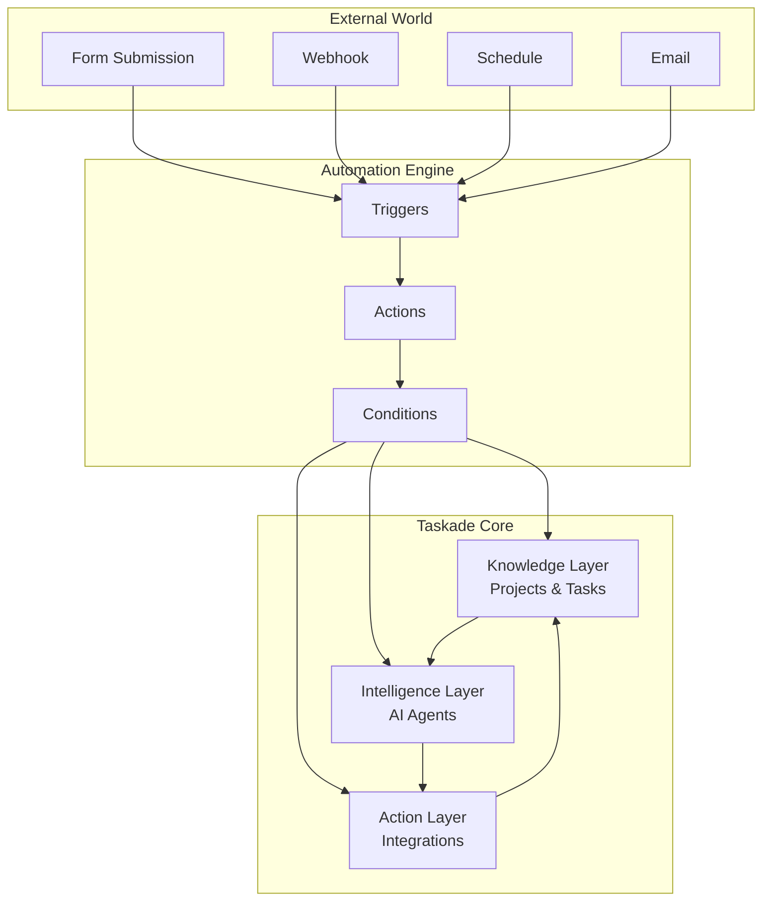

# Taskade Automations Overview

Taskade Automations let you connect 100+ tools and services into intelligent workflows that combine **human action**, **AI agents**, and **real-time execution.**

Think of automations as the nervous system of your AI-powered applications. They bridge the gap between your app's knowledge (Projects), intelligence (Agents), and the outside world, creating seamless workflows that can:

- **React to Events**: Form submissions, webhooks, schedules, project changes
- **Process with AI**: Analyze, categorize, summarize, and make decisions
- **Take Action**: Create tasks, send notifications, update external systems
- **Loop Back**: Update your knowledge base with new insights

## How Automations Work

Automations are composed of three key components:

### 1. **Triggers** – When Something Happens
- **Form Submitted**: User fills out a public form
- **Webhook Received**: External service sends data to your app
- **Schedule**: Time-based triggers (daily, weekly, monthly)
- **Project Event**: Task completed, member added, content changed
- **Agent Event**: Conversation started, command executed

### 2. **Actions** – Do Something
- **Create Tasks**: Add structured data to your Knowledge Layer
- **Run Agent Commands**: Process information with AI
- **Send Notifications**: Slack, email, SMS, Discord
- **Update External Systems**: CRM, spreadsheets, databases
- **Call APIs**: Custom webhooks and HTTP requests

### 3. **Intelligence** – AI-Powered Decision Making
- **Content Analysis**: Sentiment, classification, extraction
- **Smart Routing**: Assign tasks based on content and context
- **Data Enrichment**: Enhance incoming data with research and insights
- **Quality Control**: Review and approve AI-generated content

## Architecture: The Three-Layer System



## Integration Ecosystem

Taskade connects to **100+ external services** across every category:

### 🗣️ Communication & Collaboration
**Slack, Microsoft Teams, Discord, WhatsApp, Telegram, Email**

### 🛠️ Development & Project Management  
**GitHub, GitLab, Jira, Linear, Asana, Trello, Monday.com**

### 📊 Data & Analytics
**Google Sheets, Airtable, Notion, HubSpot, Salesforce, Pipedrive**

### 📧 Marketing & Sales
**Mailchimp, ConvertKit, Calendly, Stripe, PayPal, Shopify**

### 🌐 Web & Content
**WordPress, Webflow, Typeform, Google Forms, RSS, YouTube**

### 🔧 Custom & Developer
**HTTP Webhooks, REST APIs, GraphQL, Custom Forms**

→ **[View Full Integration List](./integrations.md)**

## Real-World Use Cases

### 1. **Lead Generation & Qualification**
- **Trigger**: Form submission from landing page
- **Process**: AI agent qualifies lead based on responses
- **Action**: Create CRM deal, notify sales team, schedule follow-up

### 2. **Customer Support Automation**
- **Trigger**: Support ticket via webhook
- **Process**: AI categorizes urgency and routes to right team
- **Action**: Create task, assign to specialist, update customer

### 3. **Content Creation Pipeline**
- **Trigger**: Weekly schedule
- **Process**: AI researches topics, generates content, reviews quality
- **Action**: Create draft, request approval, publish when approved

### 4. **Project Management Integration**
- **Trigger**: GitHub issue created
- **Process**: AI analyzes priority and assigns to team member
- **Action**: Create Taskade task, sync status, notify stakeholders

### 5. **Data Processing & Analysis**
- **Trigger**: New row in Google Sheets
- **Process**: AI enriches data with research and insights
- **Action**: Update sheet, create summary report, alert team

## Getting Started

### Step 1: Choose Your Trigger
What event should start your automation?
- Public form for lead capture
- Webhook from external service
- Schedule for recurring tasks
- Project event for workflow automation

### Step 2: Design Your Workflow
Map out the sequence of actions:
- What data needs processing?
- Which AI agents should be involved?
- What external systems need updates?
- Who should be notified?

### Step 3: Configure Integrations
Connect to external services:
- Authenticate with OAuth or API keys
- Map data fields between systems
- Set up error handling and retries

### Step 4: Test & Deploy
- Run through with sample data
- Monitor performance and errors
- Iterate based on results

## Advanced Features

### **Conditional Logic**
```json
{
  "condition": "{{form.priority}} === 'high'",
  "then": [...],
  "else": [...]
}
```

### **Multi-Step AI Workflows**
Chain multiple agents together for complex processing

### **Human-in-the-Loop**
Request approvals and reviews before taking action

### **Error Handling**
Retry failed actions and notify on persistent errors

### **Data Transformation**
Clean, format, and enrich data as it flows through your system

## API Access (Coming Soon)

While automations are currently managed through the Taskade interface, we're building API endpoints for programmatic control:

```bash
# Create automation (planned)
curl -X POST https://www.taskade.com/api/v1/automations \
  -H "Authorization: Bearer YOUR_TOKEN" \
  -d '{
    "name": "Lead Processor",
    "trigger": {"type": "form_submission"},
    "actions": [...]
  }'
```

## Next Steps

- **[Explore Integration Options](./integrations.md)**
- **[Browse Action & Trigger Reference](./actions.md)**
- **[View Automation Recipes](./recipes.md)**

---

> **Want to browse all integrations?**  
> → [Full Integration List](./integrations.md)

> **Want to submit your own automation pattern?**  
> → [Request via Taskade Community](https://taskade.com/community) 