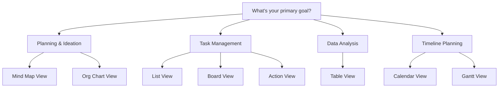

# Project Views Mastery: Choose the Right View for Every Situation

**Master Taskade's 8 unique project views and learn when to use each one for maximum productivity. The same data, infinite perspectives—discover how switching views can transform your workflow and unlock new insights.**


**Pro Tip:** The magic of Taskade is that your data lives in one place, but you can visualize it in 8 different ways. Change views instantly without losing any information—each view reveals different insights from the same underlying data.


---

## 🎯 The Multi-View Philosophy

### **One Data Source, Multiple Perspectives**

Unlike other tools that force you into rigid formats, Taskade's views are different lenses for the same information:

```yaml
Your Data Foundation:
  - Tasks and projects stored in flexible tree structure
  - Custom fields, dates, assignees, and notes
  - Rich content including files, images, and links
  - Real-time collaboration and sync across all views

8 Different Views:
  - Each view emphasizes different aspects of your data
  - Switch instantly without data conversion or loss
  - Collaborative editing works seamlessly across all views
  - Choose the best view for each situation and workflow
```

### **View Selection Strategy**


---

## 📋 List View: The Foundation

### **When to Use List View**
- **Linear workflows** and step-by-step processes
- **Meeting agendas** with clear progression
- **Checklists** and standard operating procedures
- **Document outlining** and content planning
- **Quick task capture** and brain dumps

### **List View Mastery Techniques**

#### **Advanced Indentation Strategies**
```
📋 Product Launch Plan
├── 🎯 Phase 1: Research & Planning
│   ├── Market research analysis
│   ├── Competitor analysis
│   │   ├── Feature comparison
│   │   └── Pricing analysis
│   └── User persona development
├── 🎨 Phase 2: Design & Development  
│   ├── UI/UX design
│   ├── Development sprints
│   └── Quality assurance testing
└── 🚀 Phase 3: Launch & Marketing
    ├── Marketing campaign creation
    ├── Launch event planning
    └── Post-launch monitoring
```

#### **Smart List Organization**
```yaml
Hierarchical Thinking:
  Level 1 - Major Categories:
    - Use emojis for visual categorization
    - Keep to 3-7 main categories for cognitive ease
  
  Level 2 - Sub-processes:
    - Break down each category into logical steps
    - Maintain parallel structure across categories
  
  Level 3 - Action Items:
    - Specific, actionable tasks
    - Include deadlines and assignees
    - Add custom fields for priority and status
```

#### **Real-World List View Example: Content Creation Workflow**
```
📝 Blog Post Creation System
├── 📊 Research & Planning (2 days)
│   ├── Keyword research and SEO analysis @sarah
│   ├── Competitor content analysis @mike  
│   ├── Outline creation and approval @team
│   └── Resource gathering and linking @sarah
├── ✍️ Writing & Creation (3 days)
│   ├── First draft completion @writer
│   ├── Internal review and feedback @editor
│   ├── Revision and optimization @writer
│   └── Final approval and sign-off @manager
├── 🎨 Design & Media (2 days)
│   ├── Header image creation @designer
│   ├── Infographic development @designer
│   ├── Social media assets @designer
│   └── Alt text and accessibility @writer
└── 🚀 Publishing & Promotion (1 day)
    ├── WordPress publishing and formatting @writer
    ├── Social media scheduling @marketing
    ├── Email newsletter inclusion @marketing
    └── Performance tracking setup @analytics
```

---

## 🏢 Board View: Visual Workflow Management

### **When to Use Board View**
- **Kanban workflows** and pipeline management
- **Status tracking** with clear stages
- **Sales processes** and lead management
- **Project phases** with hand-offs between teams
- **Content calendars** and editorial workflows

### **Board Setup Strategies**

#### **Classic Kanban Configuration**
```yaml
Sales Pipeline Board:
  Columns:
    - 📥 New Leads (Inbox for all incoming)
    - 🔍 Qualifying (Initial assessment)
    - 📞 In Contact (Active communication)
    - 💰 Proposal Sent (Waiting for decision)
    - ✅ Closed Won (Successful conversions)
    - ❌ Closed Lost (Learning opportunities)
```

#### **Custom Workflow Boards**
```yaml
Content Production Board:
  Columns:
    - 💡 Ideas (Brainstorming and concepts)
    - 📋 Planned (Approved and scheduled)
    - ✍️ In Progress (Active creation)
    - 👀 Review (Quality control phase)
    - ✅ Ready (Approved for publishing)
    - 📢 Published (Live content tracking)
```

### **Advanced Board Techniques**

#### **Card Organization Best Practices**
```javascript
// Optimal card information hierarchy
{
  "cardStructure": {
    "title": "Clear, actionable headline (40-60 characters)",
    "description": "Context and requirements (2-3 sentences)",
    "customFields": {
      "priority": "High/Medium/Low visual indicators",
      "effort": "Time estimation (1-8 point scale)",
      "value": "Business impact assessment"
    },
    "assignees": "Maximum 2-3 people per card",
    "dueDate": "When absolutely necessary",
    "labels": "2-3 maximum for visual clarity"
  }
}
```

#### **Board View Success Story: Marketing Agency**
```yaml
Agency Project Management:
  Challenge: Managing 15 client projects simultaneously
  
  Board Setup:
    - Client columns for project ownership
    - Horizontal swimlanes for project phases
    - Color coding by service type
    - Custom fields for budget and timeline
  
  Results:
    - 40% reduction in project delays
    - 60% improvement in client communication
    - 25% increase in project profitability
    - 90% team adoption rate
```

---

## 📅 Calendar View: Time-Based Planning

### **When to Use Calendar View**
- **Event planning** and scheduling coordination
- **Deadline management** and milestone tracking
- **Resource allocation** across time periods
- **Editorial calendars** and content planning
- **Personal productivity** and time blocking

### **Calendar Mastery Strategies**

#### **Time Blocking Techniques**
```yaml
Deep Work Calendar:
  Morning Block (9-11 AM):
    - High-concentration creative tasks
    - Complex problem-solving work
    - Strategic planning sessions
  
  Communication Block (11 AM - 1 PM):
    - Team meetings and check-ins
    - Client calls and presentations  
    - Email and message responses
  
  Afternoon Block (2-4 PM):
    - Administrative tasks and documentation
    - Review and quality control work
    - Planning and preparation for next day
```

#### **Multi-Project Calendar Management**
```javascript
// Calendar view optimization for complex schedules
{
  "calendarStrategies": {
    "colorCoding": {
      "projectA": "#FF6B6B", // Red for urgent client work
      "projectB": "#4ECDC4", // Teal for internal projects  
      "meetings": "#45B7D1", // Blue for all meetings
      "personal": "#96CEB4"  // Green for personal time
    },
    "viewModes": {
      "daily": "Detailed task scheduling and time blocking",
      "weekly": "Project coordination and deadline management",
      "monthly": "High-level planning and milestone tracking"
    }
  }
}
```

### **Calendar View Use Case: Event Planning**
```yaml
Conference Planning Calendar:
  6 Months Before:
    - Venue booking and contract negotiation
    - Speaker outreach and confirmation
    - Sponsorship package development
  
  3 Months Before:
    - Marketing campaign launch
    - Registration system setup
    - Catering and logistics coordination
  
  1 Month Before:
    - Final attendee confirmations
    - Material preparation and printing  
    - Staff briefing and role assignment
  
  Event Week:
    - Daily setup and coordination tasks
    - Real-time issue management
    - Post-event follow-up planning
```

---

## 📊 Table View: Data Analysis Powerhouse

### **When to Use Table View**
- **Database-like data management** with sorting and filtering
- **Inventory tracking** and asset management
- **Contact management** and CRM functionality
- **Financial tracking** and budget management
- **Performance analysis** and reporting

### **Table Configuration Mastery**

#### **Custom Field Strategy**
```yaml
CRM Table Setup:
  Core Fields:
    - Contact Name (Text)
    - Company (Text with autocomplete)
    - Email (Email validation)
    - Phone (Phone number formatting)
  
  Sales Fields:
    - Deal Value (Currency with calculations)
    - Stage (Dropdown with pipeline stages)
    - Probability (Percentage slider)
    - Next Action (Text with due date)
  
  Analytics Fields:
    - Lead Source (Multi-select tags)
    - Last Contact (Auto-updating date)
    - Engagement Score (Formula calculation)
    - Notes (Rich text for context)
```

#### **Fill with AI: Intelligent Data Population**

Transform your Table View into an AI-powered data processing engine that automatically fills columns with intelligent analysis.

| **AI Action** | **Use Case** | **Business Impact** |
|---------------|--------------|-------------------|
| **Translate** | Multi-language customer data | Global business expansion |
| **Summarize** | Long feedback into key points | Quick decision making |
| **Extract** | Pull specific data from text | Automated data entry |
| **Categorize** | Auto-assign tags and labels | Consistent data organization |
| **Custom Analysis** | Business-specific intelligence | Tailored insights |

**Fill with AI Examples:**

**Marketing Campaign Analysis:**
```yaml
Campaign Data Table:
  - Campaign Name: "Q4 Product Launch"
  - Description: "Comprehensive multi-channel campaign targeting enterprise clients..."
  - AI Analysis: "High-value B2B campaign with strong ROI potential"
  - Category: [AI fills] "Enterprise Marketing"
  - Priority: [AI fills] "High"
  - Budget Recommendation: [AI fills] "$50,000-75,000"
```

**Customer Feedback Processing:**
```yaml
Feedback Table:
  - Customer: "John Smith - TechCorp"
  - Feedback: "The software is great but the onboarding process was confusing..."
  - Sentiment: [AI fills] "Mixed - Positive product, Negative experience"
  - Action Items: [AI fills] "Improve onboarding documentation"
  - Priority: [AI fills] "Medium"
  - Department: [AI fills] "Customer Success"
```

**Lead Qualification:**
```yaml
Lead Table:
  - Company: "StartupXYZ"
  - Description: "50-person SaaS company looking for project management..."
  - Qualification: [AI fills] "High - Perfect ICP match"
  - Deal Size: [AI fills] "$15,000-25,000 annually"
  - Next Action: [AI fills] "Schedule demo call"
```

#### **Advanced Filtering and Sorting**
```javascript
// Table view power user techniques
{
  "tableOptimization": {
    "filterStrategies": {
      "activeDeals": "Stage != 'Closed Lost' AND Value > $1000",
      "hotProspects": "Engagement Score > 80 AND Last Contact < 7 days",
      "followUpNeeded": "Next Action Date < Today AND Stage = 'In Progress'"
    },
    "sortingLogic": {
      "priority": ["Deal Value DESC", "Probability DESC", "Next Action ASC"],
      "pipeline": ["Stage ASC", "Deal Value DESC"],
      "activity": ["Last Contact DESC", "Engagement Score DESC"]
    }
  }
}
```

### **Table View Success Story: Inventory Management**
```yaml
Retail Inventory System:
  Implementation:
    - Product catalog with 500+ items
    - Real-time stock level tracking
    - Automated reorder point alerts
    - Supplier information and lead times
  
  Custom Fields:
    - SKU (unique identifier)
    - Current Stock (number with alerts)
    - Reorder Point (threshold setting)
    - Supplier (dropdown with contact info)
    - Cost & Price (currency calculations)
  
  Results:
    - 95% reduction in stockouts
    - 30% improvement in inventory turnover
    - 50% less time spent on manual counting
    - $50k annual savings from optimized ordering
```

---

## 🧠 Mind Map View: Creative Thinking Unleashed

### **When to Use Mind Map View**
- **Brainstorming** and idea generation
- **Concept mapping** and knowledge organization
- **Creative planning** and innovation processes
- **Problem solving** and root cause analysis
- **Learning** and information synthesis

### **Mind Mapping Mastery**

#### **Radial Thinking Techniques**
```yaml
Mind Map Structure:
  Central Node: Core topic or challenge
  
  Primary Branches (3-7 main themes):
    - Major categories or aspects
    - Different perspectives or approaches
    - Key stakeholders or components
  
  Secondary Branches (unlimited depth):
    - Specific ideas and solutions
    - Supporting evidence and examples
    - Action items and next steps
  
  Visual Enhancement:
    - Colors for different categories
    - Icons and emojis for quick recognition
    - Size variations for importance hierarchy
```

#### **Creative Problem Solving Framework**
```
                    🎯 Product Innovation Challenge
                           /        |        \
                    Market Research  Technology  User Experience
                      /     |     \      |         /     |     \
                 Surveys  Focus    Trends  AI    UI Design  Testing  Feedback
                         Groups          /ML              |
                                    Automation          Usability
                                                         Study
```

### **Mind Map Applications**

#### **Project Planning Mind Map**
```yaml
Website Redesign Project:
  Central Focus: "New Company Website"
  
  Main Branches:
    - User Research (personas, surveys, analytics)
    - Content Strategy (messaging, SEO, copywriting)  
    - Design System (colors, typography, components)
    - Technical Architecture (hosting, CMS, performance)
    - Launch Strategy (timeline, testing, marketing)
  
  Benefits:
    - Visual overview of project scope
    - Non-linear thinking and idea generation
    - Easy identification of connections between areas
    - Collaborative brainstorming facilitation
```

---

## 🏗️ Org Chart View: Hierarchical Structure

### **When to Use Org Chart View**
- **Organizational structure** visualization
- **Decision trees** and process flows
- **Skill development** and learning paths
- **Product hierarchies** and categorization
- **Reporting structures** and dependencies

### **Org Chart Optimization**

#### **Corporate Structure Mapping**
```yaml
Company Organization:
  CEO Level:
    - Strategic oversight and vision
    - Board communications
    - Major partnership decisions
  
  Department Heads:
    - Operational management
    - Team leadership and development
    - Resource allocation
  
  Team Members:
    - Execution and delivery
    - Skill development
    - Peer collaboration
```

#### **Process Flow Documentation**
```yaml
Customer Support Escalation:
  Level 1: Initial Support
    - Basic troubleshooting
    - FAQ and documentation
    - Ticket creation and tracking
  
  Level 2: Technical Support  
    - Advanced problem solving
    - System access and diagnostics
    - Solution implementation
  
  Level 3: Engineering Escalation
    - Bug investigation and fixes
    - System architecture changes
    - Long-term solution planning
```

---

## ⚡ Action View: Mobile-First Productivity

### **When to Use Action View**
- **Mobile task management** and on-the-go productivity
- **Quick task capture** without complex formatting
- **Simple workflows** that don't require elaborate structure
- **Personal productivity** and daily task management
- **Field work** and remote task completion

### **Action View Optimization**

#### **Mobile Workflow Design**
```yaml
Action View Benefits:
  Simplicity:
    - Clean, distraction-free interface
    - Large touch targets for mobile use
    - Swipe gestures for quick task completion
  
  Speed:
    - Rapid task entry and editing
    - Voice-to-text integration
    - Minimal navigation required
  
  Focus:
    - Single-column layout for clarity
    - Priority-based task ordering
    - Essential information only
```

---

## 📈 Gantt View: Project Timeline Management

### **When to Use Gantt View**
- **Complex project scheduling** with dependencies
- **Resource allocation** and capacity planning
- **Milestone tracking** and deadline management
- **Critical path analysis** and risk assessment
- **Stakeholder communication** and progress reporting

### **Gantt Chart Mastery**

#### **Project Timeline Planning**
```yaml
Software Development Project:
  Phase 1: Planning (Weeks 1-2)
    - Requirements gathering
    - Technical specification
    - Resource allocation
  
  Phase 2: Development (Weeks 3-8)
    - Backend development (parallel)
    - Frontend development (parallel)
    - API integration (dependent)
  
  Phase 3: Testing (Weeks 9-10)
    - Unit testing (parallel)
    - Integration testing (sequential)
    - User acceptance testing (final)
  
  Phase 4: Deployment (Week 11)
    - Production setup
    - Data migration
    - Go-live coordination
```

#### **Dependency Management**
```javascript
// Gantt view dependency relationships
{
  "dependencyTypes": {
    "finishToStart": "Task B cannot start until Task A is completed",
    "startToStart": "Task B cannot start until Task A has started", 
    "finishToFinish": "Task B cannot finish until Task A is finished",
    "startToFinish": "Task B cannot finish until Task A has started"
  }
}
```

---

## 🎯 View Switching Strategies

### **Dynamic View Selection**

#### **Workflow-Based View Changes**
```yaml
Daily Productivity Cycle:
  Morning Planning (8-9 AM):
    - Calendar View: Review day's schedule
    - List View: Prioritize tasks and activities
  
  Focused Work (9 AM-12 PM):
    - Action View: Execute high-priority tasks
    - Table View: Data entry and analysis work
  
  Collaboration Time (1-3 PM):
    - Board View: Team project coordination  
    - Mind Map: Creative brainstorming sessions
  
  Planning & Review (4-5 PM):
    - Gantt View: Project timeline updates
    - Calendar View: Tomorrow's planning
```

#### **Project Lifecycle View Progression**
```yaml
Project Evolution:
  Ideation Phase:
    - Mind Map View for brainstorming
    - List View for initial organization
  
  Planning Phase:
    - Gantt View for timeline development
    - Table View for resource allocation
  
  Execution Phase:
    - Board View for workflow management
    - Action View for daily task completion
  
  Review Phase:
    - Calendar View for timeline analysis
    - Table View for performance metrics
```

### **Team Collaboration Across Views**

#### **Role-Based View Preferences**
```yaml
Team View Optimization:
  Project Managers:
    - Primary: Gantt (timeline oversight)
    - Secondary: Board (workflow monitoring)
  
  Designers:
    - Primary: Mind Map (creative planning)
    - Secondary: List (task organization)
  
  Developers:
    - Primary: Board (sprint management)
    - Secondary: Action (daily standups)
  
  Analysts:
    - Primary: Table (data management)
    - Secondary: Calendar (reporting cycles)
```

---

## 📊 View Performance Analytics

### **Productivity Metrics by View**

#### **View Usage Optimization**
```javascript
{
  "viewAnalytics": {
    "taskCompletion": {
      "listView": "85% completion rate - best for sequential work",
      "boardView": "78% completion rate - excellent for collaborative work",
      "actionView": "90% completion rate - ideal for simple, focused tasks",
      "tableView": "72% completion rate - best for data-heavy workflows"
    },
    "collaborationEffectiveness": {
      "mindMap": "95% team engagement in brainstorming sessions",
      "board": "88% improvement in workflow transparency",
      "gantt": "82% better timeline adherence"
    }
  }
}
```

---

## 💡 Pro Tips & Advanced Techniques

### **View Mastery Checklist**

#### **Optimization Strategies**
- [ ] **Match view to workflow purpose** - don't force data into wrong format
- [ ] **Switch views during different project phases** - leverage each view's strengths
- [ ] **Use custom fields consistently** across all views for seamless switching
- [ ] **Train team members** on when and why to use specific views
- [ ] **Create view-specific templates** for common use cases

#### **Common Mistakes to Avoid**
```yaml
View Selection Anti-Patterns:
  Wrong View Choice:
    - Using Gantt for simple task lists (overkill)
    - Using Action View for complex project planning (insufficient)
    - Using Table View for creative brainstorming (restrictive)
  
  Poor Data Structure:
    - Inconsistent naming conventions across views
    - Missing custom fields that enhance specific views
    - Over-complicated hierarchies that don't translate well
  
  Team Adoption Issues:
    - Not training team on view benefits
    - Forcing everyone to use the same view
    - Not establishing view-switching protocols
```

---

## 🚀 Getting Started with Multi-View Mastery

### **30-Day View Mastery Plan**

#### **Week 1: Foundation Views**
- [ ] Master **List View** for daily task management
- [ ] Experiment with **Action View** for mobile productivity
- [ ] Practice **Calendar View** for time blocking

#### **Week 2: Collaboration Views**
- [ ] Set up **Board View** for team workflow management  
- [ ] Use **Mind Map View** for creative brainstorming sessions
- [ ] Try **Table View** for data organization

#### **Week 3: Advanced Views**
- [ ] Learn **Gantt View** for project timeline management
- [ ] Explore **Org Chart View** for process documentation
- [ ] Practice switching between views for different purposes

#### **Week 4: Integration & Optimization**
- [ ] Establish team protocols for view usage
- [ ] Optimize custom fields for multi-view compatibility
- [ ] Create templates for common view configurations

---

**🎯 Ready to master multi-view productivity?** Start with the view that matches your immediate needs, then gradually explore others as your projects and workflows evolve.

*For specific industry applications, see our [Industry Use Cases Guide](./industry-use-cases.md). For advanced project customization, explore our [Knowledge Management](./knowledge-management.md) documentation.*
