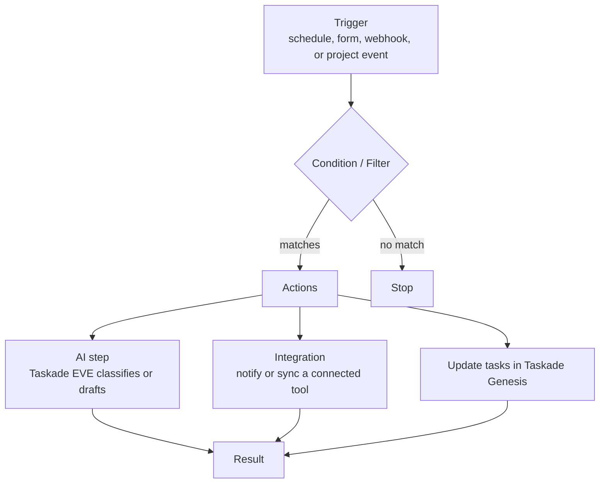

# Automations Overview

Automations let you build trigger-and-action workflows that run on their own — connecting Taskade to your tools and letting agents act 24/7.

## I want to…

| I want to… | Go to |
| --- | --- |
| Build my first workflow | [Action & Trigger Reference](actions.md) |
| Find available triggers and actions | [Action & Trigger Reference](actions.md) |
| Generate a workflow from a prompt | [Workflow Generator](workflow-generator.md) |
| Connect an integration | [Integration Overview](comprehensive-integration-guide.md) |
| See every available connector | [Integration Options](integrations.md) |
| Start from a ready-made recipe | [Automation Recipes](recipes.md) |

**Act. Execute. Evolve.** Taskade Automations are the living motion layer of Workspace DNA, transforming static workflows into intelligent, adaptive systems that act with precision and learn from every execution.


**Living Motion Layer** — Automations that don't just execute tasks, but learn from patterns, adapt to changing conditions, and continuously improve business outcomes.


## What is Living Motion?

Living Motion is Taskade’s automation layer. It’s how your workspace can **react**, **decide**, and **execute** when something happens.

Every automation follows the same shape: a trigger starts it, an optional condition routes it, and actions do the work.

Canonical foundation: [Workspace DNA](../../genesis-living-system-builder/genesis/workspace-dna.md).

### What you use it for

* **Notifications**: send Slack/Teams/email alerts.
* **Routing**: assign work based on content, priority, or owner.
* **Sync**: keep CRMs, Sheets, and databases updated.
* **Reporting**: scheduled summaries and digests.
* **Approvals**: add a human-in-the-loop before publishing or sending.

### Core building blocks

#### Triggers

Triggers start workflows. Common ones are schedules, forms, webhooks, and project events.

#### Actions

Actions do work. Create tasks, update fields, call webhooks, send notifications, and more.

#### Conditions and branching

Use branches to route different cases. Example: urgent → page someone, normal → add to queue.

#### AI steps

Use an agent to classify, extract, or draft. Then route or act on the structured result.

### Getting started (fast)

1. Pick one workflow you want end-to-end.
2. Choose one trigger.
3. Add 1–3 actions.
4. Test with real data.
5. Add branching and AI only if needed.

### Typical workflows

* Form submission → classify → create task → notify channel
* Webhook → normalize data → update CRM → log result
* Schedule → build weekly summary → send digest

### Available Triggers

**Project Events:**

* **Task Added** — when a new task is created
* **Task Completed** — when a task is marked done
* **Task Assigned** — when a task is assigned to someone
* **Task Due** — when a task reaches its due date
* **New Comment** — when a comment is added
* **New Due Date** — when a due date is set
* **Custom Field Updated** — when a custom field value changes
* **Project Completed** — when all tasks are done
* **Public Agent Chat Ended** — when a public agent conversation finishes
* **Task Moved** — when a task moves from one project to another
* **Project Created** — when a new project is created in a space
* **Due Date Removed** — when a due date is cleared from a task
* **File Added to Media** — when a file is uploaded to the media library

**External Triggers:**

* **Webhook** — receive data from any external service via HTTP POST
* **Form** — custom input forms with text, email, date, and time fields
* **Schedule** — run every X minutes (sub-hourly intervals), hourly, daily, weekly, or monthly
* **Mailhook** — trigger from incoming emails

**Integration Triggers** (from connected services):

Calendly, Slack, Typeform, Gmail, Google Sheets, Google Forms, Google Drive, Webflow, HubSpot, Discord, GitHub, YouTube, RSS, Google Calendar

### 36 Integration Pieces

Connect your workflows to popular tools across the [Taskade integrations](https://www.taskade.com/integrations) directory.

| Category         | Services                                                             |
| ---------------- | -------------------------------------------------------------------- |
| Communication    | Slack, Discord, Microsoft Teams, WhatsApp Business, Telegram Bot     |
| Email            | Gmail, Mailchimp                                                     |
| Google Workspace | Sheets, Drive, Calendar, Docs, Forms                                 |
| CRM & Sales      | HubSpot, Apollo                                                      |
| E-Commerce       | Shopify, Stripe                                                      |
| Social Media     | X/Twitter, LinkedIn, Facebook Pages, Reddit, YouTube                 |
| Developer        | GitHub, HTTP                                                         |
| Forms & CMS      | Typeform, Webflow, WordPress                                         |
| Scheduling       | Calendly, Zoom                                                       |
| AI & Media       | Web Search, Web Scraping, YouTube Transcription, Document Extraction |
| Utilities        | Schedule, Delay, Loop, Branch, Filter                                |

### Where to go next

* Build your first workflow: [Actions & Triggers](actions.md)
* Step catalog: [Actions & Triggers](actions.md)
* Pick tools to connect: [Integration Overview](comprehensive-integration-guide.md)
* Full list of connectors: [Integration Options](integrations.md)
* Troubleshoot: [Living System Troubleshooting](../community-and-sharing/troubleshooting.md)

## Next steps

* [Action & Trigger Reference](actions.md) — pick a trigger and add your first actions
* [Automation Recipes](recipes.md) — start from a proven workflow
* [Integration Overview](comprehensive-integration-guide.md) — connect the tools you already use
* [Living System Troubleshooting](../community-and-sharing/troubleshooting.md) — fix issues and get help


This page stays overview-level. Deep trigger/action lists, templates, and advanced patterns live in the reference pages above.

