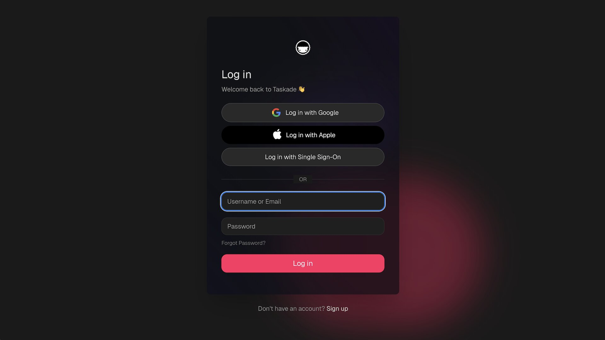
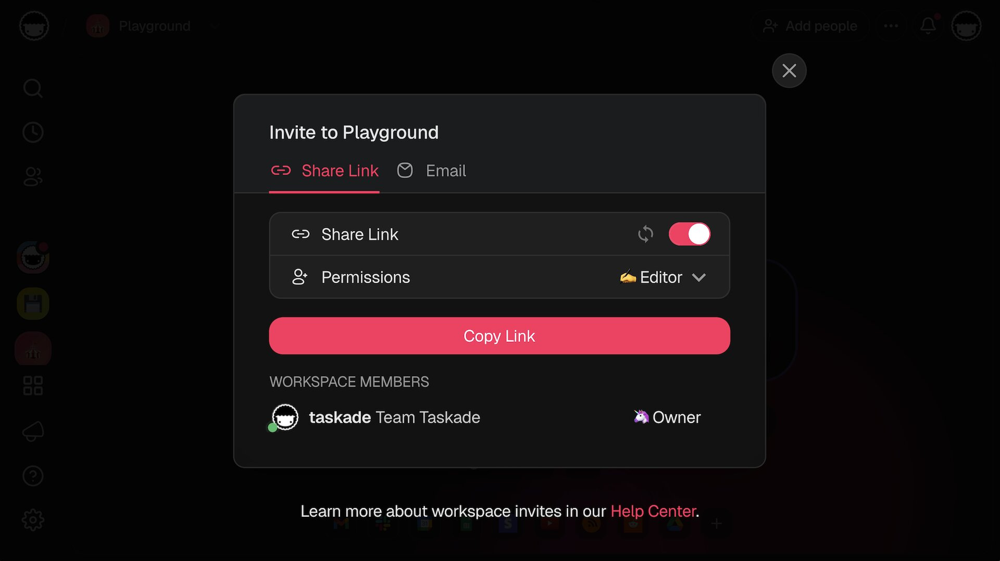
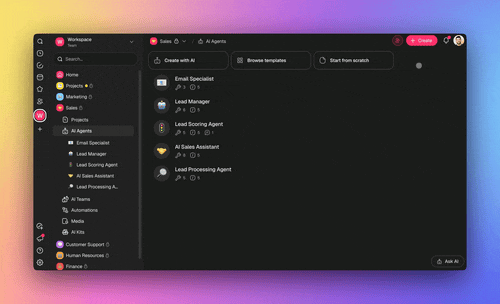

# GenesisAuth

A dedicated security layer for Taskade Genesis apps. Every Genesis app can ship with real user accounts and secure sign-in — no code, no third-party provider setup, no DevOps.

---

## Table of Contents

- [What Is GenesisAuth](#what-is-genesisauth)
- [Turning Any App Into a Multi-User Product](#turning-any-app-into-a-multi-user-product)
- [The App Users Tab](#the-app-users-tab)
- [Workspace Single Sign-On](#workspace-single-sign-on)
- [Custom Domain Sign-In](#custom-domain-sign-in)
- [Access Control](#access-control)
- [How It Works Under the Hood](#how-it-works-under-the-hood)
- [Security Best Practices](#security-best-practices)
- [Related](#related)

---

## What Is GenesisAuth

GenesisAuth is the authentication layer for apps built with Taskade Genesis. When you describe an app that needs user accounts, Taskade wires up secure sign-in automatically — session management, credential handling, and access control all work out of the box.

* **Built-in user accounts.** No Auth0 or Clerk to wire up, no schema to design.
* **Pre-built sign-in component** added to the generated app automatically.
* **Scales with your app.** Handles sessions, password hashing, and session tokens securely.
* **Turns every Genesis app into a real multi-user product.**

<figure><figcaption></figcaption></figure>

---

## Turning Any App Into a Multi-User Product

You don't configure GenesisAuth manually — you describe the need.

1. In Genesis, describe your app in plain language. Include phrases like:
   * *"a client portal where each client has their own dashboard"*
   * *"users can sign in to see their own habit streaks"*
   * *"a members-only knowledge base"*
2. Taskade EVE generates the app **with the sign-in component in place**.
3. Open the app's settings to review the **App Users** tab.

That's it. Your app now accepts user sign-ups, handles sign-in, and enforces per-user data access.


If your first prompt doesn't trigger auth setup, you can add it later by asking EVE to *"add sign-in for users"* while editing the app.


---

## The App Users Tab

The **App Users** tab lives in your Genesis app's settings. It's a first-class user management dashboard.

### What You Can Do

* See the list of end users who have signed in to your app.
* Invite new users by email.
* Suspend access without deleting accounts.
* Remove accounts entirely.

All without touching code.

<figure><figcaption></figcaption></figure>


The App Users tab is currently in Beta. The feature is rolling out across paid plans — bug reports welcome at [github.com/taskade/taskade/issues](https://github.com/taskade/taskade/issues).


---

## Workspace Single Sign-On

Workspace members can sign in to any Genesis app using their existing Taskade workspace identity.

* One identity across your workspace and all your apps.
* No separate account for each Genesis app.
* Sign-in flows work on both Taskade-hosted and custom-domain deployments.

This is especially useful for internal tools — team members use their Taskade credentials and you don't have to manage a second user directory.

---

## Custom Domain Sign-In

GenesisAuth works seamlessly on apps hosted at your own domain.

* No additional configuration required when you connect a custom domain.
* Session cookies and redirects handle custom domains correctly.
* Specific reliability improvements were added for sign-in flows on custom domains.


Combine GenesisAuth with a [custom domain](../space-apps-guide/custom-domains.md) to deliver a fully branded, production-ready product to end users.


---

## Access Control

GenesisAuth is part of a broader access-control story.

| Control | What It Does | When to Use |
| --- | --- | --- |
| GenesisAuth (App Users) | Account-based sign-in for app end users | Any multi-user app |
| Workspace SSO | Taskade identity for workspace members | Internal tools |
| Password-protected public links | Single shared password for a link | Quick gated preview |
| Private / Unlisted visibility | Controls discoverability | Non-indexed sharing |
| Public agent tool opt-out | Sensitive tools stay workspace-only | Published agents |

<figure><figcaption></figcaption></figure>

---

## How It Works Under the Hood

You don't need to know these details to use GenesisAuth, but they matter if you're auditing the security model.

* **Token-based session management.** Sign-in produces a secure session token stored in an HTTP-only cookie.
* **Session cookie migration.** Recent updates moved sessions to more secure cookie configurations with smooth migration for existing users.
* **No credentials in the app bundle.** Exported app bundles never contain end-user credentials or session tokens — only the app structure.
* **Per-app user isolation.** Each Genesis app's App Users list is scoped to that app.

---

## Security Best Practices

* **Review exposed tools.** For public agents, opt sensitive tools out so external users can't invoke them.
* **Suspend instead of delete** when you want to retain a user's history but block access.
* **Use a custom domain with TLS** for any app that handles user data in production.
* **Monitor sign-in activity** via the App Users tab and your workspace activity log.
* **Rotate workspace tokens** periodically if you also expose the app via the [Public API](../../apis-living-system-development/developers/authentication.md).

---

## Related


[publish-and-clone.md](publish-and-clone.md)



[custom-domains.md](../space-apps-guide/custom-domains.md)



[authentication.md](../../apis-living-system-development/developers/authentication.md)

