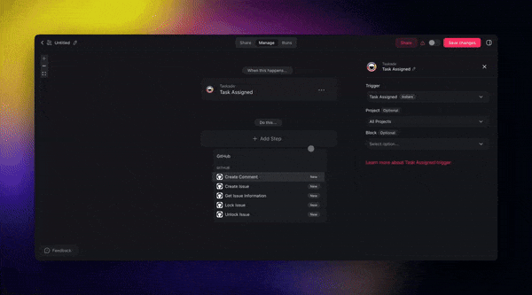

# GitHub Import & Export for Genesis Apps

Bring Genesis apps in from GitHub repositories and push your apps back to GitHub with branch-and-PR workflows. Two-way sync turns every Genesis app into a portable, version-controlled kit.

---

## Table of Contents

- [Overview](#overview)
- [Importing a Genesis App](#importing-a-genesis-app)
- [Exporting a Genesis App](#exporting-a-genesis-app)
- [What's in an Export Bundle](#whats-in-an-export-bundle)
- [Working with the Pull Request Flow](#working-with-the-pull-request-flow)
- [Permissions & Errors](#permissions--errors)
- [Troubleshooting](#troubleshooting)
- [Related](#related)

---

## Overview

GitHub Import & Export lets you treat any Genesis app like code — back it up, collaborate on it through pull requests, and share it with others as a cloneable repository.

* **Import** an app from a public or private GitHub repo with one click.
* **Export** an app to a brand-new repo or push updates to an existing repo as a pull request.
* **Two-way sync** keeps your Taskade workspace and your repo in step.

<figure><figcaption></figcaption></figure>

---

## Importing a Genesis App

### From a Public Repository

1. Open the Genesis app creation screen and choose **Import from GitHub**.
2. Paste the repository URL.
3. Taskade fetches the app bundle and imports it into your workspace.

The entire app kit — projects, agents, and automations — comes in together. **Automations are enabled automatically** after import, so the app is ready to run without manual setup.

### From a Private Repository

Private repositories require authenticated access.

1. Click **Connect GitHub** and authorize Taskade.
2. Select the private repo from the picker.
3. Taskade reads the repo contents directly and imports the same way as a public repo.


The GitHub token needs `repo` scope to read private repositories. You can revoke access anytime from your GitHub account settings.


---

## Exporting a Genesis App

### Create a New Repository

1. Open your Genesis app and choose **Export to GitHub**.
2. Connect your GitHub account if you haven't already.
3. Pick an owner (personal or organization) and a repo name.
4. Taskade creates the repo and pushes your complete app kit.

### Push to an Existing Repository

1. In the Export modal, choose **Push to existing repo**.
2. Pick the target repository and branch.
3. Taskade opens a pull request containing your app bundle.
4. Review the diff in GitHub and merge when you're ready.


Existing files in the target repo are preserved. Only the Genesis app bundle is added or updated.


<figure><figcaption></figcaption></figure>

Old export bundles clean up automatically, so your repo doesn't accumulate stale artifacts.

---

## What's in an Export Bundle

An export captures everything needed to reconstruct the app in another workspace.

| Included | Not Included |
| --- | --- |
| Projects (structure, tasks, notes) | Runtime state (live users, sessions) |
| AI agents (definitions, tools, knowledge attachments) | API tokens or connected account credentials |
| Automations (triggers, actions, flow logic) | Workspace-level settings |
| Media assets | End-user account data (handled by GenesisAuth) |
| App configuration (branding, theming) | Billing / plan state |

---

## Working with the Pull Request Flow

When you push to an existing repo, Taskade does not commit directly to the base branch. Instead:

1. Taskade creates a new branch in the target repo.
2. The Genesis app bundle is committed to that branch.
3. A pull request opens automatically with the diff.
4. You review and merge in GitHub like any other PR.

Re-exporting the same app either updates the open PR or opens a new one, depending on whether the previous PR is still open.

---

## Permissions & Errors

| Scenario | What You See | How to Fix |
| --- | --- | --- |
| Collaborator lacks export permission | Clear error message in the Export modal | Workspace owner must grant export rights |
| GitHub token expired | "Unable to access repository" | Reconnect GitHub from workspace settings |
| Private repo not visible in picker | Repo doesn't appear after connecting | Check token scopes (`repo`) and re-auth |
| Merge conflict on re-export | GitHub shows conflict markers | Resolve in GitHub as you would any PR conflict |

---

## Troubleshooting


**"Repository not found" on import**: Double-check the URL and confirm the repo is either public or that your connected GitHub account has access.



**Exported bundle shows stale data**: Export runs on your current app state. If you expect newer content, confirm your latest edits are saved before exporting.



**PR didn't open automatically**: Check your GitHub account's pending authorizations and confirm the Taskade app has write access to the target repository.


---

## Related


[publish-and-clone.md](../community-and-sharing/publish-and-clone.md)



[bundles.md](../../apis-living-system-development/bundles.md)



[genesis-auth.md](../community-and-sharing/genesis-auth.md)

