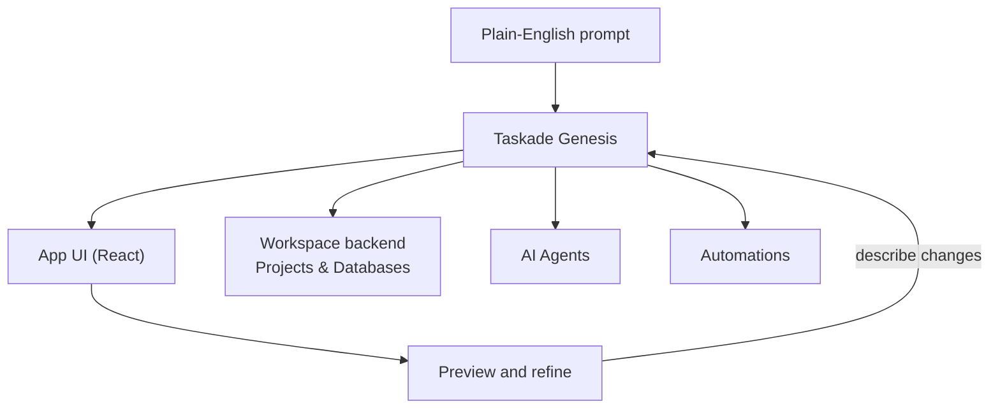

# How Genesis Works: Workspace DNA

---

## Table of Contents

- [Overview](#overview)
- [What Is Taskade Genesis?](#what-is-genesis)
- [What You Can Build](#what-you-can-build)
- [What Makes Taskade Genesis Different](#what-makes-genesis-different)
- [The Tree of Life Architecture](#the-tree-of-life-architecture)
  - [Memory: Projects & Databases](#memory-projects-and-databases)
  - [Intelligence: Custom AI Agents](#intelligence-custom-ai-agents)
  - [Execution: Automations & Integrations](#execution-automations-and-integrations)
- [The Self-Reinforcing Feedback Loop](#the-self-reinforcing-feedback-loop)
- [Workspace Intelligence Score](#workspace-intelligence-score)
- [EVE: The Unified Intelligence](#eve-the-unified-intelligence)
- [What EVE Can Do](#what-eve-can-do)
- [Kits & Bundles](#kits-and-bundles-package-your-entire-workspace)
- [Memory Architecture: 5 Memory Types](#memory-architecture-5-memory-types)
- [What's Next](#whats-next)

---

## Overview

This guide explains the core architecture behind **Taskade Genesis** — the AI platform that transforms natural language into complete, living business applications. You'll learn:

At a high level, here is how a plain-English prompt becomes a working app you can preview and refine.




- **The Tree of Life:** How Memory (Projects), Intelligence (Agents), and Action (Automations) form a continuous cycle that powers living software.
- **Workspace DNA:** What your workspace's genetic code is and why every app you build is unique.
- **EVE:** How Taskade's unified AI system connects everything together.
- **Intelligence Score:** How your workspace earns a 0–100 score across 5 maturity tiers.

> **New to Taskade Genesis?** Start with [Create Your First App](./getting-started.md) for a hands-on walkthrough, or jump straight in and build your first app with [Taskade Genesis](https://www.taskade.com/create).

---

## What Is Genesis?

Taskade Genesis is Taskade's breakthrough AI platform that transforms natural language descriptions into **complete, working business applications** in minutes — not mockups, not prototypes, but fully functional software.

A single prompt gives you:

| Component | What You Get |
|---|---|
| **User Interface** | Professional React app with 50+ UI components (shadcn/ui), responsive design, and customizable styles |
| **Databases** | Structured project databases with custom fields, relationships, and persistent memory |
| **AI Agents** | Custom agents trained on your business context, embeddable directly in your apps |
| **Automations** | Intelligent workflows across 100+ integrated tools (Slack, Gmail, HubSpot, Google Sheets, and more) |
| **File Handling** | Document and media management with upload, storage, and AI processing |
| **Security** | Role-based access control, password protection, and custom domain support |
| **Analytics** | Built-in visitor tracking, geographic data, traffic sources, and device metrics |
| **Version Control** | Full commit history with one-click restore to any previous version |
| **Publishing** | Instant deployment with shareable links, custom domains, and community gallery |

> **Taskade Genesis hint:** Your AI credits power app creation. Different models have different credit costs — see [Taskade AI Credits](https://www.taskade.com/learn/agents/ai-usage) for details.

---

## What You Can Build

Taskade Genesis doesn't care what industry you're in. You describe the problem; it builds the solution.

| What You Ask For | What Taskade Genesis Builds | Powered By Your DNA |
|---|---|---|
| "Build a customer feedback app" | Ratings system, sentiment analysis, photo uploads, manager alerts, follow-up workflows | Your service standards, past feedback patterns, resolution strategies |
| "Create a booking system" | Real-time scheduling, payment processing, automated confirmations, customer history, staff optimization | Your services, pricing, availability rules, customer preferences |
| "I need a CRM for leads" | Multi-source capture, AI qualification scoring, automated nurturing, pipeline tracking, forecasting | Your sales process, customer segments, qualification criteria |
| "Build an onboarding portal" | New hire forms, equipment provisioning, training checklists, document collection, milestone tracking | Your org structure, role definitions, policies, training materials |
| "Create an AI help desk" | Ticket submission, AI routing, knowledge base integration, SLA tracking, satisfaction surveys | Your support categories, team structure, common issues |
| "Build an inventory tracker" | Product database, stock-level monitoring, supplier management, reorder automation, sales pattern analysis | Your product catalog, supplier info, reorder history |
| "Create a course platform" | Video hosting, quiz builder, progress tracking, certificate generation, engagement analytics | Your course content, learning paths, assessment criteria |

---

## What Makes Genesis Different

Unlike every other app builder, Taskade Genesis doesn't start with empty templates or generic forms. It reaches into your **existing Workspace DNA**:

| Traditional App Builders | Taskade Genesis |
|---|---|
| Start from blank templates | Starts from your existing workspace data |
| Manual database setup | Databases auto-populated from your projects |
| No AI intelligence | Custom AI agents embedded in every app |
| Separate automation tools | 100+ integrations built in from day one |
| Static, one-time builds | Living apps that learn and improve over time |
| Weeks/months to deploy | Minutes from prompt to live app |

**Your workspace is your app's foundation:**
- Your **projects** become the app's memory
- Your **AI agents** become the app's intelligence
- Your **automations** become the app's execution layer
- Your **documents** become the app's knowledge base

> Human DNA contains genetic instructions for life. Your workspace contains digital instructions for your apps. That means every app you create is **unique**.

---

## The Tree of Life Architecture

At the core of every Taskade Genesis app lies the **Tree of Life** — a continuous cycle of three interconnected systems that never stop learning.

```
        +------------------+
        |     MEMORY       |
        |   (Projects &    |
        |    Databases)    |
        +--------+---------+
                 |
    Feeds into   |   Writes back
                 v
  +--------------+---------------+
  |         EVE                  |
  |   (Unified Intelligence)     |
  +--------------+---------------+
        |                 |
        v                 v
+-------+------+  +------+--------+
| INTELLIGENCE |  |   EXECUTION   |
| (AI Agents)  |  | (Automations) |
+--------------+  +---------------+
```

> Remove any pillar and the system becomes mechanical, reactive, incomplete. All three work together to create truly living software.

---

### Memory: Projects & Databases

In Taskade Genesis, "Memory" means **living context** — information that maintains relationships, accumulates meaning over time, and actively participates in intelligence.

| App Type | Memory Structure Taskade Genesis Creates |
|---|---|
| **Customer Feedback** | Feedback database with rating fields, contact storage, photo attachments, follow-up tracking, resolution history |
| **Booking System** | Appointment database, client profiles, service catalog, staff schedules, payment records |
| **Inventory Management** | Product database, stock-level tracking, supplier information, reorder history, sales patterns |
| **CRM** | Lead database, interaction logs, deal pipeline, qualification scores, conversion history |
| **Help Desk** | Ticket database, agent assignments, SLA timers, resolution logs, satisfaction ratings |

> **Deep dive:** [Projects & Databases: The Memory Pillar](../workspaces/projects-databases.md)

---

### Intelligence: Custom AI Agents

Intelligence means AI agents that go far beyond answering questions. These are **persistent teammates** that continuously learn, reason, and make decisions.

| App Type | Agent Intelligence |
|---|---|
| **Real Estate Portal** | Trained on property listings, market data, client preferences. Capabilities: property matching, trend analysis, client qualification, tour scheduling |
| **Healthcare Management** | Trained on appointment types, provider schedules, insurance policies. Capabilities: symptom triage, appointment routing, insurance verification |
| **E-Learning Platform** | Trained on course content, student performance, learning paths. Capabilities: personalized recommendations, progress tracking, difficulty adjustment |
| **Customer Support** | Trained on product docs, past tickets, resolution playbooks. Capabilities: issue classification, auto-response, escalation routing |
| **Sales CRM** | Trained on deal history, buyer personas, competitive intel. Capabilities: lead scoring, next-best-action, forecast generation |

> **Deep dive:** [Custom AI Agents: The Intelligence Pillar](../ai-features/ai-agents-getting-started.md)

---

### Execution: Automations & Integrations

Execution means **intelligent automation workflows** — the nervous system that makes your application reactive, adaptive, and alive across 100+ external tools.

| App Type | Automation Workflows Created |
|---|---|
| **Booking System** | Form submitted → Check availability → Process payment → Send confirmation email → Create calendar event → Update availability |
| **Customer Feedback** | Low rating received → Agent analyzes severity → Slack alert to manager → Create follow-up task → Log to database |
| **Inventory Management** | Stock below threshold → Agent calculates optimal quantity → Email supplier → Post Slack alert → Create purchase order → Track delivery |
| **Lead CRM** | New form submission → Create lead record → AI qualification score → Route to sales rep → Set follow-up reminder → Add to nurturing sequence |
| **Help Desk** | Ticket submitted → AI categorizes issue → Route to specialist → Send acknowledgment → Track SLA timer → Follow-up survey on close |

**Supported integration categories (100+ tools):**

| Category | Tools |
|---|---|
| **Communication** | Slack, Discord, Microsoft Teams, WhatsApp Business, Twilio SMS, Zoom |
| **Email** | Gmail, Outlook, Mailchimp |
| **Productivity** | Google Sheets, Google Docs, Google Drive, Google Calendar, Google Forms, Calendly |
| **CRM & Sales** | HubSpot, Apollo |
| **Social & Marketing** | Twitter/X, LinkedIn, Facebook, YouTube, Reddit, WordPress, Webflow, RSS |
| **Development** | GitHub, HTTP/Webhooks |
| **Storage** | Google Drive, Dropbox, Box, OneDrive |

> **Deep dive:** [Automations: The Execution Pillar](../automation/README.md)

Connect your agents to Slack, Stripe, Shopify, and more with [MCP Connectors](mcp-connectors.md).

---

## The Self-Reinforcing Feedback Loop

Every action in your Taskade Genesis app generates results that flow back into your workspace memory, creating a **self-reinforcing intelligence loop**.

| Action Type | Memory Created | Your Workspace Learns |
|---|---|---|
| **Email Sent** | Delivery status, open/click tracking, response captured, time to reply | Best email timing, effective templates, response prediction |
| **Payment Processed** | Transaction record, receipt generated, payment method used | Optimal pricing, payment preferences, conversion patterns |
| **Task Completed** | Completion time, who completed it, outcome captured | Time estimation, team performance, bottleneck identification |
| **Customer Interaction** | Feedback stored, sentiment analyzed, satisfaction tracked | Customer patterns, issue resolution, retention factors |
| **Automation Run** | Trigger data, execution results, success/failure status | Process optimization, failure prediction, timing refinement |
| **Agent Conversation** | Query patterns, resolution paths, knowledge gaps | Improved responses, training gaps, new FAQ candidates |

**How the loop works:**
1. Automations capture real-world data (customer responses, transactions, task completions, support chats)
2. Data writes to project databases
3. AI agents immediately inherit new information
4. Agents make better decisions with richer context
5. Better decisions trigger more effective automations
6. Cycle repeats — your workspace gets smarter with every interaction

---

## Workspace Intelligence Score

Every Taskade Genesis workspace earns an **Intelligence Score** from 0–100, calculated from your three DNA pillars:

| Component | Points Each | Max Items Scored | Max Points |
|---|---|---|---|
| Projects (Memory) | 2 pts | 10 | 20 |
| AI Agents (Intelligence) | 10 pts | 3 | 30 |
| Automation Flows (Execution) | 5 pts | 6 | 30 |
| Integrations (Connections) | _Reserved_ | — | 20 |
| **Total** | | | **100** |

### Intelligence Tiers

| Tier | Score | Indicator | What It Means |
|---|---|---|---|
| **Empty** | 0–19 | ⚪ | Initial state — start adding projects and agents |
| **Beginner** | 20–39 | 🟠 | Basic setup — your workspace is taking shape |
| **Learning** | 40–69 | 🟡 | Growing — apps are getting smarter with real data |
| **Intelligent** | 70–89 | 🔵 | Advanced — strong AI coverage with active automations |
| **Genius** | 90–100 | 🟢 | Full-featured ecosystem — maximum AI-powered capability |

> **Tip:** The fastest way to increase your Intelligence Score is to add AI agents (+10 pts each). Three agents plus six automation flows puts you in the Intelligent tier.

---

## EVE: The Unified Intelligence

**EVE** is the central AI system that powers everything in Taskade. It's the living consciousness that connects Memory, Intelligence, and Action into a unified whole.

When you interact with Taskade, EVE:
1. **Reads** your entire workspace DNA (projects, agents, automations, files)
2. **Understands** holistic context across all three pillars
3. **Decides** what to generate or how to respond
4. **Learns** continuously from every interaction and outcome

### How EVE Powers Each DNA Strand

| DNA Strand | How EVE Powers It |
|---|---|
| **Memory (Projects)** | Indexes and understands project data, extracts patterns, generates structured databases, maintains semantic connections |
| **Intelligence (Agents)** | Trains custom agents on knowledge, routes queries to relevant models, provides context-aware responses, enables multi-agent collaboration |
| **Action (Automations)** | Interprets triggers, makes conditional decisions, generates dynamic content, captures and structures results |

### The Bicameral Partnership

Taskade Genesis creates a cognitive partnership where:
- **Your mind** contributes intent, goals, domain knowledge, and creative vision
- **EVE's intelligence** handles technical implementation, pattern recognition, and optimization
- **Together**, you create something neither could build alone

---

## What EVE Can Do

| Action | Example | What Happens |
|---|---|---|
| **Build Taskade Genesis Apps** | "Build a customer feedback app with sentiment analysis" | Generates complete app with projects, agents, and automations |
| **Create AI Agents** | "Create an agent trained on our product documentation" | Creates agent, indexes docs, configures knowledge base |
| **Configure Automations** | "When a task is complete, send a Slack notification" | Creates automation with trigger, action, and conditions |
| **Manage Projects** | "Create a project for Q1 marketing campaigns" | Creates structured project with relevant sections |
| **Answer Questions** | "Which projects have overdue tasks?" | Scans workspace and provides detailed results |
| **Edit Existing Work** | "Update the Customer Support agent to be more empathetic" | Modifies agent training and behavior |
| **Generate Images** | "Create a hero banner for my booking app" | Generates image, saves to Media library |
| **Connect Integrations** | "Send new leads to our HubSpot CRM" | Creates automation flow with HubSpot integration |
| **Run an Automation** | "Run my daily digest now" | Runs a saved automation in your workspace by name or id, waits for it to finish, and returns a plain-language summary (disabled automations are refused until you enable them) |
| **Build an Automation** | "Build a flow that posts new form submissions to Slack" | Creates a new automation from your description, materialized from a validated template — created switched off so it never fires until you review and enable it |

---

## Kits & Bundles: Package Your Entire Workspace

Taskade Genesis workspaces can be packaged as **Bundles (Kits)** — installable packages that include everything:

| Bundle Component | Included | Description |
|---|---|---|
| **Taskade Genesis Apps** | Yes | Full app with UI, code, and configuration |
| **Projects & Databases** | Yes | Data structures and sample records |
| **AI Agents** | Yes | Agent configs, personas, knowledge references |
| **Automation Flows** | Yes | Workflow definitions and triggers |
| **Templates** | Yes | Project and agent templates |
| **Media** | Yes | Images, documents, uploads |

### How Bundles Work

| Feature | Detail |
|---|---|
| **Create** | Package your workspace into a shareable bundle (empty or include all) |
| **Dependencies** | Automatic dependency resolution — all linked resources included |
| **Install** | Others clone the entire bundle to their workspace in one click |
| **Public sharing** | Publish bundles to the community gallery |
| **Password protection** | Secure bundles with a password |

> **Think of Bundles as "Workspace DNA transplants."** A complete intelligence ecosystem — apps, agents, automations, data — that anyone can install and customize.

---

## Memory Architecture: 5 Memory Types

Your workspace DNA organizes memory into 5 psychological layers:

| Memory Type | Purpose | Example |
|---|---|---|
| **Core Memory** | Primary operational data | Customer database, product catalog |
| **Reference Memory** | Knowledge bases and documentation | FAQ docs, brand guidelines, SOPs |
| **Working Memory** | Current state and active processes | Today's tasks, open tickets, active orders |
| **Navigation Memory** | Structural organization | Workspace hierarchy, project categories |
| **Learning Memory** | Insights and patterns accumulated over time | Performance trends, customer behavior patterns |

> AI agents and Taskade Genesis apps access all 5 memory layers to provide contextual, accurate responses.

---

## What's Next

You now understand the DNA of your workspace. Choose your path:

### Get Started with Genesis

| Guide | What You'll Learn |
|---|---|
| [Create Your First App](./getting-started.md) | Step-by-step walkthrough of your first build |
| [A Maker's Guide to AI Prompts](./prompt-guide.md) | How to describe what you need effectively |
| [App Starter Prompts](../space-apps-guide/genesis-prompt-library.md) | Ready-to-use prompts for common app types |

### Master the Three Pillars

| Guide | What You'll Learn |
|---|---|
| [Projects & Databases: The Memory Pillar](../workspaces/projects-databases.md) | Advanced database structures and data management |
| [Custom AI Agents: The Intelligence Pillar](../ai-features/ai-agents-getting-started.md) | Build, train, and deploy AI agents |
| [Automations: The Execution Pillar](../automation/README.md) | Triggers, actions, and 100+ integrations |

### Go Deeper

| Guide | What You'll Learn |
|---|---|
| [Adding Taskade Genesis Context](./adding-context.md) | Upload files and data to enrich app intelligence |
| [Publish and Clone Your Apps](../community-and-sharing/publish-and-clone.md) | Deploy, share, and distribute your apps |
| [Taskade AI Credits](../../account-management/credits-and-billing.md) | Understand credits, models, and usage |
| [Build on Taskade (Developer Hub)](../../apis-living-system-development/developer-home.md) | APIs, SDKs, and MCP for programmatic access |
