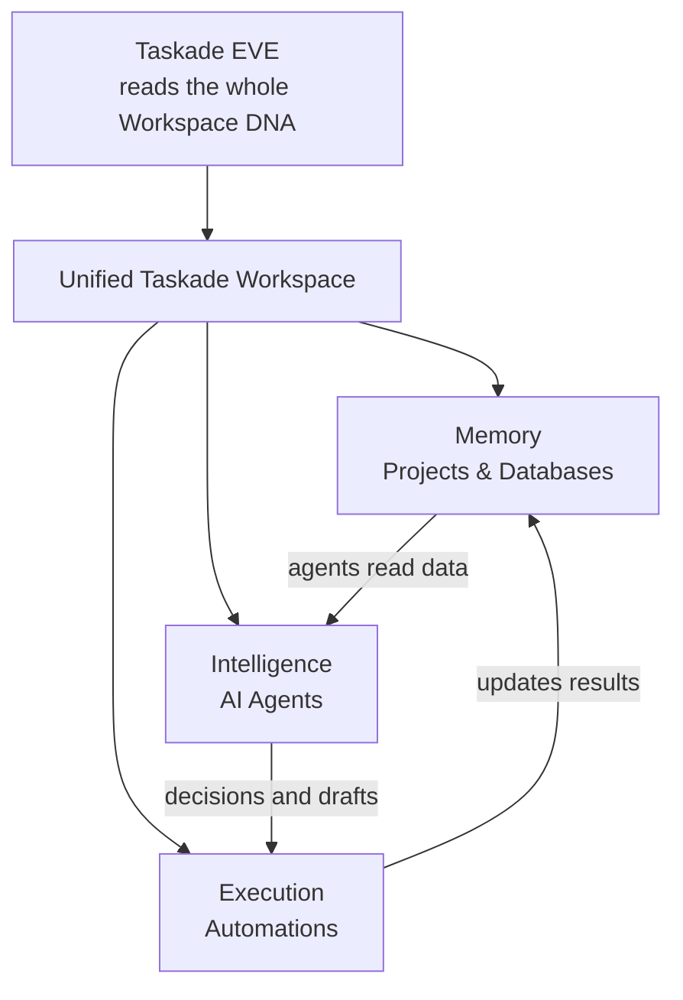

# Workspace DNA

Every Taskade workspace runs on three pillars that work together as a continuous cycle. Understanding this architecture helps you build better apps, smarter agents, and more reliable automations.

## The Three Pillars

The three pillars form one workspace, each feeding the next in a continuous cycle.

### 1. Memory — Projects & Databases

Projects store structured knowledge: tasks, notes, custom fields, documents, and media. This is what agents read and automations update.

**What you get:**
- 9 project views (List, Board, Calendar, Table, Mind Map, Gantt, Org Chart, Action, Docs)
- Custom fields for structured data
- Real-time sync across all devices
- File and media uploads as active knowledge

**Learn more:** [Project Views Mastery](../workspaces/project-views.md) · [Knowledge Organization](../workspaces/knowledge-management.md)

### 2. Intelligence — AI Agents

AI agents reason over your workspace context. They draft, classify, summarize, answer questions, and take actions using the knowledge stored in Memory.

**What you get:**
- Custom agents scoped to specific roles or tasks
- Multi-agent teams with automatic delegation
- 22+ built-in tools (Slack, Gmail, Sheets, and more)
- Persistent memory across conversations
- Multiple frontier AI models, including the latest from Anthropic (Claude), OpenAI (GPT), and Google (Gemini)

**Learn more:** [AI Agents Getting Started](../ai-features/ai-agents-getting-started.md)

### 3. Execution — Automations

Automations execute event-driven workflows. They connect your workspace to 100+ external tools and run 24/7 in the background.

**What you get:**
- 15+ native triggers (webhooks, forms, schedules, project events)
- 100+ integration actions (Slack, Gmail, Google Sheets, HubSpot, Stripe, and more)
- Branching, loops, and conditional logic
- AI steps that classify, extract, or draft within a workflow

**Learn more:** [Automations Overview](../automation/README.md) · [Integration Options](../automation/integrations.md)

## How the Cycle Works

The three pillars form a continuous loop:

1. **Memory** stores data → agents and automations read it.
2. **Intelligence** reasons over data → creates insights, drafts, and decisions.
3. **Execution** acts on decisions → updates Memory with results.

Every action reinforces the cycle. A form submission (Execution) creates a new record (Memory) that an agent (Intelligence) can analyze and act on.

## Why This Matters for Genesis

When you describe an app to Genesis, it generates all three pillars at once:

- **Database projects** for your app's data (Memory)
- **AI agents** trained on your business context (Intelligence)
- **Automation workflows** connecting your tools (Execution)

The app runs on your workspace — not a separate backend. This means every Genesis app shares the same knowledge, agents, and automations as the rest of your workspace.


**The more you build, the smarter everything gets.** Each project, agent, and automation adds to your Workspace DNA, making future apps more capable.


## Intelligence Score

Your workspace has an Intelligence Score (0–100) that reflects its richness:

| Score | Level | What it means |
|-------|-------|--------------|
| 0–20 | Starter | Basic projects, no agents or automations |
| 21–40 | Builder | Some agents and automations connected |
| 41–60 | Expert | Multiple agents, active automations, rich data |
| 61–80 | Advanced | Cross-project intelligence, agent teams |
| 81–100 | Genius | Full ecosystem — agents, automations, and data working as one |

Higher scores mean Genesis can build better apps because it has more context to work with.

## Workspace DNA Flow Canvas

The Workspace DNA flow canvas is a visual, real-time relationship graph that surfaces from the workspace overview. It renders every project, agent, and automation as a node and draws live edges between them — showing at a glance how knowledge flows through your workspace.

**What you see on the canvas:**

- **Project nodes** — each database or project in Memory, with their current record count and connected agents
- **Agent nodes** — every AI agent, the projects it reads, and the automations it triggers
- **Automation nodes** — active workflows, their trigger sources, and the projects or agents they write back to
- **Edges** — directed connections that show how knowledge flows between projects, agents, and automations

**Phase 0 rollout:** The canvas is being introduced progressively starting from the workspace overview panel. Early access surfaces a read-only graph; later phases will add drag-to-rearrange layout, click-through to edit any node inline, and canvas-level filtering by node type or tag.


**No setup required.** The canvas is generated automatically from your existing Workspace DNA — projects, agents, and automations you have already built appear as nodes the moment you open the view.


### Exploring the DNA graph

Open **Memory** from the sidebar to see your whole account rendered as an interactive graph. Your account sits at the center, with every workspace orbiting it and each workspace's projects, AI agents, media, and team spaces branching out from there.

**Two ways to view it:**

- **Galaxy** — a force-directed view that arranges everything in 3D (the default) or flat 2D. The 3D galaxy gently rotates against a starfield so you can take in the whole picture at once.
- **Flow** — a cleaner, structured layout if you prefer straight connectors over an organic constellation.

**What you can do:**

- **Inspect any node.** Click a workspace, project, agent, or any other node to open a panel showing what it is, what it contains, and its child items. From there you can open it in Taskade or copy a direct link. On desktop, right-click a node for the same quick actions.
- **Zoom and navigate.** Use the on-screen zoom in / out / fit controls, or the keyboard shortcuts `+`, `-`, and `0` (fit to screen). In the 2D galaxy a minimap in the corner shows where you are in the larger map.
- **Filter and recolor.** Toggle node types (workspaces, projects, AI agents, media, and more) on or off, and switch between several color palettes to suit your eye.
- **Check status at a glance.** A health indicator in the corner confirms when everything in your account is connected.


**No setup required.** The graph is generated automatically from what you have already built — every workspace, project, agent, and piece of media appears the moment you open Memory.


## EVE: Your AI Companion

EVE is Taskade's central AI assistant. It reads your entire Workspace DNA — every project, agent, and automation — and uses that context to help you build and manage your workspace.

**What EVE can do:**

- Build Genesis apps from a description
- Create and configure AI agents
- Set up automation workflows
- Create and manage projects, tasks, and data
- Answer questions about your workspace
- Edit existing work (rewrite, restructure, expand)

**Four interaction modes:**

| Mode | Focus | Best for |
|------|-------|----------|
| **Genesis** | Full-spectrum | Building complete apps with all three pillars |
| **Projects** | Project-focused | Creating and managing projects, tasks, and data |
| **Agents** | Agent-focused | Building and configuring AI agents |
| **Automations** | Workflow-focused | Setting up triggers, actions, and integrations |


**EVE is available in every workspace.** Open the AI panel or start a chat to begin. The richer your Workspace DNA, the better EVE's suggestions.


## Custom Fields & Structured Data

Projects can function as databases with custom fields, turning simple task lists into structured data stores.

**Custom field types:**

| Type | Details |
|------|---------|
| **Text** | Free-form text values |
| **Number** | Decimal, currency, or percentage formats |
| **Date/Time** | Dates with optional time component |
| **Select** | Dropdown with color-coded options |

> This is a summary. See [Projects & Databases](../workspaces/projects-databases.md#available-field-types) for the full field-type reference — Rating, Currency, URL, Person, and more.

**Why this matters:**

- Store structured data alongside tasks and notes
- Filter and sort projects by any field
- Use field values as automation triggers (e.g., "when Status changes to Closed")
- Build reporting views with Table and Board layouts


**Example:** Track sales leads with fields for Status (Select: New / Contacted / Won / Lost), Deal Amount (Number: currency), Close Date (Date), and Priority (Select: High / Medium / Low). Automate follow-ups when Status changes.


## Next Steps

- **Build your first app:** [Your First Living System in 5 Minutes](getting-started.md)
- **Add AI agents:** [AI Agents Getting Started](../ai-features/ai-agents-getting-started.md)
- **Set up automations:** [Automations Overview](../automation/README.md)
- **Browse examples:** [Living System Examples & Templates](examples-and-templates.md)
