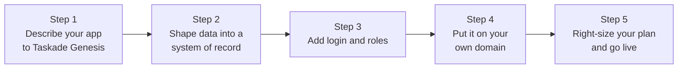

# From idea to live business — the 5 steps

You have a business problem and an idea for an app that fixes it. This guide is the spine: five steps that take you from a plain-English idea to a real, branded app your customers can sign in to and use. Each step links to a full guide when you want the detail.

The five steps form one path from idea to a live, branded app.

***

## Step 1 — Describe your app to Genesis

Start with the problem, not the software. Tell Taskade Genesis what you do, who will use the app, and what should happen when they use it. EVE turns that description into a working app — the screens, the data behind them, and the logic that connects them. This is where your idea becomes something you can click. You build by describing changes in plain English, so refining is just another sentence.

→ Full guide: [Getting Started with Taskade Genesis](../genesis/getting-started.md)

## Step 2 — Shape your data into a system of record

Every real business app remembers things — customers, bookings, orders, requests. Taskade Genesis creates the databases your app needs automatically, and this is where you shape them: name your fields clearly, link related records, and choose the view (table, board, calendar, and more) that matches how you actually work. Get this right and your app stops being a form and becomes a single source of truth your whole business runs on.

→ Full guide: [Projects & Databases](../workspaces/projects-databases.md)

## Step 3 — Add login and roles

The moment real people use your app, you need accounts. GenesisAuth gives every app secure sign-in with no setup — you describe that users should log in, and the sign-in screen is built for you. From the App Users tab you invite people, suspend access, and decide who sees what. This is what turns a shared link into a real multi-user product.

→ Full guide: [GenesisAuth](../community-and-sharing/genesis-auth.md)

## Step 4 — Put it on your own domain

A branded web address makes your app look like software you commissioned, not a tool you borrowed. Connect a domain like `app.yourcompany.com`, point one DNS record at Taskade, and your app goes live with automatic HTTPS — your customers see your brand, never a random link. This is the difference between a prototype and a product people trust with their data.

→ Full guide: [Custom Domains & Branding](../space-apps-guide/custom-domains.md)

## Step 5 — Right-size your plan and go live

Your app runs on AI, and AI runs on credits. Before launch, match your plan and credit balance to how much you expect to use — turn on Auto Top-Up so a busy day never stops your workflows mid-task. Confirm billing is in order, then publish. You are live.

→ Full guide: [Credits & Billing](../../account-management/credits-and-billing.md)

***


**Before you announce it, run the checklist.** Walk the [Go-Live Checklist](./go-live-checklist.md) to confirm sign-in, data, domain, and billing are all ready for real customers.


## Next steps

* [Go-Live Checklist](./go-live-checklist.md) — final pre-launch pass before you share the link
* [Add Login & Roles](./add-login-and-roles.md) — go deeper on accounts and access control
* [Getting Started with Taskade Genesis](../genesis/getting-started.md) — revisit Step 1 to refine your app
* [Custom Domains & Branding](../space-apps-guide/custom-domains.md) — polish your branded launch
