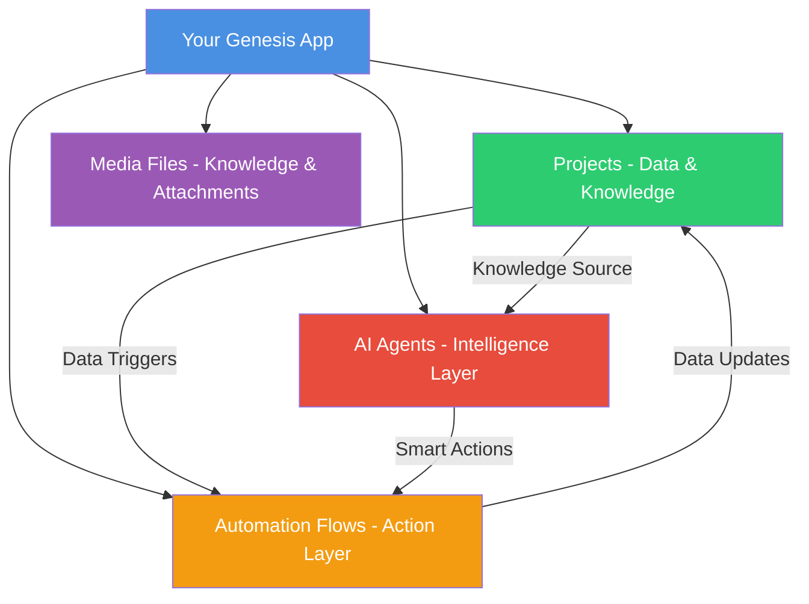

# Taskade Genesis

> **Build professional apps in minutes, not months**  
> Transform your business ideas into working applications using nothing but plain English.

## What is Taskade Genesis?

Taskade Genesis is an AI-powered app generator that creates complete business applications from a single prompt. Unlike traditional app builders that only create interfaces, Genesis gives you everything you need to run a real business application by intelligently combining Taskade's four core pillars.

**Think of it like this:** Instead of hiring developers, learning to code, or struggling with complex app builders, you simply describe what you need in plain English, and Genesis builds it for you — complete with a database, smart features, and connections to your favorite business tools.

Genesis offers **two powerful creation modes** to suit different needs:

### 🏗️ **Project-Based Apps** (Traditional Genesis)
Create structured workspaces with intelligent data management, AI assistants, and automated workflows.

- **📊 Smart Data Storage** - Flexible database that grows with your needs
- **🤖 AI Assistant Built-In** - Learns your business and helps users automatically  
- **⚡ Connects to Everything** - Integrates with 100+ business tools
- **📁 File & Document Support** - Upload and organize business documents
- **🔒 Enterprise Security** - Role-based permissions and data protection

### ⚡ **Space Apps** (New React Generation) 
Generate complete React web applications deployed to live URLs with real-time data integration.

- **🌐 Complete Web Applications** - Full-stack React apps with modern UI
- **🚀 Live Deployment** - Automatic hosting on Fly.io with global CDN
- **🔗 Data Integration** - Connects seamlessly to your Taskade projects
- **🎨 Modern Styling** - Responsive design with Tailwind CSS
- **⚡ Real-time Updates** - Changes sync instantly across your workspace

## The Genesis Difference

| **Traditional Development** | **Taskade Genesis** |
|---------------------------|-------------------|
| ❌ Write technical specifications | ✅ Describe your business needs |
| ❌ Hire developers and manage teams | ✅ Your idea becomes an app in minutes |
| ❌ Debug code and fix bugs | ✅ Changes through simple conversations |
| ❌ Handle servers and security | ✅ Everything managed automatically |
| ❌ Months of development cycles | ✅ Start getting user feedback today |

## Quick Start

Ready to build your first app? Here's what you need:

- A Taskade account ([Sign up free](https://taskade.com/signup))
- A clear business problem you want to solve
- 5-10 minutes of your time

[Understand the Core Pillars →](core-pillars.md) | [Get Started →](getting-started.md)

## What You Can Build

Genesis works for any business challenge you face:

### **Customer-Facing Applications**
- **Customer Portals** - "Clients can submit support requests and track progress without calling"
- **Booking Systems** - "Customers book appointments online, payments handled automatically"
- **Feedback Collection** - "Gather customer reviews and get instant alerts for issues"
- **Event Registration** - "Handle RSVPs, payments, and send reminders"

### **Business Operations**
- **Team Dashboards** - "See your business metrics and KPIs in one place"
- **Inventory Tracking** - "Know when you're running low and reorder automatically"
- **Project Management** - "Keep your team organized with tasks and deadlines"
- **Lead Management** - "Capture leads from your website and follow up automatically"

### **Industry-Specific Solutions**
- **Healthcare Patient Portals** - Appointment scheduling with HIPAA compliance
- **Restaurant Management** - Order tracking, feedback, and staff scheduling
- **Real Estate CRM** - Lead tracking, property management, client portals
- **Education Platforms** - Course management, student tracking, resource sharing

**Real Success Stories:**
- *"I built a customer feedback system for my restaurant in 3 minutes. Now I get Slack alerts for any rating below 4 stars."*
- *"Created a booking system for my yoga studio that handles payments and sends calendar invites automatically."*
- *"Made an inventory tracker that emails my supplier when I'm running low on products."*

[See Examples →](examples-and-templates.md)

## How Genesis Works

Genesis is powered by the **TAA (Taskade AI Assistant) Unified System** and combines four essential components:

### The Four Pillars of Genesis

**When you say:** *"I need customers to submit feedback about their dining experience"*

**Genesis creates:**
1. **📊 A Database** - Stores all feedback with ratings, comments, and customer info
2. **🤖 A Smart Assistant** - Learns from feedback patterns and can respond to customers
3. **⚡ Automatic Actions** - Sends you alerts for low ratings, emails customers back
4. **📁 File Storage** - Lets customers upload photos of their food

**The magic:** You don't need to set up databases, write code, or configure anything. Genesis handles all the technical stuff while you focus on your business.

[Learn more about the Core Pillars →](core-pillars.md)

## Space Apps vs Project Apps

| Feature | Space Apps | Project Apps |
|---------|------------|--------------|
| **Output** | React web applications | Structured workspaces |
| **URL** | Live preview URLs | Taskade workspace URLs |
| **Sharing** | Public web links | Team member access |
| **Customization** | Full visual control | Template-based views |
| **Data** | Project integration | Native project structure |
| **Hosting** | Fly.io deployment | Taskade platform |
| **Use Cases** | Customer-facing apps | Internal workflows |
| **AI Models** | GPT-5 & Claude-4 | Standard Genesis AI |

## Getting Started Paths

### For Business Users (No Technical Background)
1. [Getting Started Guide](getting-started.md) - Your first app in 5 minutes
2. [Examples & Templates](examples-and-templates.md) - Ready-to-use prompts
3. [Best Practices](best-practices.md) - Write better prompts, get better results

### For Advanced Users
1. [Core Pillars](core-pillars.md) - Understand how Genesis components work together
2. [Advanced Features](advanced-features.md) - TAA system, multi-model AI, complex integrations
3. [API Documentation](../api/genesis/README.md) - Programmatic access to Genesis

### Need Help?
1. [Troubleshooting Guide](troubleshooting.md) - Fix common issues
2. [FAQ](faq.md) - Quick answers to common questions
3. [Community Support](https://taskade.com/community) - Connect with other users

## Help & Support

- **Help Center:** [help.taskade.com](https://help.taskade.com/en/collections/14476419-taskade-genesis)
- **Video Tutorials:** [youtube.com/taskade](https://youtube.com/taskade)
- **Email Support:** [support@taskade.com](mailto:support@taskade.com)
- **Community:** [taskade.com/community](https://taskade.com/community)

---

*Ready to transform your business ideas into working applications? [Start building with Genesis →](https://taskade.com)*