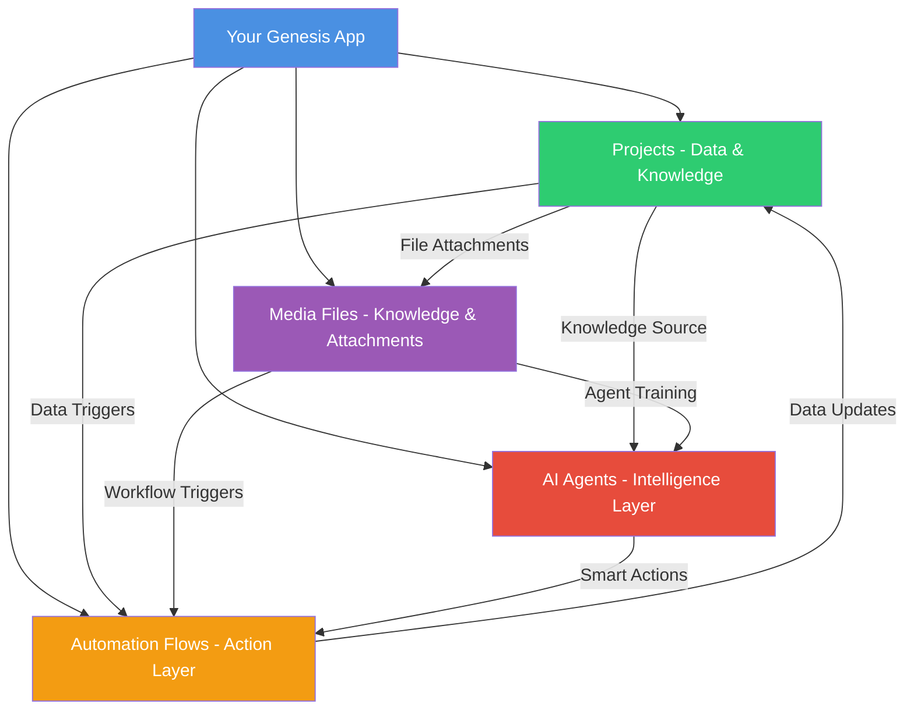
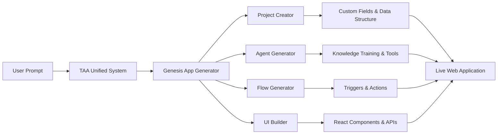

# Understanding Taskade's Core Pillars

Genesis apps are built on Taskade's four foundational pillars that work together seamlessly. Understanding how these components connect will help you build more powerful and effective applications.

## The Four Pillars of Taskade



## 1. Projects: Your App's Data & Knowledge Hub 🗂️

**Think of Projects as:** Flexible databases that store data AND serve as knowledge sources for AI agents and automation triggers

### What Projects Do in Your Genesis App

**Data Storage:**
- Store customer information, orders, feedback, bookings, inventory
- Each project acts like a database table with customizable fields (columns)
- Support different data types: text, numbers, dates, dropdowns, files

**Knowledge Source for AI Agents:**
- Projects provide real-time business data that AI agents learn from
- Agents understand patterns, trends, and context from project data
- Historical data helps agents make better recommendations and decisions

**Automation Triggers:**
- Project changes can trigger automation flows (new item added, status changed, etc.)
- Data from projects can be used as inputs for automation actions
- Projects can be updated automatically by automation flows

**File Attachments:**
- Projects can contain media files as attachments to specific items
- Files attached to projects become part of the project's knowledge context
- Supports documents, images, videos, and other file types

**Structure Information:**
- Organize data in lists, boards, calendars, tables, or mind maps
- Create hierarchical relationships (tasks with subtasks)
- Link related information across different projects

**Real-Time Collaboration:**
- Multiple people can update data simultaneously
- Changes sync instantly across all users
- Full edit history and version control

### Examples in Genesis Apps

**Customer Feedback App:**
```
Project: "Customer Feedback Database"
Custom Fields:
- Customer Name (text)
- Email (text) 
- Rating (number 1-5)
- Feedback Category (dropdown: Food, Service, Ambiance)
- Comments (long text)
- Follow-up Required (checkbox)
- Response Sent (checkbox)
```

**Booking System App:**
```
Project: "Appointment Bookings"
Custom Fields:
- Client Name (text)
- Service Type (dropdown)
- Appointment Date (date)
- Duration (number)
- Therapist (dropdown)
- Payment Status (dropdown: Pending, Paid, Refunded)
- Special Requests (text)
```

### How to Use Projects in Your Prompts

**When describing your app to Genesis:**
```
"Store all customer feedback in a project with fields for rating, comments, and follow-up status. Each piece of feedback should be a separate item that our team can review and respond to."
```

**For complex data relationships:**
```
"Create a project for customer information and another for their booking history. Link them so we can see a customer's complete history when they make a new appointment."
```

## 2. AI Agents: Your App's Intelligence Layer 🤖

**Think of AI Agents as:** Smart assistants that understand your business and can help users or automate tasks

### What AI Agents Do in Your Genesis App

**Learn Your Business:**
- Study your Projects (data) to understand patterns and context
- Learn from uploaded documents, manuals, and training materials
- Access web resources and stay updated with current information

**Help Users:**
- Answer questions about your products or services
- Guide users through complex processes
- Provide personalized recommendations based on data

**Automate Intelligence:**
- Categorize and prioritize incoming requests automatically
- Analyze data trends and generate insights
- Make smart decisions based on business rules

### AI Agent Knowledge Sources

**Projects as Knowledge:**
- Agents learn from your project data to understand business patterns
- Example: A support agent learns from past tickets to suggest solutions

**Media Files as Training:**
- Upload PDFs, documents, videos to train agents
- Example: Upload your employee handbook so agents understand company policies

**Web Resources:**
- Connect to websites, blogs, YouTube videos for current information
- Example: Real estate agent stays updated with market trends from news sites

### Examples in Genesis Apps

**Restaurant Feedback Agent:**
```
Agent Name: "Customer Experience Assistant"
Knowledge Sources:
- Customer Feedback Database (project)
- Restaurant menu and policies (uploaded PDFs)
- Food safety guidelines (web links)

Capabilities:
- Automatically categorize feedback as urgent/positive/suggestion
- Suggest responses based on similar past situations
- Alert management when ratings drop below threshold
```

**Booking Assistant Agent:**
```
Agent Name: "Appointment Coordinator"
Knowledge Sources:
- Appointment Bookings (project)
- Service descriptions and pricing (uploaded documents)
- Staff schedules and availability (linked calendar)

Capabilities:
- Help customers find available time slots
- Suggest appropriate services based on customer history
- Handle rescheduling and cancellation requests
```

### How to Use AI Agents in Your Prompts

**For customer-facing assistance:**
```
"Include an AI agent that can answer customer questions about our services, help them choose the right appointment type, and guide them through the booking process using information from our service menu."
```

**For internal automation:**
```
"Train an AI agent to automatically categorize support tickets by urgency and topic, then assign them to the right team member based on their expertise and current workload."
```

## 3. Automation Flows: Your App's Action Layer ⚡

**Think of Automation Flows as:** Smart workflows that connect your app to the outside world

### What Automation Flows Do in Your Genesis App

**Trigger on Events:**
- When someone submits a form
- When data changes in a project
- On a schedule (daily, weekly, monthly)
- When external services send webhooks

**Take Smart Actions:**
- Send emails, Slack messages, or SMS notifications
- Update data in projects or external systems
- Generate reports and summaries
- Create tasks and assign team members

**Connect Everything:**
- Link your app to 100+ external services
- Sync data between your app and existing business tools
- Handle complex multi-step business processes

### Examples in Genesis Apps

**Customer Feedback Flow:**
```
Trigger: New feedback submitted with rating ≤ 3 stars
Actions:
1. Add feedback to "Customer Feedback Database" project
2. Send Slack alert to manager with customer details
3. Create follow-up task assigned to customer service team
4. Send automated "thank you for feedback" email to customer
```

**Appointment Booking Flow:**
```
Trigger: New appointment booked
Actions:
1. Save booking details to "Appointment Bookings" project
2. Send confirmation email with calendar invite
3. Add event to staff member's Google Calendar
4. Send reminder SMS 24 hours before appointment
5. Update availability in booking system
```

**Inventory Alert Flow:**
```
Trigger: Item quantity drops below 10 units
Actions:
1. Update "Low Stock Alert" field in inventory project
2. Send email to procurement team with reorder details
3. Create task in "Reorder Items" project
4. Post alert in #inventory Slack channel
```

### How to Use Automation Flows in Your Prompts

**For notifications and alerts:**
```
"When a customer gives us 3 stars or lower, immediately send a Slack message to our manager with the customer's name, feedback, and contact information so we can follow up personally."
```

**For data synchronization:**
```
"When someone books an appointment, automatically add their information to our HubSpot CRM, send them a confirmation email, and create a calendar event for the assigned therapist."
```

**For complex workflows:**
```
"When inventory drops below the reorder point, automatically create a purchase order, email our supplier, update our accounting system, and notify the warehouse team."
```

## 4. Media Files: Knowledge Sources & Project Attachments 📁

**Think of Media Files as:** Documents, images, and resources that can train AI agents OR be attached to specific project items

### What Media Files Do in Your Genesis App

**Knowledge Sources for AI Agents:**
- Upload manuals, policies, and training materials to train agents
- Provide product catalogs and service descriptions for agent knowledge
- Share industry knowledge and best practices that agents can reference
- Files become part of the agent's intelligence and decision-making capability

**Project Attachments:**
- Attach files directly to specific project items (tasks, records, entries)
- Files become part of the project data and context
- Examples: Customer photos attached to feedback items, contracts attached to client records
- Attached files can still be used for agent training if needed

**Support User Experience:**
- Display images, videos, and documents in your app interface
- Provide downloadable resources for customers
- Create rich, multimedia experiences within your application

**Enable Automation:**
- Trigger workflows when files are uploaded or attached
- Process documents automatically (extract data, generate summaries)
- Sync files with external storage services
- Use file content as inputs for automation actions

### Types of Media Files

**Documents:**
- PDFs, Word docs, spreadsheets
- Training manuals and policy documents
- Product catalogs and service descriptions

**Images and Videos:**
- Product photos and demonstration videos
- Training materials and tutorials
- Brand assets and marketing materials

**Web Resources:**
- Links to websites and blogs
- YouTube videos for transcription
- Industry news and updates

### Examples in Genesis Apps

**Real Estate Agent App:**
```
Knowledge Sources (Train AI Agent):
- Market analysis reports (PDFs) → Agent can answer pricing questions
- Neighborhood guides and school info → Agent provides area insights
- Legal procedures manual → Agent guides clients through processes

Project Attachments:
- Property photos attached to listing items in "Properties" project
- Client documents attached to client records in "Clients" project
- Contract templates attached to deal items in "Active Deals" project

Dual Purpose:
- Property photos serve as both agent training (learn property types) AND project attachments
```

**Restaurant Management App:**
```
Knowledge Sources (Train AI Agent):
- Menu descriptions and pricing → Agent answers customer questions
- Food safety procedures → Agent ensures compliance guidance
- Staff training manuals → Agent helps with employee questions

Project Attachments:
- Customer feedback photos attached to feedback items in "Customer Reviews" project
- Supplier invoices attached to inventory items in "Inventory" project
- Staff certificates attached to employee records in "Staff" project

Dual Purpose:
- Menu photos train the agent (learn dishes) AND attach to menu items in projects
```

### How to Use Media Files in Your Prompts

**For AI agent training:**
```
"Upload our employee handbook and service menu so the AI agent can answer customer questions accurately and help staff follow proper procedures."
```

**For rich user experiences:**
```
"Include photo galleries for each service so customers can see examples of our work before booking appointments."
```

**For automated processing:**
```
"When customers upload photos with their feedback, automatically analyze them for quality issues and flag any problems for the kitchen manager to review."
```

## How the Pillars Work Together

### The Genesis Magic: Unified Intelligence

When you describe an app to Genesis, it intelligently creates and connects all four pillars:

#### Example: Restaurant Feedback App

**1. Your Prompt:**
```
"I run a restaurant and need customers to submit feedback about their dining experience. They should rate food quality and service, upload photos if they want, and get automatic follow-up when we resolve issues."
```

**2. Genesis Creates:**

**Projects (Database):**
- "Customer Feedback" project with custom fields for ratings, comments, photos
- "Follow-up Tasks" project for tracking manager responses

**AI Agent (Intelligence):**
- "Customer Experience Assistant" trained on:
  - Your menu and service descriptions (media files)
  - Past feedback patterns (project data)
  - Response templates and policies (uploaded documents)

**Automation Flows (Actions):**
- Flow 1: New feedback → Save to project → Alert manager if rating < 4
- Flow 2: Manager marks issue resolved → Send follow-up email to customer
- Flow 3: Weekly summary → Generate report → Email to management

**Media Integration (Knowledge):**
- Customer photo uploads stored in space media
- Menu PDFs and policy documents train the AI agent
- Photos automatically analyzed for quality issues

#### The Result: Everything Works Together

1. **Customer submits feedback** with a 2-star rating and photo
2. **Project stores the data** with all fields populated
3. **AI agent analyzes** the feedback and photo for issues
4. **Automation flow triggers** immediate Slack alert to manager
5. **Manager reviews** and creates follow-up task
6. **When resolved**, automation sends personalized email to customer
7. **AI agent learns** from the resolution for future similar issues

### The TAA Unified System

Behind the scenes, the **TAA (Taskade AI Assistant) Unified System** orchestrates all these components:



### Advanced Integration Patterns

#### Cross-Pillar Data Flow

**Scenario: E-commerce Inventory App**

1. **Media Files** (supplier catalogs) → **AI Agent** learns product information
2. **AI Agent** processes new orders → **Automation Flow** updates **Project** inventory
3. **Project** inventory changes → **Automation Flow** reorders stock
4. **Automation Flow** receives delivery confirmation → **AI Agent** updates customer status

#### Knowledge Amplification

**How AI Agents Get Smarter:**
- **Projects provide real-time data** about customer behavior and business metrics
- **Media files provide static knowledge** like policies, procedures, and product information  
- **Automation flows provide feedback loops** showing what actions work best
- **Cross-pillar learning** improves decision-making over time

## Building with the Pillars in Mind

### Start with Data (Projects)

**Ask yourself:**
- What information does my app need to store?
- How should this data be organized?
- Who needs access to what information?

**Genesis prompt tips:**
```
"Store customer information in a project with fields for name, email, service history, and preferences. Each booking should be a separate item linked to the customer."
```

### Add Intelligence (AI Agents)

**Ask yourself:**
- What questions will users have?
- What decisions need to be made automatically?
- What knowledge does the agent need to be helpful?

**Genesis prompt tips:**
```
"Include an AI agent trained on our service menu and policies that can answer customer questions, suggest appropriate services, and help resolve common issues."
```

### Connect Actions (Automation Flows)

**Ask yourself:**
- What should happen automatically when events occur?
- How should my app connect to existing business tools?
- What notifications and follow-ups are needed?

**Genesis prompt tips:**
```
"When someone books an appointment, automatically send confirmation emails, add events to staff calendars, and create follow-up reminders for after the service."
```

### Enrich with Media

**Ask yourself:**
- What documents will help the AI agent be more helpful?
- What files do users need to upload or download?
- How can visual content improve the user experience?

**Genesis prompt tips:**
```
"Include photo uploads for customer feedback, and train the AI agent on our service menu PDFs and staff training videos so it can provide accurate information."
```

## Best Practices for Pillar Integration

### 1. Design for Data Flow
- Plan how information moves between pillars
- Ensure AI agents can access relevant project data
- Set up automation flows to keep data synchronized

### 2. Train Agents Comprehensively
- Use project data for real-time business intelligence
- Upload media files for static knowledge and procedures
- Connect web resources for current industry information

### 3. Automate Strategically
- Connect user actions to backend processes
- Use AI agents to make smart automation decisions
- Create feedback loops that improve performance over time

### 4. Organize Media Thoughtfully
- Group related files for easy agent training
- Use consistent naming and organization
- Regularly update knowledge sources

## Common Integration Patterns

### Pattern 1: Data Collection App
```
User Input → Project Storage → AI Analysis → Automation Action
```
**Example:** Feedback form → Customer database → Sentiment analysis → Manager alert

### Pattern 2: Knowledge-Driven App
```
Media Training → AI Agent → User Interaction → Project Update
```
**Example:** Policy documents → Support agent → Customer chat → Ticket creation

### Pattern 3: Workflow Automation App
```
External Trigger → Automation Flow → Project Update → AI Decision
```
**Example:** Email received → Parse content → Update CRM → Route to specialist

### Pattern 4: Intelligence Amplification App
```
Project Data → AI Analysis → Automation Action → External Integration
```
**Example:** Sales data → Trend analysis → Report generation → Email to executives

## Troubleshooting Pillar Integration

### When Projects Aren't Working Right

**Problem:** Data isn't structured properly
**Solution:** Be specific about field types and organization
```
"Create separate dropdown fields for service type (massage, facial, consultation) and duration (30, 60, 90 minutes) so we can track popular services and schedule efficiently."
```

### When AI Agents Need Better Knowledge

**Problem:** Agent gives generic or unhelpful responses
**Solution:** Provide more specific training materials
```
"Train the AI agent on our complete service menu with prices, our booking policies including cancellation rules, and our staff expertise areas so it can make appropriate recommendations."
```

### When Automation Flows Break Down

**Problem:** Actions don't trigger or connect properly
**Solution:** Be explicit about the complete workflow
```
"When someone cancels an appointment, update the booking status in our project, send a cancellation confirmation email, free up the time slot for other customers, and notify the assigned therapist via Slack."
```

### When Media Integration Falls Short

**Problem:** Files aren't being used effectively
**Solution:** Connect media to specific use cases
```
"Use uploaded customer photos to train the AI agent to recognize common issues, and automatically attach relevant product photos to email responses based on customer questions."
```

## Advanced Pillar Combinations

### Multi-Agent Knowledge Sharing
```
"Create specialized agents for different departments (sales, support, technical) that all learn from the same customer database but have access to department-specific training materials and automation tools."
```

### Cross-Project Intelligence
```
"Set up the AI agent to analyze patterns across both customer feedback and sales data projects to identify which services generate the most satisfaction and revenue."
```

### Dynamic Automation Chains
```
"When inventory gets low, have the AI agent analyze sales trends to predict demand, automatically generate purchase orders with optimal quantities, and schedule delivery based on projected usage."
```

### Intelligent Media Processing
```
"When customers upload photos with support requests, automatically analyze them with AI to categorize the issue type, attach relevant troubleshooting guides, and route to specialists with experience in that area."
```

---

## Key Takeaways

### The Power of Integration
- **Each pillar is powerful alone**, but they're transformative when combined
- **Genesis automatically creates the connections** between pillars based on your business description
- **The more specific your prompt**, the better Genesis can optimize pillar integration

### Think in Business Terms, Not Technical Terms
- Describe **what your business needs**, not how to implement it technically
- Focus on **user experience and outcomes**, let Genesis handle the technical connections
- **Trust the system** to create appropriate projects, agents, flows, and media integration

### Start Simple, Grow Complex
- Begin with **basic pillar integration** and add complexity over time
- **Test each component** individually before building complex cross-pillar workflows
- **Monitor and optimize** based on actual usage patterns

**Ready to build with all four pillars?** Describe your business need to Genesis and watch it create an integrated solution that leverages projects, agents, automation, and media working together seamlessly.
