# Chapter 1: Workspaces - The Foundation

Welcome to your first step in understanding Taskade's living architecture! Imagine you're building a house, but instead of static bricks and mortar, your foundation is alive and growing. That's what a Taskade workspace does—it becomes the living DNA that powers everything you build.

## What Problem Does a Workspace Solve?

**Have you ever struggled with:**

* **Scattered Information**: Projects spread across different tools and accounts
* **Team Coordination**: Different groups working in isolated silos
* **Scaling Complexity**: Adding new people or projects creates more confusion
* **Lost Context**: Important information buried in endless email threads

**Workspaces solve this by creating a living foundation** where everything connects, learns, and grows together. Your workspace isn't just a container—it's the intelligent DNA that makes all your projects, agents, and automations work as one cohesive system.

## What is a Workspace? (Think of it Like a Living Organism)

A workspace in Taskade is your **digital headquarters**—but with a twist. Instead of being static, it's alive and adaptive. Every project, AI agent, and automation you create becomes part of this living ecosystem.

```mermaid
flowchart TD
    WS[Your Workspace<br/>Living Foundation] --> DNA[DNA Strands]

    DNA --> INT[🧠 Intelligence<br/>AI Agents]
    DNA --> ACT[⚡ Action<br/>Automations]
    DNA --> KNOW[📚 Knowledge<br/>Projects & Data]

    INT --> LEARN[Learns from<br/>your work]
    ACT --> ADAPT[Adapts to<br/>your needs]
    KNOW --> GROW[Grows with<br/>your business]

    LEARN --> EVOLVE[Everything gets<br/>smarter together]
    ADAPT --> EVOLVE
    GROW --> EVOLVE

    style WS fill:#e1f5fe
    style EVOLVE fill:#e8f5e8
```



**Here's what makes workspaces special:**

* **🏠 Living Container**: Not just storage—your workspace learns and adapts
* **🧬 DNA Foundation**: Everything you create inherits intelligence from the workspace
* **🤝 Team Hub**: Centralized collaboration with isolated security
* **📈 Scalable Growth**: From personal use to enterprise-level organization

## How Workspaces Work (The Living DNA Concept)

Let's break down how this "living" concept works in practice:

### The Home Space (Your Default DNA Strand)

Every workspace starts with a **Home Space** that can't be deleted. This is like your workspace's "heart"—it contains:

* **Generator Input Field** - Where you create new apps with AI
* **AI Agents Panel** - Your digital team members
* **Automation Center** - Workflow orchestration hub
* **Project Library** - All your work organized intelligently

### DNA Inheritance

When you create new projects or apps, they automatically inherit capabilities from your workspace:

* **Shared Intelligence**: AI agents trained on your business context
* **Connected Automations**: Workflows that span across projects
* **Unified Knowledge**: Data that connects and learns across boundaries

## Creating Your First Workspace (Step-by-Step)

**Ready to start building? Here's how to create your living foundation:**



#### Access Workspace Creation

Click the workspace dropdown in the top-left corner of Taskade, then select "Create New Workspace"



#### Name Your Living Foundation

Choose a meaningful name that represents what this workspace will become. Think: "Marketing Agency Hub" or "Product Development Lab"



#### Add Your Team DNA

Invite the people who will help this workspace grow. Each person brings unique skills to your living system.



#### Set Your Workspace Personality

Choose colors, icons, and settings that reflect your workspace's purpose and culture.



**Congratulations!** You've just created a living foundation that will grow smarter with every interaction.

## Understanding Workspace Hierarchy (The Family Tree)

Workspaces contain **Spaces** (formerly called Team Folders) that help organize different areas of work:

```
Your Company Workspace
├── 🏠 Home Space (Default - contains your AI generator)
├── 📁 Client Projects Space
│   ├── 📄 Website Redesign Project
│   ├── 📄 Marketing Campaign
│   └── 🤖 Client Communication Agent
├── 📁 Product Development Space
│   ├── 📄 App Features Roadmap
│   ├── 📄 Bug Tracking System
│   └── ⚡ Release Automation
└── 📁 Sales Team Space
    ├── 📄 Lead Pipeline
    ├── 📊 Sales Dashboard
    └── 🤖 Lead Qualification Agent
```

**Each space inherits DNA from the workspace but specializes for specific purposes.**

## Workspace Types (Choose Your Growth Path)

| Type           | Perfect For              | Member Limit | Key Features                           |
| -------------- | ------------------------ | ------------ | -------------------------------------- |
| **Personal**   | Individual productivity  | 1            | Basic features, unlimited projects     |
| **Team**       | Small team collaboration | 10           | Full collaboration, basic automations  |
| **Business**   | Growing company          | 100          | Advanced AI, priority support          |
| **Enterprise** | Large organization       | Unlimited    | Custom security, advanced integrations |

## The Magic Happens When Everything Connects

**Here's where the "living" concept shines:**

### Cross-Space Intelligence

* Your marketing AI agent learns from sales data
* Product development automations trigger based on customer feedback
* Knowledge from one project enhances recommendations in another

### Adaptive Learning

* The more you use your workspace, the smarter it gets
* AI agents remember your preferences and working style
* Automations learn optimal timing and conditions

### Scalable Evolution

* Start with one project, grow to hundreds
* Add team members without losing organization
* Connect new tools without disrupting existing workflows

## Workspace Settings (Customizing Your DNA)

**Make your workspace uniquely yours:**

* **🎨 Visual Identity**: Colors, icons, and branding
* **🔐 Security Settings**: Permission levels and access controls
* **⚙️ Default Preferences**: How new projects and tasks behave
* **🤖 AI Agent Training**: What your agents should know about your business
* **🔄 Integration Defaults**: Which tools to connect automatically

## Common Workspace Patterns (Real-World Examples)

### Pattern 1: Agency Hub

```
Creative Agency Workspace
├── 🏠 Home (AI Generator for client proposals)
├── 📁 Client A Space (All client work isolated)
├── 📁 Client B Space (Separate security and billing)
└── 📁 Internal Space (Company operations)
```

### Pattern 2: Product Company

```
Tech Startup Workspace
├── 🏠 Home (Product roadmap and planning)
├── 📁 Development Space (Code and technical docs)
├── 📁 Marketing Space (Campaigns and content)
├── 📁 Sales Space (Leads and customer data)
└── 📁 Support Space (Customer tickets and knowledge base)
```

## How it Works Under the Hood

**Technically speaking, workspaces are:**

* **Isolated databases** with their own security boundaries
* **Shared AI context** that learns across all contained projects
* **Unified automation engines** that can coordinate across spaces
* **Scalable architectures** that grow from personal to enterprise scale

But you don't need to understand the technical details—the magic happens automatically!

## Your Workspace is Alive and Learning

**Every interaction makes your workspace smarter:**

* Creating projects teaches it your organizational patterns
* Setting up automations shows it your workflow preferences
* Training AI agents builds its understanding of your business
* Adding team members expands its collaborative intelligence

**Great job!** You now understand how workspaces form the living foundation of everything in Taskade. Your workspace isn't just a container—it's the DNA that makes all your work connected, intelligent, and alive.

**Ready for the next chapter?** Let's explore [Projects - Your Data Containers](02_projects.md), where we'll see how flexible data structures bring your workspace's DNA to life!

***

_What questions do you have about workspaces? This living foundation concept can seem magical at first, but once you start using it, you'll wonder how you ever worked without it!_

[← Back to Tutorial Overview](../../index.md) | [Next: Projects →](02_projects.md)
