# Chapter 3: AI Agents - Your Digital Team

Incredible! You've built your workspace foundation and created flexible project containers. Now let's add the **intelligence layer**—AI agents that act like specialized team members, each trained for specific roles in your business.

## What Problem Do AI Agents Solve?

**Traditional AI tools are generic and forgetful:**

* ChatGPT forgets your business context after each conversation
* Generic AI doesn't understand your specific processes or terminology
* You have to explain your business repeatedly to get useful help

**AI agents in Taskade solve this by becoming permanent, specialized team members** who learn your business, remember your preferences, and work alongside your human team members.

## What is an AI Agent? (Your Digital Team Member)

An AI agent is a **specialized digital assistant** trained on your business knowledge, processes, and preferences. Unlike generic AI chatbots, agents become part of your team with specific roles and expertise.

```mermaid
flowchart TD
    AGENT[Your AI Agent<br/>Digital Team Member] --> ROLES[Specialized Roles]

    ROLES --> MARKETING[🎯 Marketing Agent<br/>Content creation, campaign analysis]
    ROLES --> SALES[💼 Sales Agent<br/>Lead qualification, proposal drafting]
    ROLES --> SUPPORT[🛠️ Support Agent<br/>Ticket routing, knowledge base]
    ROLES --> RESEARCH[🔍 Research Agent<br/>Data analysis, insights]
    ROLES --> PROJECT[📋 Project Agent<br/>Task management, progress tracking]

    MARKETING --> TRAINING[Trained on your<br/>brand guidelines & content]
    SALES --> TRAINING[Trained on your<br/>products & pricing]
    SUPPORT --> TRAINING[Trained on your<br/>FAQs & procedures]
    RESEARCH --> TRAINING[Trained on your<br/>data & reports]
    PROJECT --> TRAINING[Trained on your<br/>methodologies & templates]

    TRAINING --> WORK[Works 24/7<br/>Learns continuously]

    style AGENT fill:#e1f5fe
    style WORK fill:#e8f5e8
```



**AI agents are:**

* **🧠 Specialized Experts**: Trained for specific business roles
* **📚 Knowledge Keepers**: Remember everything about your business
* **⚡ Action Takers**: Can create tasks, send emails, update projects
* **🔄 Continuous Learners**: Get smarter with every interaction
* **🤝 Team Players**: Work alongside human colleagues

## How AI Agents Work (The Training & Learning Process)

**Agents start as blank slates and become experts through training:**

### Step 1: Define the Role

```
"I need a Marketing Agent who can:
- Write blog posts in our brand voice
- Analyze campaign performance
- Suggest content ideas based on our audience
- Track competitor activities"
```

### Step 2: Train with Knowledge

**Upload documents, projects, and examples:**

* Brand guidelines and style guides
* Past successful campaigns and content
* Customer data and audience insights
* Competitor analysis reports
* Team procedures and best practices

### Step 3: Test and Refine

**Ask questions and give feedback:**

* "Write a blog post about our new feature"
* "Analyze why last month's campaign underperformed"
* "Suggest 5 content ideas for next quarter"

### Step 4: Deploy and Learn

**The agent starts working and gets smarter:**

* Learns from your feedback and corrections
* Remembers successful patterns
* Adapts to your preferences and style

## Creating Your First AI Agent (Step-by-Step)

**Let's create a practical agent together:**



#### Access Agent Creation

In your workspace, click the AI Agents panel in the left sidebar, then click "Create New Agent"



#### Define the Role

Give your agent a clear name and description:

```
Name: Customer Support Agent
Description: Handles customer inquiries, creates support tickets, and provides instant answers from our knowledge base
```



#### Add Training Data

Upload relevant documents and information:

* FAQ documents
* Product manuals
* Previous support conversations
* Company policies



#### Test the Agent

Ask some questions to see how it performs:

```
"How do customers reset their passwords?"
"What's our refund policy?"
"How do I upgrade my subscription?"
```



#### Refine and Deploy

Give feedback on responses and deploy the agent to start working



**Congratulations!** You now have a digital team member working 24/7!

## Industry-Specific Agent Examples (Real-World Applications)

### 🏥 Healthcare Agent

**Trained on:** Medical protocols, patient data handling, HIPAA compliance

**Capabilities:**

* **Patient Documentation**: Organize and analyze medical records
* **Research Support**: Find latest treatment protocols and studies
* **Compliance Monitoring**: Ensure regulatory requirements are met
* **Scheduling Optimization**: Coordinate appointments and resources

**Example Commands:**

* "Review this patient's treatment history"
* "Find studies on diabetes management"
* "Check if this procedure follows our protocols"

### ⚖️ Legal Agent

**Trained on:** Case law, contracts, legal procedures, compliance

**Capabilities:**

* **Document Review**: Analyze contracts and legal documents
* **Legal Research**: Search precedents and statutes
* **Case Management**: Track deadlines and filing requirements
* **Client Communication**: Draft responses to common inquiries

**Example Commands:**

* "Review this contract for liability clauses"
* "Find similar cases to our current dispute"
* "Draft a response to this client inquiry"

### 📈 Marketing Agent

**Trained on:** Brand guidelines, audience data, campaign analytics

**Capabilities:**

* **Content Creation**: Generate blog posts, social media, emails
* **Campaign Analysis**: Review performance and suggest improvements
* **Audience Research**: Identify trends and target demographics
* **Competitive Intelligence**: Monitor competitor activities

**Example Commands:**

* "Write a blog post about our new feature"
* "Analyze why last month's campaign got low engagement"
* "Suggest content ideas for our target audience"

### 🛠️ Customer Service Agent

**Trained on:** FAQs, support procedures, product knowledge

**Capabilities:**

* **Ticket Routing**: Automatically categorize and prioritize requests
* **Instant Answers**: Provide solutions from knowledge base
* **Escalation Logic**: Identify when to involve human agents
* **Feedback Analysis**: Spot patterns in customer issues

**Example Commands:**

* "Help this customer with login issues"
* "Categorize this support ticket"
* "Analyze customer feedback trends"

## How Agents Connect to Your Workspace DNA

**Remember the living DNA concept? AI agents are the intelligence layer:**

### Workspace-Level Intelligence

* **Global Knowledge**: Access information across all projects
* **Consistent Voice**: Maintain brand voice across all communications
* **Cross-Project Insights**: Connect data from different areas

### Project-Specific Specialization

* **Context Awareness**: Understand which project they're working in
* **Role Adaptation**: Adjust behavior based on project requirements
* **Team Coordination**: Communicate with other agents and humans

### Continuous Learning

* **Feedback Integration**: Get better with every interaction
* **Pattern Recognition**: Learn your preferences and habits
* **Knowledge Expansion**: Grow smarter as you add more content

## Advanced Agent Techniques

### Multi-Agent Collaboration

**Different agents can work together:**

```
Customer Inquiry → Support Agent → Escalation Agent → Manager Agent
                                      ↓
Sales Opportunity → Sales Agent → Proposal Agent → Contract Agent
```

### Agent Workflows

**Chain agents together for complex processes:**

1. **Research Agent** gathers information
2. **Analysis Agent** processes the data
3. **Communication Agent** creates the response
4. **Action Agent** implements the decisions

### Custom Training Strategies

**Make agents experts in your specific domain:**

* **Document Libraries**: Upload comprehensive knowledge bases
* **Example Outputs**: Show agents your preferred formats and styles
* **Feedback Loops**: Regularly review and improve agent responses
* **Specialized Prompts**: Create custom instructions for specific scenarios

## Agent Management Best Practices

### Regular Training Updates

* **Monthly Reviews**: Check agent performance and update training
* **New Content Integration**: Add new documents and procedures
* **Performance Metrics**: Track accuracy and user satisfaction

### Clear Role Definitions

* **Avoid Overlap**: Give each agent distinct responsibilities
* **Escalation Paths**: Define when agents should involve humans
* **Quality Gates**: Set standards for when responses need human review

### Security and Privacy

* **Access Controls**: Limit what data agents can access
* **Audit Trails**: Track agent actions and decisions
* **Compliance Training**: Ensure agents follow your policies

## How it Works Under the Hood

**Technically, AI agents are:**

* **Large Language Models** fine-tuned on your specific data
* **Retrieval-Augmented Generation** systems that access your knowledge
* **Context-Aware Systems** that understand workspace and project relationships
* **Action-Capable Interfaces** that can trigger workflows and updates
* **Continuous Learning Systems** that improve with feedback

**But the magic happens automatically—you just train them and they work!**

## Real-World Agent Success Stories

### E-commerce Company

**Challenge:** Customer service team overwhelmed with repetitive questions **Solution:** Deployed Support Agent trained on product catalog and policies **Result:** 60% reduction in basic support tickets, faster response times

### Marketing Agency

**Challenge:** Content creation bottleneck for social media and blogs **Solution:** Created Marketing Agent trained on brand guidelines and past content **Result:** 3x faster content production, consistent brand voice

### Legal Firm

**Challenge:** Research and document review taking excessive time **Solution:** Built Legal Agent trained on case law and firm procedures **Result:** 40% faster research, improved accuracy on routine tasks

## Your AI Agents Are Learning and Growing

**Every agent gets better over time:**

* **Remembers your preferences** for how you like things done
* **Learns from feedback** on what works and what doesn't
* **Adapts to your style** of communication and decision-making
* **Discovers patterns** in your business that even you might not see

**Excellent progress!** You now have digital team members that understand your business, work around the clock, and continuously learn from your workspace. AI agents transform productivity from human-only efforts to true human-AI collaboration.

**Ready to automate the routine work?** In [Chapter 4: Automation](04_automation.md), we'll connect your agents to workflows that run automatically, creating systems that operate with minimal human intervention!

***

_Have you created your first AI agent yet? Start with something simple like a "Meeting Summarizer" or "Task Organizer"—the key is training them well from the beginning!_

[← Back to Chapter 2: Projects](02_projects.md) | [Next: Automation →](04_automation.md)
