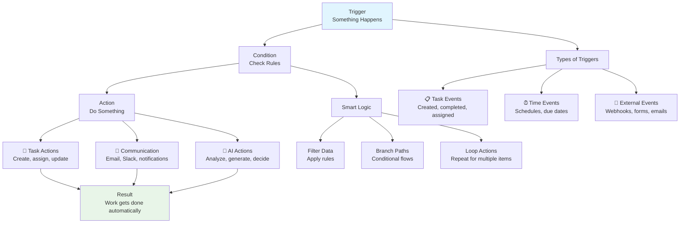

# Chapter 4: Automation - Workflows on Autopilot

Outstanding! You've built your workspace foundation, created flexible projects, and deployed AI agents. Now let's connect everything with **automation**—the nervous system that makes your entire ecosystem work together automatically.

## What Problem Does Automation Solve?

**Manual processes create bottlenecks and waste:**

* **Repetitive Tasks**: Copying data between systems, sending follow-up emails
* **Missed Deadlines**: Forgetting to follow up or check in
* **Inconsistent Processes**: Different team members doing things differently
* **Delayed Responses**: Waiting for someone to notice and act

**Automation solves this by creating intelligent workflows** that react instantly to events, coordinate across systems, and handle routine work automatically.

## What is Automation? (The Nervous System of Your Workspace)

Automation in Taskade is the **intelligent coordination layer** that connects your workspace, projects, agents, and external tools. It follows simple "if this, then that" logic but becomes incredibly powerful when combined with AI.



**Automation is:**

* **⚡ Event-Driven**: Reacts instantly to changes and events
* **🤖 AI-Enhanced**: Uses intelligence to make decisions
* **🔗 Cross-System**: Connects your tools and workflows
* **📈 Scalable**: Handles growing workloads automatically
* **🔄 Self-Learning**: Gets smarter as it processes more data

## How Automation Works (The "If This, Then That" Magic)

**Automation follows three simple steps:**

### Step 1: Define the Trigger (When to Start)

```
TRIGGERS:
├── 📋 Task Events: Created, completed, assigned, due
├── ⏰ Time Events: Schedules, delays, deadlines
├── 📧 External Events: Webhooks, emails, form submissions
├── 🔗 Integration Events: Slack messages, Google Sheets updates
└── 🤖 Agent Events: AI conversations, commands executed
```

### Step 2: Add Conditions (Smart Filtering)

```
CONDITIONS:
├── Filter by: Priority, assignee, project, custom fields
├── Check values: Amount > $1000, status = "urgent"
├── Time windows: Business hours, weekdays only
└── Complex logic: AND/OR combinations
```

### Step 3: Execute Actions (What to Do)

```
ACTIONS:
├── 📝 Task Management: Create, assign, update, move tasks
├── 💬 Communication: Send emails, Slack messages, notifications
├── 🧠 AI Processing: Analyze data, generate content, make decisions
├── 🔗 External Systems: Update CRMs, spreadsheets, APIs
└── 🔄 Flow Control: Wait, loop, branch based on conditions
```

## Creating Your First Automation (Step-by-Step)

**Let's build a practical automation together:**



#### Access Automation Builder

In your workspace, click "Automations" in the left sidebar, then "Create New Automation"



#### Choose Your Trigger

Select what starts the automation:

```
"When a new task is created in my Support project"
```



#### Add Smart Conditions

Filter when the automation should run:

```
Only if: Priority = "High" AND Assignee is empty
```



#### Define Actions

Specify what should happen:

```
Then: Assign to next available support agent
      Send Slack notification to support channel
      Create follow-up task for 24 hours later
```



#### Test and Activate

Test with sample data, then turn it on to run automatically



**Congratulations!** You just eliminated manual work and ensured instant, consistent responses!

## Real-World Automation Examples

### Customer Support Workflow

```
TRIGGER: New support ticket submitted
├── CONDITION: Priority = "High"
├── ACTIONS:
│   ├── Assign to senior support agent
│   ├── Send urgent Slack notification
│   ├── Create escalation task for 2 hours
│   └── Update CRM with ticket details
```

### Content Publishing Pipeline

```
TRIGGER: Blog post marked as "Ready to Publish"
├── CONDITION: All review tasks completed
├── ACTIONS:
│   ├── Generate social media posts with AI
│   ├── Schedule posts across platforms
│   ├── Send newsletter to subscribers
│   └── Create engagement tracking tasks
```

### Sales Lead Management

```
TRIGGER: New lead form submission
├── CONDITION: Company size > 100 employees
├── ACTIONS:
│   ├── Create qualified lead task
│   ├── Assign to appropriate sales rep
│   ├── Send welcome email with AI personalization
│   └── Add lead to CRM with scoring
```

### Project Status Updates

```
TRIGGER: Project due date approaching (7 days)
├── CONDITION: Project completion < 80%
├── ACTIONS:
│   ├── Send progress reminder to project owner
│   ├── Escalate to manager if overdue
│   ├── Generate status report with AI
│   └── Schedule daily check-ins until complete
```

## Advanced Automation Techniques

### Conditional Branching (Smart Decision Making)

**Different actions based on conditions:**

```
If task priority = "Critical"
├── Then: Notify all team leads + create emergency meeting
Else if priority = "High"
├── Then: Assign to senior team member + send urgent notification
Else
├── Then: Add to regular queue + normal notification
```

### Loops and Batch Processing

**Handle multiple items automatically:**

```
For each: Overdue tasks in project
├── Send reminder email to assignee
├── Update task with "Reminder Sent" status
└── Escalate to manager if 3+ reminders sent
```

### AI-Enhanced Automation

**Use intelligence in your workflows:**

```
When: Customer feedback received
├── AI analyzes sentiment and categorizes feedback
├── Routes to appropriate department automatically
├── Generates response suggestions
└── Updates customer satisfaction metrics
```

### Time-Based Automation

**Schedule recurring tasks:**

```
Every Monday at 9 AM:
├── Generate weekly progress report
├── Send team status updates
├── Review upcoming deadlines
└── Create next week's priority tasks
```

## Integration Power (Connecting 100+ Tools)

**Automation becomes exponentially powerful when connected to external tools:**

### Communication Integrations

* **Slack/Discord**: Instant team notifications and updates
* **Email**: Automated customer communications and reminders
* **SMS**: Critical alerts and urgent notifications

### Business Tools

* **CRM Systems**: HubSpot, Salesforce, Pipedrive updates
* **Project Management**: Jira, Asana, Trello synchronization
* **Calendars**: Google Calendar, Outlook event creation

### Data and Analytics

* **Spreadsheets**: Google Sheets, Excel automatic updates
* **Databases**: Airtable, Notion data synchronization
* **Analytics**: Custom dashboards and reporting

### Development Tools

* **GitHub/GitLab**: Issue tracking and deployment notifications
* **CI/CD**: Build status updates and deployment tracking
* **Monitoring**: System alerts and performance tracking

## How Automation Connects to Your Workspace DNA

**Remember the living DNA concept? Automation is the action layer:**

### Event-Driven Intelligence

* **Triggers** detect changes across your entire ecosystem
* **AI Agents** can be triggered by automation events
* **Projects** update automatically based on external data

### Cross-System Coordination

* **Workspace-wide awareness**: Automation can span multiple projects
* **Agent collaboration**: Automations can trigger AI agent actions
* **External integration**: Connect your workspace to the wider business ecosystem

### Learning and Adaptation

* **Pattern recognition**: Automations learn optimal timing and conditions
* **Performance optimization**: Routes improve based on success rates
* **Scalability**: Handles growing complexity without additional effort

## Best Practices for Automation

### Start Simple, Build Complexity

**Begin with single-step automations:**

```
Simple: "When task completed → Send notification"
Complex: "When high-priority task completed → Update CRM → Send personalized thank-you → Schedule follow-up"
```

### Test Thoroughly Before Activation

**Use test data to verify behavior:**

* Create sample tasks and see what happens
* Test edge cases and error conditions
* Monitor for unexpected side effects

### Monitor and Optimize

**Track automation performance:**

* Success rates and failure patterns
* Processing times and bottlenecks
* User feedback and satisfaction
* ROI in time saved vs. setup effort

### Documentation and Maintenance

**Keep automations manageable:**

* Clear naming conventions
* Regular reviews and updates
* Documentation of complex logic
* Version control for automation changes

## How it Works Under the Hood

**Technically, automations are:**

* **Event-driven systems** that monitor for trigger conditions
* **State machines** that manage complex workflow logic
* **Integration hubs** that connect to external APIs
* **AI orchestration engines** that coordinate intelligent actions
* **Scalable architectures** that handle high-volume processing

**But you don't need to understand the tech—the workflows just work!**

## Common Automation Patterns

### Pattern 1: Customer Onboarding

```
New customer signs up → Create welcome project → Assign onboarding tasks → Send welcome email series → Schedule check-in calls
```

### Pattern 2: Content Approval Workflow

```
Content draft completed → Notify reviewers → Collect feedback → AI summarizes comments → Route for approval → Auto-publish when approved
```

### Pattern 3: Project Health Monitoring

```
Daily at 6 PM → Check project status → Calculate completion percentage → Send alerts for at-risk projects → Generate progress reports
```

### Pattern 4: Sales Pipeline Management

```
Lead enters system → Score lead quality → Assign to sales rep → Send personalized email → Schedule follow-up → Update CRM status
```

## Your Automations Are Learning and Optimizing

**Every automation gets smarter over time:**

* **Learns optimal timing** for notifications and actions
* **Recognizes patterns** in successful vs. unsuccessful workflows
* **Adapts to team preferences** for how work gets done
* **Optimizes performance** by learning from past executions

**Fantastic work!** You now have intelligent workflows that coordinate your entire ecosystem automatically. Automation transforms reactive work into proactive systems that anticipate needs and handle routine tasks without human intervention.

**Ready to build complete applications?** In [Chapter 5: Genesis](05_genesis.md), we'll use AI to create entire business applications from simple descriptions—no coding required!

***

_What's your most repetitive task that could be automated? Start there—every automation you create eliminates hours of manual work and ensures consistency across your team!_

[← Back to Chapter 3: AI Agents](03_ai_agents.md) | [Next: Genesis →](05_genesis.md)
