# Chapter 7: API - Developer Interfaces

Brilliant! You've connected your tools and built integrated workflows. Now let's **unlock unlimited possibilities** with Taskade's API—giving you programmatic access to build custom applications, advanced integrations, and automated systems that extend Taskade infinitely.

## What Problem Does the API Solve?

**Pre-built integrations have limitations:**

* **Generic functionality** that doesn't match your specific needs
* **Missing features** that your business requires
* **Proprietary systems** that can't connect to anything else
* **Manual processes** that should be automated but aren't available

**The API solves this by giving you complete programmatic access**—build exactly what you need, connect anything to anything, and create custom solutions that perfectly fit your business.

## What is the Taskade API? (Programmatic Superpowers)

The Taskade API is a **complete RESTful interface** that exposes all Taskade functionality programmatically. It transforms Taskade from a productivity tool into a development platform where you can build custom applications, integrations, and automated workflows.

```mermaid
flowchart TD
    API[Taskade API<br/>RESTful Interface] --> RESOURCES[Core Resources]

    RESOURCES --> WORKSPACES[🏢 Workspaces<br/>Team containers]
    RESOURCES --> PROJECTS[📋 Projects<br/>Work containers]
    RESOURCES --> TASKS[✅ Tasks<br/>Work units]
    RESOURCES --> USERS[👥 Users<br/>Team members]
    RESOURCES --> WEBHOOKS[🔗 Webhooks<br/>Real-time events]

    WORKSPACES --> OPERATIONS[Operations]
    PROJECTS --> OPERATIONS
    TASKS --> OPERATIONS
    USERS --> OPERATIONS
    WEBHOOKS --> OPERATIONS

    OPERATIONS --> CRUD[Create, Read, Update, Delete]
    OPERATIONS --> QUERY[Advanced Queries & Filters]
    OPERATIONS --> BATCH[Bulk Operations]
    OPERATIONS --> REALTIME[Real-time Updates]

    CRUD --> APPS[Custom Applications]
    QUERY --> INTEGRATIONS[Advanced Integrations]
    BATCH --> AUTOMATION[Enterprise Automation]
    REALTIME --> MONITORING[Live Dashboards]

    style API fill:#e1f5fe
    style APPS fill:#e8f5e8
```



**The API enables:**

* **🔧 Custom Applications**: Build apps tailored to your business
* **🔗 Advanced Integrations**: Connect systems that don't have native integrations
* **⚡ Enterprise Automation**: Large-scale automated workflows
* **📊 Live Dashboards**: Real-time business intelligence
* **🤖 AI-Enhanced Development**: Programmatic access to AI features
* **📱 Mobile Applications**: Custom mobile experiences

## How the API Works (RESTful Architecture)

**The API follows REST principles with predictable patterns:**

### HTTP Methods

```
GET    /projects       # Retrieve projects
POST   /projects       # Create new project
PUT    /projects/123   # Update project 123
DELETE /projects/123   # Delete project 123
```

### Resource Structure

```
/workspaces     # Workspace management
/projects       # Project operations
/tasks          # Task manipulation
/users          # User management
/webhooks       # Real-time notifications
/automations    # Workflow automation
```

### Request/Response Format

```json
// Request
{
  "method": "POST",
  "url": "/projects",
  "headers": {
    "Authorization": "Bearer YOUR_API_KEY",
    "Content-Type": "application/json"
  },
  "body": {
    "name": "New Project",
    "description": "API-created project"
  }
}

// Response
{
  "id": "project_123",
  "name": "New Project",
  "description": "API-created project",
  "created_at": "2024-01-15T10:30:00Z",
  "workspace_id": "workspace_456"
}
```

## Getting Started with the API (Step-by-Step)

**Let's make your first API call:**



#### Get Your API Key

Go to Settings → Developer → API Keys → Generate New Key



#### Make a Test Call

Use curl to retrieve your projects:

```
curl -H "Authorization: Bearer YOUR_API_KEY" \
     https://api.taskade.com/v1/projects
```



#### Parse the Response

You'll get a JSON array of your projects with full details



#### Create Something New

Try creating a task:

```
curl -X POST https://api.taskade.com/v1/tasks \
  -H "Authorization: Bearer YOUR_API_KEY" \
  -H "Content-Type: application/json" \
  -d '{"name": "API Test Task", "project_id": "your_project_id"}'
```



**Congratulations!** You're now a Taskade API developer!

## Core API Resources and Operations

### Workspaces API

**Manage your organizational structure:**

```javascript
// Get all workspaces
const workspaces = await api.get('/workspaces');

// Create a new workspace
const newWorkspace = await api.post('/workspaces', {
  name: 'API Development Workspace',
  description: 'For custom API integrations'
});

// Update workspace settings
await api.put(`/workspaces/${workspaceId}`, {
  settings: { theme: 'dark', notifications: true }
});
```

### Projects API

**Handle project lifecycle:**

```javascript
// List projects with filtering
const projects = await api.get('/projects', {
  params: { workspace_id: 'ws_123', type: 'board' }
});

// Create project from template
const project = await api.post('/projects', {
  name: 'Customer Onboarding',
  template_id: 'template_456',
  workspace_id: 'ws_123'
});

// Update project metadata
await api.patch(`/projects/${projectId}`, {
  description: 'Updated project description',
  due_date: '2024-02-01'
});
```

### Tasks API

**Manipulate work items programmatically:**

```javascript
// Get tasks with advanced filtering
const tasks = await api.get('/tasks', {
  params: {
    project_id: 'proj_123',
    assignee: 'user_456',
    status: 'pending',
    due_before: '2024-01-31'
  }
});

// Bulk create tasks
const newTasks = await api.post('/tasks/bulk', {
  tasks: [
    { name: 'Design mockups', assignee: 'user_123' },
    { name: 'Write documentation', assignee: 'user_456' },
    { name: 'Code review', assignee: 'user_789' }
  ]
});

// Update task with custom fields
await api.put(`/tasks/${taskId}`, {
  name: 'Updated task name',
  priority: 'high',
  custom_fields: {
    estimated_hours: 8,
    difficulty: 'medium'
  }
});
```

## Advanced API Techniques

### Webhooks for Real-Time Integration

**Get instant notifications of changes:**

```javascript
// Register webhook for task updates
const webhook = await api.post('/webhooks', {
  url: 'https://your-app.com/webhook/task-updated',
  events: ['task.created', 'task.updated', 'task.completed'],
  secret: 'your_webhook_secret'
});

// Handle webhook in your application
app.post('/webhook/task-updated', (req, res) => {
  const signature = req.headers['x-taskade-signature'];
  const payload = req.body;

  // Verify webhook signature
  if (verifySignature(signature, payload, webhook.secret)) {
    // Process the task update
    handleTaskUpdate(payload);
    res.status(200).send('OK');
  } else {
    res.status(401).send('Invalid signature');
  }
});
```

### Batch Operations for Efficiency

**Handle multiple operations atomically:**

```javascript
// Bulk update multiple tasks
const batchUpdate = await api.post('/batch', {
  operations: [
    {
      method: 'PUT',
      path: '/tasks/task_123',
      body: { status: 'completed' }
    },
    {
      method: 'POST',
      path: '/tasks',
      body: { name: 'Follow-up task', project_id: 'proj_456' }
    },
    {
      method: 'DELETE',
      path: '/tasks/task_789'
    }
  ]
});
```

### Advanced Querying and Filtering

**Extract exactly the data you need:**

```javascript
// Complex filtering with multiple criteria
const filteredTasks = await api.get('/tasks', {
  params: {
    project_id: 'proj_123',
    assignee: ['user_456', 'user_789'],
    due_date: { $gte: '2024-01-01', $lte: '2024-01-31' },
    priority: 'high',
    labels: { $in: ['urgent', 'client-work'] },
    sort: '-due_date',
    limit: 50,
    include: ['assignee', 'project']
  }
});
```

## Building Custom Applications

### Example: Customer Dashboard

**Build a custom interface for customer data:**

```javascript
class CustomerDashboard {
  constructor(apiKey) {
    this.api = new TaskadeAPI(apiKey);
  }

  async getCustomerProjects(customerId) {
    return await this.api.get('/projects', {
      params: {
        'custom_fields.customer_id': customerId,
        include: ['tasks', 'members']
      }
    });
  }

  async updateCustomerStatus(projectId, status) {
    return await this.api.put(`/projects/${projectId}`, {
      custom_fields: { status },
      updated_at: new Date().toISOString()
    });
  }

  async createSupportTicket(customerId, issue) {
    const project = await this.api.post('/projects', {
      name: `Support: ${issue.title}`,
      type: 'list',
      custom_fields: {
        customer_id: customerId,
        priority: issue.priority,
        category: issue.category
      }
    });

    await this.api.post('/tasks', {
      name: issue.description,
      project_id: project.id,
      assignee: 'support_team_lead'
    });

    return project;
  }
}
```

### Example: Automated Reporting System

**Generate business reports automatically:**

```javascript
class ReportingSystem {
  constructor(apiKey) {
    this.api = new TaskadeAPI(apiKey);
    this.scheduleDailyReports();
  }

  async generateDailyReport() {
    const yesterday = new Date(Date.now() - 86400000).toISOString().split('T')[0];

    const completedTasks = await this.api.get('/tasks', {
      params: {
        completed_at: { $gte: yesterday },
        include: ['assignee', 'project']
      }
    });

    const report = {
      date: yesterday,
      total_completed: completedTasks.length,
      by_assignee: this.groupByAssignee(completedTasks),
      by_project: this.groupByProject(completedTasks),
      productivity_score: this.calculateProductivity(completedTasks)
    };

    await this.createReportProject(report);
    await this.sendReportEmail(report);
  }

  groupByAssignee(tasks) {
    return tasks.reduce((acc, task) => {
      const assignee = task.assignee?.name || 'Unassigned';
      acc[assignee] = (acc[assignee] || 0) + 1;
      return acc;
    }, {});
  }

  async createReportProject(report) {
    const project = await this.api.post('/projects', {
      name: `Daily Report - ${report.date}`,
      type: 'table'
    });

    // Add report data as tasks/table rows
    for (const [assignee, count] of Object.entries(report.by_assignee)) {
      await this.api.post('/tasks', {
        name: assignee,
        project_id: project.id,
        custom_fields: { tasks_completed: count }
      });
    }
  }
}
```

## API Security and Best Practices

### Authentication Security

**Protect your API access:**

```javascript
// Use environment variables for API keys
const apiKey = process.env.TASKADE_API_KEY;

// Implement proper error handling
try {
  const response = await api.get('/projects');
  // Process response
} catch (error) {
  if (error.status === 401) {
    // Handle authentication error
    refreshToken();
  } else if (error.status === 429) {
    // Handle rate limiting
    await delay(error.retryAfter);
    retryRequest();
  }
}
```

### Rate Limiting and Optimization

**Work within API limits efficiently:**

```javascript
class RateLimitedAPI {
  constructor(apiKey) {
    this.api = new TaskadeAPI(apiKey);
    this.requests = [];
    this.rateLimit = 100; // requests per minute
  }

  async request(method, path, options = {}) {
    // Implement token bucket algorithm
    const now = Date.now();
    this.requests = this.requests.filter(time => now - time < 60000);

    if (this.requests.length >= this.rateLimit) {
      const waitTime = 60000 - (now - this.requests[0]);
      await new Promise(resolve => setTimeout(resolve, waitTime));
    }

    this.requests.push(now);
    return await this.api.request(method, path, options);
  }
}
```

### Error Handling and Resilience

**Build robust API integrations:**

```javascript
class ResilientAPI {
  async requestWithRetry(method, path, options = {}, maxRetries = 3) {
    let lastError;

    for (let attempt = 1; attempt <= maxRetries; attempt++) {
      try {
        return await this.api.request(method, path, options);
      } catch (error) {
        lastError = error;

        if (error.status >= 400 && error.status < 500) {
          // Client error, don't retry
          throw error;
        }

        if (attempt < maxRetries) {
          // Exponential backoff
          const delay = Math.pow(2, attempt) * 1000;
          await new Promise(resolve => setTimeout(resolve, delay));
        }
      }
    }

    throw lastError;
  }
}
```

## SDKs and Development Tools

### Official SDKs

**Pre-built libraries for popular languages:**

```javascript
// JavaScript/TypeScript SDK
import { TaskadeAPI } from '@taskade/sdk';

const api = new TaskadeAPI({
  apiKey: 'your_api_key',
  baseURL: 'https://api.taskade.com/v1'
});

// Python SDK
from taskade import TaskadeAPI

api = TaskadeAPI(api_key='your_api_key')

# Go SDK
import "github.com/taskade/go-sdk/taskade"

api := taskade.NewAPI("your_api_key")
```

### Development Tools

**Accelerate your development:**

* **API Explorer**: Interactive web interface for testing endpoints
* **Code Generators**: Generate SDK code from API specifications
* **Webhook Testing Tools**: Local webhook development servers
* **Monitoring Dashboards**: Track API usage and performance

## How it Works Under the Hood

**Technically, the API is:**

* **RESTful Architecture**: Standard HTTP methods and status codes
* **JSON API Specification**: Consistent data formats and error handling
* **OAuth 2.0 Support**: Secure user authentication flows
* **Webhook System**: Real-time event notifications
* **Rate Limiting**: Fair usage policies with burst handling
* **Caching Layer**: Performance optimization for frequently accessed data
* **Audit Logging**: Complete activity tracking for security

**But you don't need to understand the tech—powerful applications just work!**

## API Use Cases and Examples

### Custom Mobile Applications

**Build native mobile experiences:**

* Field service apps for technicians
* Customer feedback mobile apps
* Inventory management for warehouse staff
* Executive dashboards for leadership

### Enterprise Integration Hubs

**Connect legacy systems:**

* ERP system integration
* HR platform synchronization
* Financial system connections
* Manufacturing execution systems

### AI-Powered Applications

**Leverage Taskade's AI capabilities:**

* Intelligent task routing systems
* Automated content generation workflows
* Smart customer support assistants
* Predictive analytics dashboards

### IoT and Hardware Integration

**Connect physical devices:**

* Sensor data collection and monitoring
* Equipment maintenance scheduling
* Facility management systems
* Smart building automation

## Your API-Enabled Ecosystem Becomes Limitless

**Programmatic access unlocks infinite possibilities:**

* **Custom UIs**: Build interfaces perfectly suited to your workflows
* **Advanced Automation**: Create complex multi-system workflows
* **Real-time Dashboards**: Live business intelligence and monitoring
* **Mobile Innovation**: Native apps that extend Taskade's reach
* **AI Integration**: Combine Taskade's AI with your custom logic

**Exceptional work!** You now have complete programmatic control over Taskade. The API transforms Taskade from a productivity tool into a development platform where you can build anything your business needs.

**Ready for the final chapter?** In [Chapter 8: Mobile & Desktop](08_mobile_desktop.md), we'll ensure your living workspace works perfectly everywhere!

***

_What's the custom application your business has always needed? With the API, you can now build it. The possibilities are literally endless—start small, dream big!_

[← Back to Chapter 6: Integrations](06_integrations.md) | [Next: Mobile & Desktop →](08_mobile_desktop.md)
