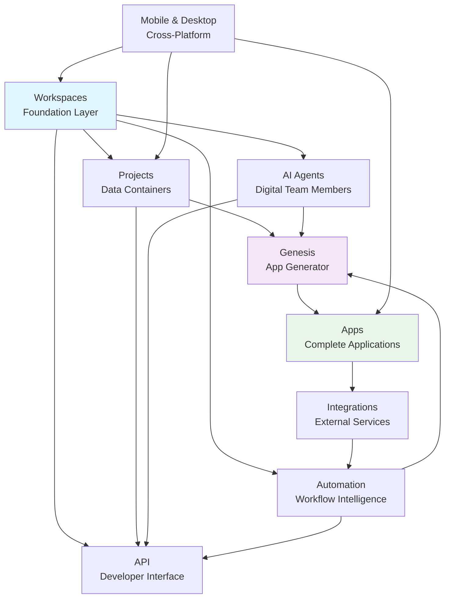

# Tutorial: Taskade - The Living DNA Productivity Platform

> This tutorial is AI-generated! To learn more, check out [AI Codebase Knowledge Builder](https://github.com/The-Pocket/Tutorial-Codebase-Knowledge)

**Taskade**[View Repo](https://github.com/taskade/docs) is a revolutionary productivity platform that treats your workspace as a living organism. Instead of static tools, Taskade creates an interconnected ecosystem where AI agents, automations, and projects work together like DNA strands to build intelligent, adaptive experiences.

Imagine your workspace isn't just a collection of projects—it's a living foundation that powers unlimited business applications. Each new project you create can become a complete app, powered by your workspace's "living DNA" of intelligence, automation, and knowledge.

## What Makes Taskade Special?

**Taskade transforms productivity from static tools to living systems:**

- **🏠 Living Workspace Foundation** - Your workspace becomes the DNA that powers everything you build
- **🧬 Genesis AI Builder** - Describe apps in plain English, get working applications in minutes
- **🤖 AI Agent Team** - Deploy specialized digital assistants trained on your business
- **⚡ Smart Automation** - Connect 100+ tools with intelligent workflow orchestration
- **📱 Cross-Platform Magic** - Seamless experience across web, desktop, and mobile

## The Core DNA Strands

Taskade isn't built on layers—it's built on **living DNA strands** that interweave:

## How This Tutorial Works

Welcome to your journey through Taskade's living architecture! This tutorial is designed for beginners who want to understand how Taskade's interconnected systems work together.

**Each chapter builds on the previous one**, just like how Taskade's features build upon each other:

- **Chapter 1: Workspaces** - Learn the foundation that powers everything
- **Chapter 2: Projects** - Discover flexible data containers that adapt to any workflow
- **Chapter 3: AI Agents** - Meet your digital team members that learn and grow
- **Chapter 4: Automation** - Connect tools and automate repetitive tasks
- **Chapter 5: Genesis** - Build complete apps from simple descriptions
- **Chapter 6: Integrations** - Connect Taskade to your favorite tools
- **Chapter 7: API** - Access Taskade programmatically for custom solutions
- **Chapter 8: Mobile & Desktop** - Take productivity anywhere

**Ready to begin?** Let's explore how Taskade transforms productivity into living, intelligent systems!

## Chapter Overview

### Chapter 1: [Workspaces - The Living Foundation](01_workspaces.md)
*Learn how your workspace becomes the DNA foundation for everything you build*

### Chapter 2: [Projects - Your Data Containers](02_projects.md)
*Discover flexible structures that adapt to any workflow or business need*

### Chapter 3: [AI Agents - Your Digital Team](03_ai_agents.md)
*Deploy specialized assistants that learn from your business and become expert team members*

### Chapter 4: [Automation - Workflows on Autopilot](04_automation.md)
*Connect tools and automate repetitive tasks with intelligent orchestration*

### Chapter 5: [Genesis - Building Apps with AI](05_genesis.md)
*Transform plain English descriptions into complete working applications*

### Chapter 6: [Integrations - Connecting Your Tools](06_integrations.md)
*Link Taskade to 100+ services for seamless workflow automation*

### Chapter 7: [API - Developer Interfaces](07_api.md)
*Access Taskade programmatically to build custom solutions and integrations*

### Chapter 8: [Mobile & Desktop - Cross-Platform Productivity](08_mobile_desktop.md)
*Take your living workspace anywhere with native apps and web interfaces*

---

**🎉 Ready to transform your productivity?** This tutorial will show you how Taskade's living DNA creates intelligent, adaptive experiences that grow smarter with every interaction.

**Let's start building!** 🚀

*Generated by [AI Codebase Knowledge Builder](https://github.com/The-Pocket/Tutorial-Codebase-Knowledge)*
