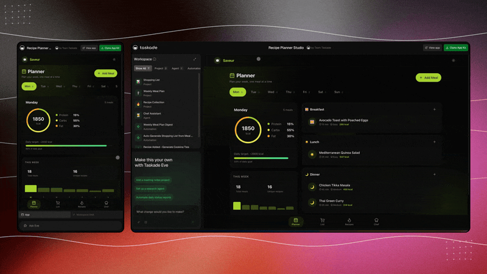
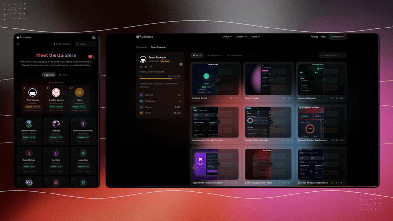
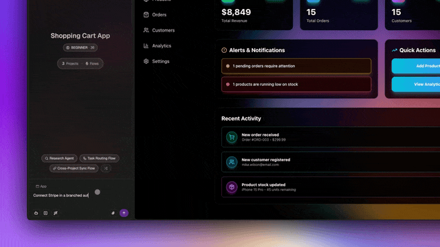

# April 13, 2026

## What's New:

### Two-Way GitHub for Genesis Apps

Push Genesis app changes to existing GitHub repos via branch and pull request. Existing files are preserved, and private repo import now works with token-based sign-in. Old export bundles are cleaned up automatically.

<figure><figcaption></figcaption></figure>

***

### Export Projects to Markdown

One-click Markdown or plain text export that preserves your full project structure, tasks, and notes. Get your data out in the format you need.

***

### Authenticated MCP Servers

External MCP servers can now authenticate into Taskade with proper credential handling — unlocking secure integrations with third-party AI tools and services.

***

### Ask Questions Tool for EVE

EVE can now pause a build or automation to ask you clarifying questions, then resume with your input. This works during Genesis app generation and automation workflows, enabling more accurate results.

***

### Guided Onboarding for Cloned Apps

When you clone a Genesis app from the community, EVE now walks you through an interactive setup — connecting agents, reviewing automations, and personalizing brand colors, copy, and key data fields.

<figure><figcaption></figcaption></figure>

***

### Stripe Checkout Action

Generate Stripe checkout sessions directly from automations. Build in-app payment flows, subscription signups, and e-commerce triggers without writing code.

<figure><figcaption></figcaption></figure>

***

## Improvements & Fixes:

* Creator credits: Earn credits when someone clones your published Genesis app. New credit audit log available.
* Category-aware email unsubscribe: Turn off product updates, comments, or automation digests independently.
* Readable slugs for public project URLs.
* Clear export permission error messages.
* Stripe webhooks now cover all invoice events.
* Better upgrade routing for out-of-credits users.
* Reverted GitHub export filename change for repo compatibility.
* \[Security] High-severity security patches and tighter outbound request safeguards.

