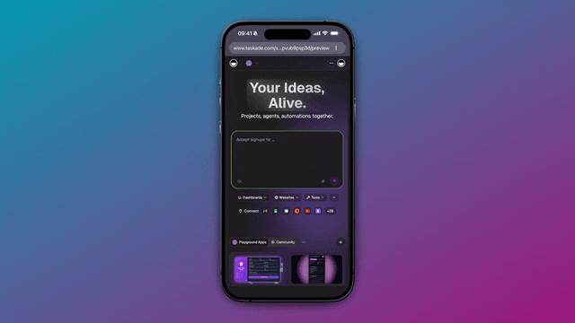

# April 2, 2026

## What's New:

### Google Calendar Actions

Fetch upcoming events with filters and date ranges, and check calendar availability with the new List Events and Get Free/Busy actions. Build scheduling assistants, meeting coordinators, and availability bots powered by your calendar data.

<figure><figcaption></figcaption></figure>

***

### Responsive Genesis Apps

Genesis apps now scale cleanly when embedded as a sidebar, viewed on mobile, or used as a full-page portal. Your apps adapt to any screen size automatically.

<figure><figcaption></figcaption></figure>

***

### Volume-Tiered Credit Packs

New credit pack pricing with volume tiers — bigger packs give bigger bonuses. Credits never expire on paid plans. Max and Enterprise plans get refined credit limits with headroom for big bursts.

***

## Improvements & Fixes:

* Public agents now auto-hide internal-only tools for safer interactions.
* Array outputs render correctly in the automation variable picker.
* Static assets load approximately 10% faster.
* Consolidated internal build tooling for better performance.

