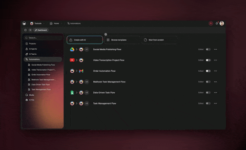

# April 8, 2026

## What's New:

### MCP Server (Beta)

Taskade now runs an MCP server that lets external AI tools — like Claude Desktop, Cursor, and other MCP-compatible clients — read and search your workspace data including projects, tasks, documents, and app files. Available for Business, Max, and Enterprise plans.

<figure><figcaption></figcaption></figure>

***

### Taskade SDK

The official Taskade SDK is here. TypeScript-first, auto-generated from the API schema, and installable via `yarn add @taskade/sdk`. Build integrations faster with typed methods for every endpoint.

***

### Public API v2

Public API v2 is now production-ready with a cleaner request/response format, improved error messages, and better pagination. v1 continues to work alongside v2.

***

### Automation Reliability

Broken connected accounts are now auto-detected and isolated. Smarter retry logic means non-retryable errors like invalid credentials are no longer retried endlessly, saving credits and reducing noise.

<figure><figcaption></figcaption></figure>

***

## Improvements & Fixes:

* Taskade Tips redesigned with three focused sections: Video Guides, Keyboard Shortcuts, and Quick Start.
* More reliable sign-in for Genesis apps on custom domains.
* EVE inspector panel restored with tighter validation.
* GitHub Import now supports token-based sign-in for private repositories.
* Slash commands, @-mentions, and input modals no longer hide behind the mobile chat drawer.
* EVE tracks and displays sources for every message.
* Faster load times for large workspaces with many unread updates.
* More secure session cookies with smooth migration.
* \[Hotfix] MCP Server fully enabled in production.
* \[Hotfix] Claude Sonnet 4.6 repriced to 110 credits per request.
* \[Hotfix] Stricter automation trigger payload validation.

