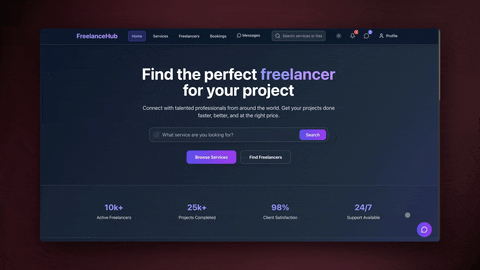
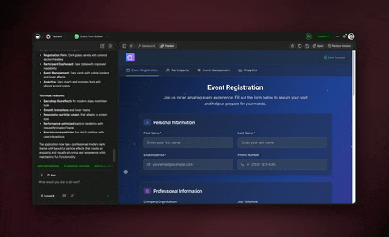

# February 13, 2026

## What's New:

### Agent Public API

Prompt any workspace agent from external apps and scripts via the new public API. Build custom integrations that connect your agents to any workflow outside of Taskade.

<figure><figcaption></figcaption></figure>

***

### Hosted MCP v2

Fully hosted MCP server — no self-hosting required. Deeper agent-to-external-tool connections and the foundation for cross-service workflows, all managed from your workspace.

<figure><figcaption></figcaption></figure>

***

### Global Language Support

Full internationalization for Genesis app creation, AI chat, credit management, authentication, and error screens. Tens of thousands of new translated strings across the platform.

***

## Improvements & Fixes:

* Export AI agent conversations as clean Markdown files with one click.
* Faster agent list loading in large workspaces, smoother scrolling through Space Agents.
* Richer agent profiles with descriptions, capabilities, and context.
* Dedicated MCP Connectors dialog to browse, add, and manage integrations.
* Attach files and add rich notes to tasks directly in List View.
* Multiple time/day format support and more natural scheduling language for automations.
* Region-aware adaptive credit pricing.
* Fully responsive guest sign-up on small screens.
* Shopify automation now available for all users.
* Improved stability during AI-generated responses in long conversations.
* Agent Usage Analytics with clearer visibility into usage across workflows.
* Updated link preview images and favicons for Genesis branding.
* Plan-aware model picker that adapts to your current plan.
* \[Hotfix] Fixed agent visibility settings not applying in shared workspaces.
* \[Hotfix] Fixed missing suggestions in AI chat conversations.
* \[Hotfix] Improved handling of all output types in automation workflow summaries.

