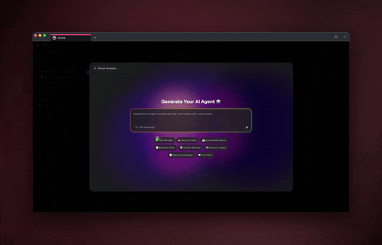

# February 2, 2026

## What's New:

### Integrations Directory

Browse 100+ integrations at a glance. Each integration now has its own page with triggers, actions, and real use cases to help you get started faster.

<figure><figcaption></figcaption></figure>

***

### Custom Agent Tools & Commands

Add custom commands, skills, and your own external tools to AI agents. Extend agent capabilities beyond built-in features with flexible, pluggable integrations.

<figure><figcaption></figcaption></figure>

***

### MCP Connectors Foundation

Early MCP connector support is here. Browse and manage third-party integrations via MCP from a new Connectors screen — the foundation for unified cross-service workflows.

<figure><figcaption></figcaption></figure>

***

### AI Model Expansion

All major AI models are now available directly in the agent interface. A new model picker adapts to your plan with clearer upgrade visibility.

<figure><figcaption></figcaption></figure>

***

## Improvements & Fixes:

* Integrations Directory now live at `/integrations` with 100+ entries.
* Community profiles are now public by default.
* Integrated search filter and multi-select for bulk actions in List View.
* Better retry handling for failed automation runs and improved toast alerts.
* Custom favicon support for Genesis apps for better branding.
* New "Popular" section in Actions Menu with Content & Media grouping.
* Rename and delete agent conversations from the chat panel.
* Mobile-optimized list view with better touch interactions.
* Fixed date field validation blocking form submissions.
* Fixed copy shortcut conflicts and updated default tab behavior.
* Smarter Project Chat with upgraded engine and better AI integration.
* Faster, more efficient search indexing for large workspaces.
* \[Hotfix] Fixed due date automation for empty values.

