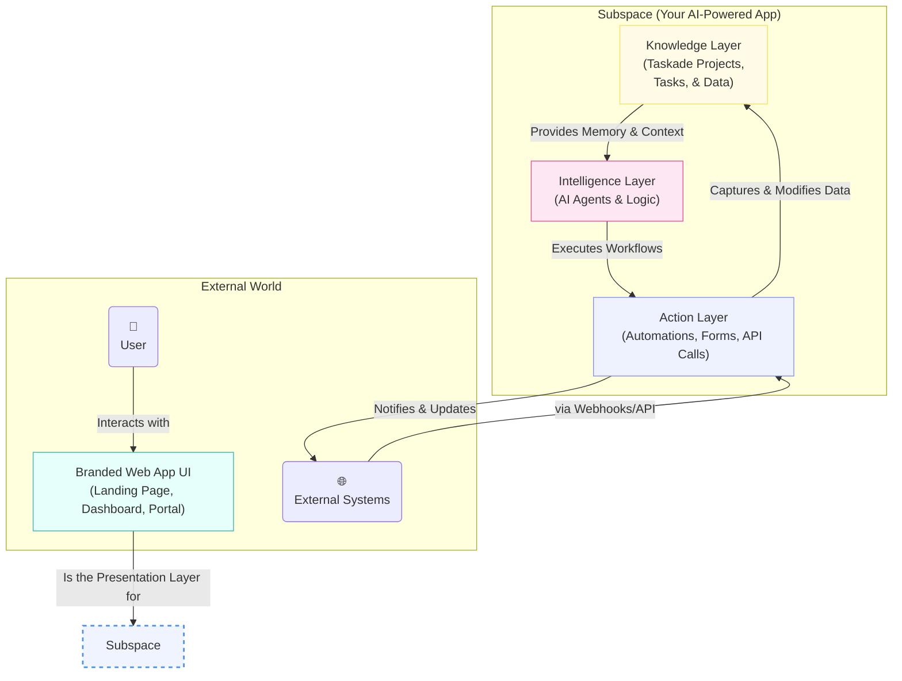

# Core Architecture: The Subspace

Every application you build with Taskade is a **Subspace**. Think of a Subspace not just as a folder for your files, but as a complete, self-contained ecosystem for a living application. It has its own memory, its own intelligence, and its own connection to the outside world.

This architecture is built on three interconnected pillars:

### 1. 🧠 Knowledge (The Memory)

The foundation of any intelligent application is its memory. In Taskade, the Knowledge layer is powered by **Taskade Projects**.

*   **Structured Data:** Projects are more than just task lists. They are flexible, structured databases that can store anything from CRM contacts to knowledge base articles. You can use custom fields, views, and nested tasks to model your data precisely.
*   **Context for AI:** This structured data isn't static; it's the living memory that your AI Agents use to understand context, answer questions, and make informed decisions.

### 2. 🤖 Intelligence (The Brain)

The Intelligence layer is where the reasoning happens. This pillar is powered by **Taskade's AI Agents**.

*   **Custom Logic:** You can define agents with specific roles, personalities, and capabilities. An agent can be a "Sales Assistant" that qualifies leads or a "Research Analyst" that summarizes articles.
*   **Execution Engine:** Agents aren't just chatbots. They are autonomous workers that can be triggered by automations to perform tasks, analyze data from the Knowledge layer, and interact with external systems.

### 3. ⚡ Action (The Nervous System)

The Action layer connects your app to the world. This is where **Automations, Forms, and API integrations** come into play.

*   **Data Intake:** Use embeddable forms to capture data directly into your Knowledge layer.
*   **Workflow Automation:** Create powerful, multi-step workflows that are triggered by events (like a form submission or a schedule), execute agent commands, and interact with other services (like Slack, Google Sheets, or your own backend via webhooks).
*   **Presentation Layer:** The Action layer culminates in the branded web app UI—the beautiful, interactive interface that your users will see and interact with.

Together, these three pillars create a powerful flywheel: Actions capture data into the Knowledge base, the Knowledge base provides context to the Intelligence, and the Intelligence drives new Actions. This is the engine that powers every app you create on Taskade. 

### 🌐 Real-time Collaboration

Taskade’s realtime engine ensures that every keystroke is synchronized across all participants in **sub-second latency**.  Edits are merged conflict-free using an Operational-Transformation (OT) algorithm, and live cursors show exactly where teammates are working.  This realtime foundation powers chat, document editing, task updates, and agent insights—helping distributed teams stay perfectly in-sync.

### 🔎 Hybrid Search & Discovery

Across each workspace Taskade provides a **hybrid search** engine that combines traditional keyword matching with AI-powered semantic (vector) search.  Results are automatically scoped to the current workspace, giving instant access to projects, tasks, agents, automations, and media without leaking data across organizations.

Together, these capabilities complement the Knowledge → Intelligence → Action flywheel and make every Subspace feel responsive, discoverable, and collaborative. 