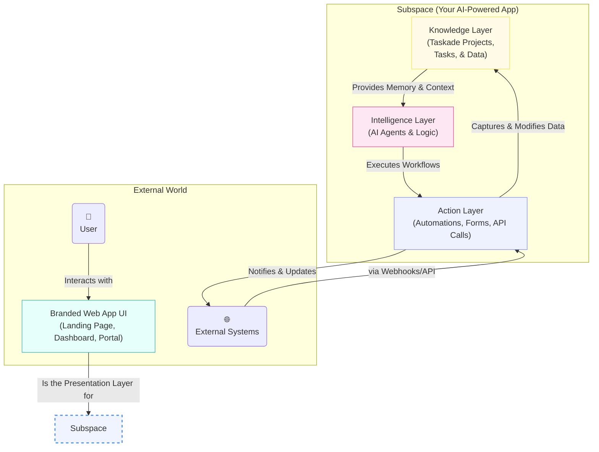
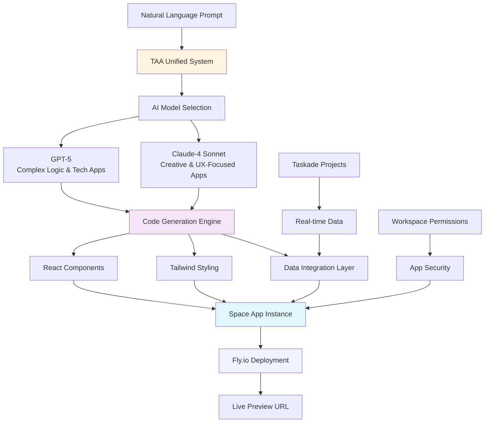
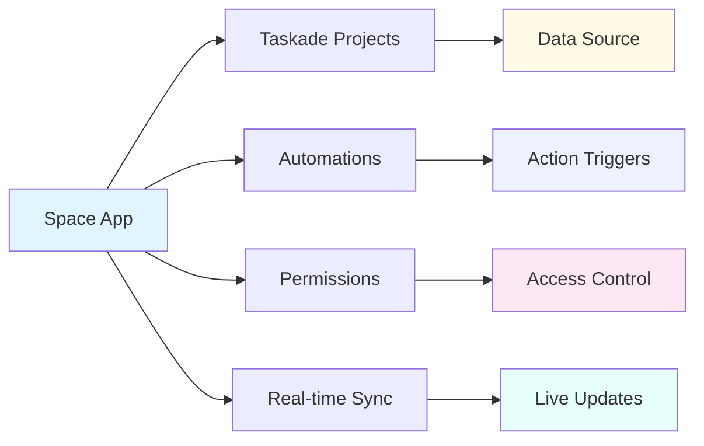

# Core Architecture: From Subspaces to Genesis

Taskade offers two powerful approaches to building intelligent applications:

1. **🏗️ Subspaces (Project-Based Apps)**: Structured workspaces with Projects, Agents, and Automations
2. **⚡ Genesis Space Apps (New!)**: Complete React web applications generated from natural language

Both approaches share the same foundational intelligence but offer different levels of customization and deployment options.

This architecture is built on three interconnected pillars:

### 1. 🧠 Knowledge (The Memory)

The foundation of any intelligent application is its memory. In Taskade, the Knowledge layer is powered by **Taskade Projects**.

*   **Structured Data:** Projects are more than just task lists. They are flexible, structured databases that can store anything from CRM contacts to knowledge base articles. You can use custom fields, views, and nested tasks to model your data precisely.
*   **Context for AI:** This structured data isn't static; it's the living memory that your AI Agents use to understand context, answer questions, and make informed decisions.

### 2. 🤖 Intelligence (The Brain)

The Intelligence layer is where the reasoning happens. This pillar is powered by **Taskade's AI Agents**.

*   **Custom Logic:** You can define agents with specific roles, personalities, and capabilities. An agent can be a "Sales Assistant" that qualifies leads or a "Research Analyst" that summarizes articles.
*   **Execution Engine:** Agents aren't just chatbots. They are autonomous workers that can be triggered by automations to perform tasks, analyze data from the Knowledge layer, and interact with external systems.

### 3. ⚡ Action (The Nervous System)

The Action layer connects your app to the world. This is where **Automations, Forms, and API integrations** come into play.

*   **Data Intake:** Use embeddable forms to capture data directly into your Knowledge layer.
*   **Workflow Automation:** Create powerful, multi-step workflows that are triggered by events (like a form submission or a schedule), execute agent commands, and interact with other services (like Slack, Google Sheets, or your own backend via webhooks).
*   **Presentation Layer:** The Action layer culminates in the branded web app UI—the beautiful, interactive interface that your users will see and interact with.

Together, these three pillars create a powerful flywheel: Actions capture data into the Knowledge base, the Knowledge base provides context to the Intelligence, and the Intelligence drives new Actions. This is the engine that powers every app you create on Taskade. 

### 🌐 Real-time Collaboration

Taskade's realtime engine ensures that every keystroke is synchronized across all participants instantly.  Edits are merged conflict-free using advanced synchronization algorithms, and live cursors show exactly where teammates are working.  This realtime foundation powers chat, document editing, task updates, and agent insights—helping distributed teams stay perfectly in-sync.

### 🔎 Hybrid Search & Discovery

Across each workspace Taskade provides a **hybrid search** engine that combines traditional keyword matching with AI-powered semantic (vector) search.  Results are automatically scoped to the current workspace, giving instant access to projects, tasks, agents, automations, and media without leaking data across organizations.

Together, these capabilities complement the Knowledge → Intelligence → Action flywheel and make every Subspace feel responsive, discoverable, and collaborative.

## Genesis: Next-Generation App Creation

### 🚀 The Genesis Revolution

Genesis represents a paradigm shift from structured workspace creation to full-stack web application generation. Powered by the **TAA (Taskade AI Assistant) Unified System**, Genesis transforms natural language descriptions into complete, deployable React applications.

### 🧠 TAA Unified System Architecture

The **TAA (Taskade AI Assistant) Unified System** serves as the central intelligence that powers Genesis and all AI interactions across Taskade:

#### **Multi-Model Intelligence**
- **GPT-5**: Optimized for complex logic, data processing, and technical applications
- **Claude-4 Sonnet**: Excels at creative design, user experience, and content-heavy applications
- **Smart Selection**: TAA automatically chooses the best model based on prompt analysis

#### **Holistic Context Understanding**
- **Workspace Awareness**: Understands projects, team members, and data relationships
- **Intent Recognition**: Interprets complex requirements and fills intelligent gaps
- **Tool Integration**: Unified access to project management, automation, and app generation

#### **Real-time Generation**
- **Streaming Responses**: Watch your app being built in real-time
- **Tool Call Streaming**: See individual components being created
- **Error Recovery**: Intelligent retry and repair mechanisms

### 🌐 Space Apps: The Application Container

Space Apps represent a fundamental shift in how applications are created and deployed:

#### **Complete Web Applications**
Unlike project-based apps that create structured workspaces, Space Apps generate:
- **Full React Codebases**: Complete component hierarchies with modern patterns
- **Responsive Design**: Mobile-first layouts using Tailwind CSS
- **Live Deployment**: Automatic hosting on Fly.io global infrastructure
- **Preview URLs**: Instantly shareable links for testing and distribution

#### **Deep Workspace Integration**

#### **Version Control & Iteration**
- **Commit History**: Git-like versioning for app changes
- **Conversational Updates**: Modify apps through natural language
- **File System Management**: Complete codebase stored and versioned
- **Rollback Capabilities**: Return to previous versions when needed

### 🔄 The Unified Development Experience

Genesis bridges the gap between no-code simplicity and full-stack power:

#### **For Non-Technical Users**
- **Natural Language Interface**: Describe apps like talking to a developer
- **Instant Results**: See working applications in minutes
- **Visual Iteration**: Make changes through conversation
- **No Infrastructure**: Automatic deployment and hosting

#### **For Developers**
- **Code Access**: Full React codebase available for inspection
- **API Integration**: Connect to external systems and databases  
- **Custom Extensions**: Build on generated foundations
- **TaskOS Compatibility**: Integrate with broader Taskade ecosystem

### 🎯 Architecture Comparison

| Feature | Subspace Apps | Genesis Space Apps |
|---------|---------------|-------------------|
| **Creation Method** | Template-based setup | Natural language generation |
| **Output Type** | Structured workspace | React web application |
| **Customization** | Project views & agents | Full UI/UX control |
| **Hosting** | Taskade platform | Fly.io deployment |
| **Audience** | Internal teams | Public & customers |
| **URL Type** | Taskade workspace | Custom preview domain |
| **Data Layer** | Native projects | Project integration |
| **Styling** | Template themes | Tailwind CSS |

### 🚀 The Future of App Development

Genesis represents Taskade's vision for democratizing application development:

- **Accessibility**: Anyone can create sophisticated applications
- **Speed**: From concept to deployment in minutes, not months  
- **Integration**: Deep connection with existing Taskade workflows
- **Scalability**: Professional hosting on global infrastructure
- **Iteration**: Continuous improvement through conversation

This unified architecture ensures that whether you're building a structured workspace or a custom web application, you have access to the same powerful AI intelligence, real-time collaboration, and integrated data that makes Taskade unique. 