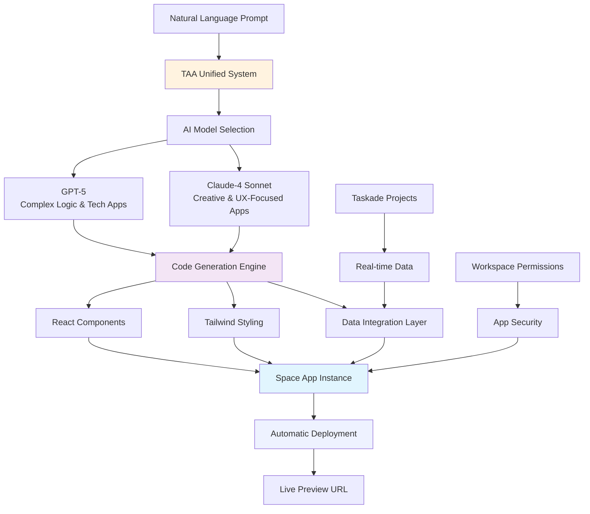

# Core Architecture: Taskade Platform

Taskade provides a unified platform for building intelligent applications, agents, and automated workflows.

## Platform Components

| Component | Description | Learn More |
|-----------|-------------|------------|
| **AI App Builder (Taskade Genesis)** | Generate full-stack applications from prompts | [Create Your First App →](https://help.taskade.com/en/articles/11957643-create-your-first-app) |
| **AI Agents Platform** | Custom assistants with knowledge retrieval | [AI Agents Guide →](https://help.taskade.com/en/articles/8958457-custom-ai-agents-the-intelligence-pillar) |
| **Workflow Automation** | Event-driven processing with 100+ integrations | [Automations Guide →](https://help.taskade.com/en/articles/8958467-automations-the-execution-pillar) |
| **Data Layer (Projects)** | Real-time projects with structured data | [Projects Guide →](https://help.taskade.com/en/articles/12166149-projects-databases-the-memory-pillar) |

**[Learn About Workspace DNA →](https://help.taskade.com/en/articles/12578949-how-genesis-works-workspace-dna)**

**Read more:** [Product Updates](https://www.taskade.com/blog/updates/)

## Two Application Approaches

1. **🏗️ Subspaces (Project-Based Apps)**: Structured workspaces with Projects, Agents, and Automations
2. **⚡ Taskade Genesis Space Apps**: Complete web applications generated from natural language

Both approaches share the same foundational intelligence and are powered by your workspace's living DNA.

## 🧬 Workspace DNA Visualization: The Living Trinity Architecture

**Complete Visual Guide to Understanding Living Software Architecture**

### **The Living Trinity Flow**

```
╔══════════════════════════════════════════════════════════════════════════════╗
║                           WORKSPACE DNA                                   ║
║                           Living Trinity                                  ║
╚══════════════════════════════════════════════════════════════════════════════╝

╔══════════════════════════════════════════════════════════════════════════════╗
║                           🧠 LIVING MEMORY LAYER                           ║
║                      "Your Digital Brain That Learns"                      ║
╠══════════════════════════════════════════════════════════════════════════════╣
║  ┌─────────────────┐  ┌─────────────────┐  ┌─────────────────┐           ║
║  │   Projects      │  │   Data Flow     │  │   Evolution     │           ║
║  │   Structures    │  │   & Context     │  │   Patterns      │           ║
║  └─────────────────┘  └─────────────────┘  └─────────────────┘           ║
║                                                                           ║
║  🗃️ Adaptive Schemas    🔄 Real-time Sync    📈 Learning Models          ║
║  🏗️ Dynamic Relationships 🎯 Contextual Intelligence 📊 Pattern Recognition║
╚══════════════════════════════════════════════════════════════════════════════╝
                                   │
                                   │ Feeds & Context
                                   ▼
╔══════════════════════════════════════════════════════════════════════════════╗
║                         🤖 LIVING INTELLIGENCE LAYER                       ║
║                    "Your Thinking Partner That Adapts"                     ║
╠══════════════════════════════════════════════════════════════════════════════╣
║  ┌─────────────────┐  ┌─────────────────┐  ┌─────────────────┐           ║
║  │   AI Agents     │  │   EVE Avatar    │  │   Predictions   │           ║
║  │   & Learning    │  │   Companion     │  │   & Insights    │           ║
║  └─────────────────┘  └─────────────────┘  └─────────────────┘           ║
║                                                                           ║
║  🧠 Contextual Understanding 🎭 Personality & Adaptation 📈 Predictive Power║
║  📚 Knowledge Integration 🤝 Human-AI Collaboration 🎯 Decision Intelligence║
╚══════════════════════════════════════════════════════════════════════════════╝
                                   │
                                   │ Executes & Optimizes
                                   ▼
╔══════════════════════════════════════════════════════════════════════════════╗
║                           ⚡ LIVING MOTION LAYER                           ║
║                    "Your Execution Engine That Evolves"                    ║
╠══════════════════════════════════════════════════════════════════════════════╣
║  ┌─────────────────┐  ┌─────────────────┐  ┌─────────────────┐           ║
║  │   Automations   │  │   Workflows     │  │   Integrations  │           ║
║  │   & Actions     │  │   & Triggers    │  │   & APIs        │           ║
║  └─────────────────┘  └─────────────────┘  └─────────────────┘           ║
║                                                                           ║
║  🔄 Self-Learning     ⚙️ Adaptive Routing    🚀 Performance Scaling      ║
║  🎯 Predictive Timing 📊 Outcome Optimization 🛡️ Error Recovery          ║
╚══════════════════════════════════════════════════════════════════════════════╝
```

### **Layer Interactions & Data Flow**

```
Memory → Intelligence → Motion → Memory (Continuous Learning Cycle)
   ↓         ↓           ↓         ↓
Context → Decisions → Actions → Results → Improved Context
```

**Cross-Layer Harmonization:**
- **Memory feeds Intelligence** with structured data and context
- **Intelligence powers Motion** with smart decision-making
- **Motion enhances Memory** with execution outcomes and feedback
- **All layers learn together** creating compound intelligence growth

### **Living System Evolution Stages**

```
Static Systems → Learning Systems → Adaptive Systems → Autonomous Systems
     ↓               ↓                   ↓                   ↓
  Manual Rules   Pattern Recognition   Self-Optimization   Full Autonomy
```

This architecture is built on three interconnected pillars:

```mermaid
graph TD
    subgraph "Subspace (Your AI-Powered App)"
        direction LR
        Knowledge["Knowledge Layer<br/>(Taskade Projects,<br/>Tasks, & Data)"] -- "Provides Memory & Context" --> Intelligence["Intelligence Layer<br/>(AI Agents & Logic)"]
        Intelligence -- "Executes Workflows" --> Action["Action Layer<br/>(Automations, Forms, API Calls)"]
        Action -- "Captures & Modifies Data" --> Knowledge
    end

    subgraph "External World"
        User("👤<br/>User") -- "Interacts with" --> WebApp["Branded Web App UI<br/>(Landing Page, Dashboard, Portal)"]
        ExternalSystems("🌐<br/>External Systems") -- "via Webhooks/API" --> Action
        Action -- "Notifies & Updates" --> ExternalSystems
    end

    WebApp -- "Is the Presentation Layer for" --> Subspace

    style Subspace fill:#f0f4ff,stroke:#4a90e2,stroke-width:2px,stroke-dasharray: 5 5
    style WebApp fill:#e6fffa,stroke:#38b2ac
    style Knowledge fill:#fffbe6,stroke:#f6e05e
    style Intelligence fill:#fce7f3,stroke:#ec4899
    style Action fill:#eef2ff,stroke:#818cf8
```



### 1. 🧠 Knowledge (The Memory)

The foundation of any intelligent application is its memory. In Taskade, the Knowledge layer is powered by **Taskade Projects**.

*   **Structured Data:** Projects are more than just task lists. They are flexible, structured databases that can store anything from CRM contacts to knowledge base articles. You can use custom fields, views, and nested tasks to model your data precisely.
*   **Context for AI:** This structured data isn't static; it's the living memory that your AI Agents use to understand context, answer questions, and make informed decisions.

### 2. 🤖 Intelligence (The Brain)

The Intelligence layer is where the reasoning happens. This pillar is powered by **Taskade's AI Agents**.

*   **Custom Logic:** You can define agents with specific roles, personalities, and capabilities. An agent can be a "Sales Assistant" that qualifies leads or a "Research Analyst" that summarizes articles.
*   **Execution Engine:** Agents aren't just chatbots. They are autonomous workers that can be triggered by automations to perform tasks, analyze data from the Knowledge layer, and interact with external systems.

### 3. ⚡ Action (The Nervous System)

The Action layer connects your app to the world. This is where **Automations, Forms, and API integrations** come into play.

*   **Data Intake:** Use embeddable forms to capture data directly into your Knowledge layer.
*   **Workflow Automation:** Create powerful, multi-step workflows that are triggered by events (like a form submission or a schedule), execute agent commands, and interact with other services (like Slack, Google Sheets, or your own backend via webhooks).
*   **Presentation Layer:** The Action layer culminates in the branded web app UI—the beautiful, interactive interface that your users will see and interact with.

Together, these three pillars create a powerful flywheel: Actions capture data into the Knowledge base, the Knowledge base provides context to the Intelligence, and the Intelligence drives new Actions. This is the engine that powers every app you create on Taskade. 

### 🌐 Real-time Collaboration

Taskade's realtime engine ensures that every keystroke is synchronized across all participants instantly.  Edits are merged conflict-free using advanced synchronization algorithms, and live cursors show exactly where teammates are working.  This realtime foundation powers chat, document editing, task updates, and agent insights—helping distributed teams stay perfectly in-sync.

### 🔎 Hybrid Search & Discovery

Across each workspace Taskade provides a **hybrid search** engine that combines traditional keyword matching with AI-powered semantic (vector) search.  Results are automatically scoped to the current workspace, giving instant access to projects, tasks, agents, automations, and media without leaking data across organizations.

Together, these capabilities complement the Knowledge → Intelligence → Action flywheel and make every Subspace feel responsive, discoverable, and collaborative.

## Genesis: Next-Generation App Creation

### 🚀 The Genesis Revolution

Genesis represents a paradigm shift from structured workspace creation to full-stack web application generation. Powered by the **TAA (Taskade AI Assistant) Unified System**, Genesis transforms natural language descriptions into complete, deployable React applications.



### 🧠 TAA Unified System Architecture

The **TAA (Taskade AI Assistant) Unified System** serves as the central intelligence that powers Genesis and all AI interactions across Taskade:

#### **Multi-Model Intelligence**
- **GPT-5**: Optimized for complex logic, data processing, and technical applications
- **Claude-4 Sonnet**: Excels at creative design, user experience, and content-heavy applications
- **Smart Selection**: TAA automatically chooses the best model based on prompt analysis

#### **Holistic Context Understanding**
- **Workspace Awareness**: Understands projects, team members, and data relationships
- **Intent Recognition**: Interprets complex requirements and fills intelligent gaps
- **Tool Integration**: Unified access to project management, automation, and app generation

#### **Real-time Generation**
- **Streaming Responses**: Watch your app being built in real-time
- **Tool Call Streaming**: See individual components being created
- **Error Recovery**: Intelligent retry and repair mechanisms

### 🌐 Space Apps: The Application Container

Space Apps represent a fundamental shift in how applications are created and deployed:

#### **Complete Web Applications**
Unlike project-based apps that create structured workspaces, Space Apps generate:
- **Full React Codebases**: Complete component hierarchies with modern patterns
- **Responsive Design**: Mobile-first layouts using Tailwind CSS
- **Live Deployment**: Automatic hosting with global distribution
- **Preview URLs**: Instantly shareable links for testing and distribution

#### **Deep Workspace Integration**


#### **Version Control & Iteration**
- **Commit History**: Git-like versioning for app changes
- **Conversational Updates**: Modify apps through natural language
- **File System Management**: Complete codebase stored and versioned
- **Rollback Capabilities**: Return to previous versions when needed

### 🔄 The Unified Development Experience

Genesis bridges the gap between no-code simplicity and full-stack power:

#### **For Non-Technical Users**
- **Natural Language Interface**: Describe apps like talking to a developer
- **Instant Results**: See working applications in minutes
- **Visual Iteration**: Make changes through conversation
- **No Infrastructure**: Automatic deployment and hosting

#### **For Developers**
- **Code Access**: Full React codebase available for inspection
- **API Integration**: Connect to external systems and databases  
- **Custom Extensions**: Build on generated foundations
- **TaskOS Compatibility**: Integrate with broader Taskade ecosystem

### 🎯 Architecture Comparison

| Feature | Subspace Apps | Genesis Space Apps |
|---------|---------------|-------------------|
| **Creation Method** | Template-based setup | Natural language generation |
| **Output Type** | Structured workspace | React web application |
| **Customization** | Project views & agents | Full UI/UX control |
| **Hosting** | Taskade platform | Automatic deployment |
| **Audience** | Internal teams | Public & customers |
| **URL Type** | Taskade workspace | Custom preview domain |
| **Data Layer** | Native projects | Project integration |
| **Styling** | Template themes | Tailwind CSS |

### 🚀 The Future of App Development

Genesis represents Taskade's vision for democratizing application development:

- **Accessibility**: Anyone can create sophisticated applications
- **Speed**: From concept to deployment in minutes, not months  
- **Integration**: Deep connection with existing Taskade workflows
- **Scalability**: Professional hosting on global infrastructure
- **Iteration**: Continuous improvement through conversation

This unified architecture ensures that whether you're building a structured workspace or a custom web application, you have access to the same powerful AI intelligence, real-time collaboration, and integrated data that makes Taskade unique. 